# Corax query catalog — RQL, query plan, and generated code""

Generated against `Items/Index` over **50,000** documents (seed 12345).

For each query we show:

* the **RQL** (one query text, run with several parameter sets),
* the **query plan** per parameter set — the structural shape surfaced by `include timings()` (`QueryTimings.QueryPlan`),
* the **compiled plan variants** for that query text — strategy, decision trail, and the generated C# (`CompiledPlan.FormattedSource`) for each distinct parameter shape the plan cache produced.

Varying parameters for the same text is what produces multiple compiled variants: the plan cache keys on a digest of parameter *types*, operand cardinality ordering, sentinel state, and the WHEN-survival mask — not on the raw values.

The `key` shown next to each variant is the low 64 bits of that shape digest. It captures the *plan shape*, not the query text or field names, so structurally identical queries (e.g. a single string-param leaf with no ORDER BY) share the same low-64 value across different query texts — they do not collide in the cache because lookup is keyed by query text first, then by the full 256-bit digest.

**Selectivity**: a single compiled plan often adapts to selectivity **at runtime** rather than producing distinct cached variants. The `ShouldSwitchToEntryScan` gate in the generated code chooses between a tree-scan intersection and a per-entry residual scan based on the live accumulator cardinality, so the *same* plan serves both a selective and a non-selective parameter set.

**Cancellation**: a bitmap fill can pull millions of entries into the accumulator (`CtxFillFromPostingSource`, the tree-scan fill, the lazy-OR materialiser). The query's `CancellationToken` is threaded into those helpers and checked once per ~4096-entry batch, so a cancelled query unwinds within one batch regardless of dataset size instead of only after the op completes. The `Ctx*` IL entry-point signatures are unchanged — the token rides on the `CompiledQueryMatch`, not on every emitted call — so the generated C# below looks identical whether or not a token is in play.

**Corax 1.0*** engine composed a query as a tree of generic match structs — `BinaryMatch<TInner, TOuter, TOp>` nodes for And/Or/AndNot wrapping `MultiTermMatch`, `TermMatch`, sort matches, and so on. Nesting generic structs this way exploded the JIT'd type count combinatorially, so the gnarliest code in that design existed only to *hide* the explosion: `BinaryMatch` carried a hand-rolled function-pointer vtable (`FunctionTable` of `delegate*<ref BinaryMatch, …>` for Fill/AndWith/Score/Count) populated from a `StaticFunctionCache<TInner, TOuter, TBinaryOperationMarker>` so the concrete generic instantiation could be type-erased back to a single non-generic struct. Control flow lived in those function pointers, threaded through `ref this`, and a query's shape was an opaque runtime object graph — impossible to inspect, cache, or read. The IL pipeline documented here retires that iterator-tree composition entirely: the shape is decided once, cached as a `CompiledPlan`, and emitted as the flat, readable op stream + generated C# shown per query.

---
## eq — single term equality

```rql
from index 'Items/Index' where Name = $p
```

The simplest leaf. A selective term and a non-matching term still share one compiled plan: the cache keys on the parameter *type*, not the value.

<details>
<summary><b>params: hit</b> — $p="alice"</summary>

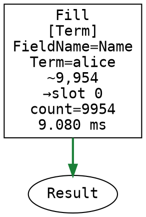

Generated C#:

```csharp
// Uses 1 result bitmaps
[SkipLocalsInit]
static void CompiledQuery(CompiledQueryMatch ctx)
{
    Span<long> buffer = stackalloc long[4096];
    cursor = 0;
    ctx.Token.ThrowIfCancellationRequested();
    QueryPrimitives.CtxFillFromPostingSource(ctx, cursor, bitmapSlot: 0);    // Name [Equals]
Done:
    return;
}
```

Executed strategy: `BitmapPipeline`

<details><summary>Query plan (JSON)</summary>

```json
{
  "Operation": "CompiledQuery",
  "Parameters": {
    "OptimizationHint": "BitmapPipeline",
    "StrategyCandidate": "BitmapPipeline",
    "ScannedEntries": "9954"
  },
  "Children": [
    {
      "Operation": "Fill",
      "Parameters": {
        "DestSlot": "0",
        "Dispatch": "Term",
        "FieldName": "Name",
        "Term": "alice",
        "EstimatedRows": "9,954",
        "Count": "9954",
        "Ms": "9.080"
      }
    }
  ]
}
```

</details>

Query timings (wall-clock, illustrative):

```
{"DurationInMs":149,"Timings":{"Query":{"DurationInMs":138,"Timings":{"Corax":{"DurationInMs":26,"Timings":{"Optimizer":{"DurationInMs":26,"Timings":null}}},"Retriever":{"DurationInMs":16,"Timings":{"Storage":{"DurationInMs":15,"Timings":null}}}}},"Staleness":{"DurationInMs":0,"Timings":null}}}
```

</details>

<details>
<summary><b>params: no-match</b> — $p="zzz"</summary>

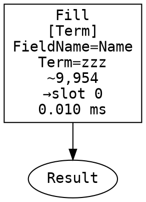

Generated C#:

```csharp
// Uses 1 result bitmaps
[SkipLocalsInit]
static void CompiledQuery(CompiledQueryMatch ctx)
{
    Span<long> buffer = stackalloc long[4096];
    cursor = 0;
    ctx.Token.ThrowIfCancellationRequested();
    QueryPrimitives.CtxFillFromPostingSource(ctx, cursor, bitmapSlot: 0);    // Name [Equals]
Done:
    return;
}
```

Executed strategy: `BitmapPipeline`

<details><summary>Query plan (JSON)</summary>

```json
{
  "Operation": "CompiledQuery",
  "Parameters": {
    "OptimizationHint": "BitmapPipeline",
    "StrategyCandidate": "BitmapPipeline",
    "ScannedEntries": "0"
  },
  "Children": [
    {
      "Operation": "Fill",
      "Parameters": {
        "DestSlot": "0",
        "Dispatch": "Term",
        "FieldName": "Name",
        "Term": "zzz",
        "EstimatedRows": "9,954",
        "Ms": "0.010"
      }
    }
  ]
}
```

</details>

Query timings (wall-clock, illustrative):

```
{"DurationInMs":0,"Timings":{"Query":{"DurationInMs":0,"Timings":{"Corax":{"DurationInMs":0,"Timings":{"Optimizer":{"DurationInMs":0,"Timings":null}}},"Retriever":{"DurationInMs":0,"Timings":null}}},"Staleness":{"DurationInMs":0,"Timings":null}}}
```

</details>

---

## or-chain — three-way OR

```rql
from index 'Items/Index' where City = $c or Name = $n or Age = $a
```

OR queries always materialise into the bitmap pipeline (no streaming sort drive). The three leaves are lazily OR-ed into the accumulator.

<details>
<summary><b>params: common</b> — $c="London", $n="alice", $a=30</summary>

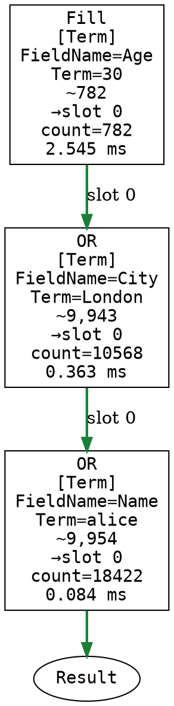

Generated C#:

```csharp
// Uses 1 result bitmaps
[SkipLocalsInit]
static void CompiledQuery(CompiledQueryMatch ctx)
{
    Span<long> buffer = stackalloc long[4096];
    cursor = 0;
    ctx.Token.ThrowIfCancellationRequested();
    QueryPrimitives.CtxFillFromPostingSource(ctx, cursor, bitmapSlot: 0);    // Age [Equals]
    cursor++;
    if (ctx.Bitmaps[0].Count >= ctx.Limit) goto Done;
    ctx.Token.ThrowIfCancellationRequested();
    QueryPrimitives.CtxOrFillFromPostingSource(ctx, cursor, bitmapSlot: 0);    // City [Equals]
    cursor++;
    if (ctx.Bitmaps[0].Count >= ctx.Limit) goto Done;
    ctx.Token.ThrowIfCancellationRequested();
    QueryPrimitives.CtxOrFillFromPostingSource(ctx, cursor, bitmapSlot: 0);    // Name [Equals]
Done:
    return;
}
```

Executed strategy: `BitmapPipeline`

<details><summary>Query plan (JSON)</summary>

```json
{
  "Operation": "CompiledQuery",
  "Parameters": {
    "OptimizationHint": "BitmapPipeline",
    "StrategyCandidate": "BitmapPipeline",
    "ScannedEntries": "18422"
  },
  "Children": [
    {
      "Operation": "Fill",
      "Parameters": {
        "DestSlot": "0",
        "Dispatch": "Term",
        "FieldName": "Age",
        "Term": "30",
        "EstimatedRows": "782",
        "Count": "782",
        "Ms": "2.545"
      }
    },
    {
      "Operation": "OR",
      "Parameters": {
        "DestSlot": "0",
        "Dispatch": "Term",
        "FieldName": "City",
        "Term": "London",
        "EstimatedRows": "9,943",
        "Count": "10568",
        "Ms": "0.363"
      }
    },
    {
      "Operation": "OR",
      "Parameters": {
        "DestSlot": "0",
        "Dispatch": "Term",
        "FieldName": "Name",
        "Term": "alice",
        "EstimatedRows": "9,954",
        "Count": "18422",
        "Ms": "0.084"
      }
    }
  ]
}
```

</details>

Query timings (wall-clock, illustrative):

```
{"DurationInMs":176,"Timings":{"Query":{"DurationInMs":176,"Timings":{"Corax":{"DurationInMs":1,"Timings":{"Optimizer":{"DurationInMs":1,"Timings":null}}},"Retriever":{"DurationInMs":31,"Timings":{"Storage":{"DurationInMs":30,"Timings":null}}}}},"Staleness":{"DurationInMs":0,"Timings":null}}}
```

</details>

<details>
<summary><b>params: rare</b> — $c="Rome", $n="erin", $a=99</summary>

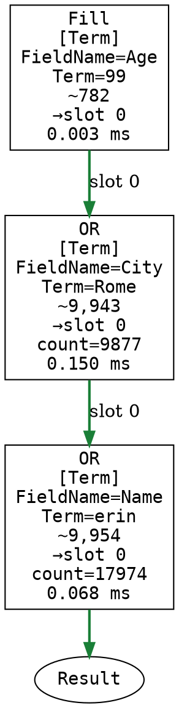

Generated C#:

```csharp
// Uses 1 result bitmaps
[SkipLocalsInit]
static void CompiledQuery(CompiledQueryMatch ctx)
{
    Span<long> buffer = stackalloc long[4096];
    cursor = 0;
    ctx.Token.ThrowIfCancellationRequested();
    QueryPrimitives.CtxFillFromPostingSource(ctx, cursor, bitmapSlot: 0);    // Age [Equals]
    cursor++;
    if (ctx.Bitmaps[0].Count >= ctx.Limit) goto Done;
    ctx.Token.ThrowIfCancellationRequested();
    QueryPrimitives.CtxOrFillFromPostingSource(ctx, cursor, bitmapSlot: 0);    // City [Equals]
    cursor++;
    if (ctx.Bitmaps[0].Count >= ctx.Limit) goto Done;
    ctx.Token.ThrowIfCancellationRequested();
    QueryPrimitives.CtxOrFillFromPostingSource(ctx, cursor, bitmapSlot: 0);    // Name [Equals]
Done:
    return;
}
```

Executed strategy: `BitmapPipeline`

<details><summary>Query plan (JSON)</summary>

```json
{
  "Operation": "CompiledQuery",
  "Parameters": {
    "OptimizationHint": "BitmapPipeline",
    "StrategyCandidate": "BitmapPipeline",
    "ScannedEntries": "17974"
  },
  "Children": [
    {
      "Operation": "Fill",
      "Parameters": {
        "DestSlot": "0",
        "Dispatch": "Term",
        "FieldName": "Age",
        "Term": "99",
        "EstimatedRows": "782",
        "Ms": "0.003"
      }
    },
    {
      "Operation": "OR",
      "Parameters": {
        "DestSlot": "0",
        "Dispatch": "Term",
        "FieldName": "City",
        "Term": "Rome",
        "EstimatedRows": "9,943",
        "Count": "9877",
        "Ms": "0.150"
      }
    },
    {
      "Operation": "OR",
      "Parameters": {
        "DestSlot": "0",
        "Dispatch": "Term",
        "FieldName": "Name",
        "Term": "erin",
        "EstimatedRows": "9,954",
        "Count": "17974",
        "Ms": "0.068"
      }
    }
  ]
}
```

</details>

Query timings (wall-clock, illustrative):

```
{"DurationInMs":102,"Timings":{"Query":{"DurationInMs":102,"Timings":{"Corax":{"DurationInMs":0,"Timings":{"Optimizer":{"DurationInMs":0,"Timings":null}}},"Retriever":{"DurationInMs":27,"Timings":{"Storage":{"DurationInMs":26,"Timings":null}}}}},"Staleness":{"DurationInMs":0,"Timings":null}}}
```

</details>

---

## not-exists-or — sentinel collapse

```rql
from index 'Items/Index' where City = $c or not exists(Name)
```

`not exists(Name)` is materialised as `AllEntries ANDNOT Exists(Name)` and lazily OR-ed with `City = $c` (see the `FillAllEntries` / `ANDNOT` / `LazyOrWith` ops). Because every document has a `Name`, the negated-exists branch evaluates to empty at runtime, so the result equals `City = $c` — but the engine computes this at runtime; it does not statically fold the branch away, since the planner does not assume the field is always present.

<details>
<summary><b>params: london</b> — $c="London"</summary>

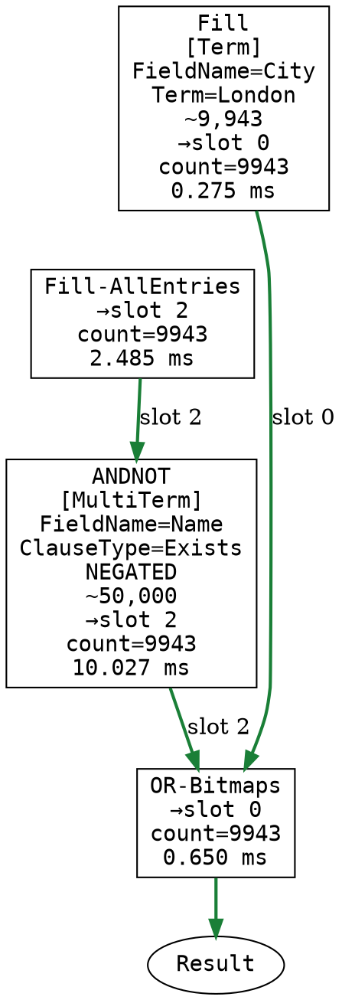

Generated C#:

```csharp
// Uses 3 result bitmaps
[SkipLocalsInit]
static void CompiledQuery(CompiledQueryMatch ctx)
{
    Span<long> buffer = stackalloc long[4096];
    cursor = 0;
    ctx.Token.ThrowIfCancellationRequested();
    QueryPrimitives.CtxFillFromPostingSource(ctx, cursor, bitmapSlot: 0);    // City [Equals]
    cursor++;
    if (ctx.Bitmaps[0].Count >= ctx.Limit) goto Done;
    ctx.Token.ThrowIfCancellationRequested();
    QueryPrimitives.CtxFillAllEntries(ctx, 2);
    ctx.Token.ThrowIfCancellationRequested();
    QueryPrimitives.CtxAndNotFromTreeScan(ctx, cursor, bitmapSlot: 2);    // Name [Exists]
    cursor++;
    ctx.Bitmaps[0].LazyOrWith(ref ctx.Bitmaps[2]);
Done:
    ctx.Bitmaps[0].RepairAfterLazy();
    return;
}
```

Executed strategy: `BitmapPipeline`

<details><summary>Query plan (JSON)</summary>

```json
{
  "Operation": "CompiledQuery",
  "Parameters": {
    "OptimizationHint": "BitmapPipeline",
    "StrategyCandidate": "BitmapPipeline",
    "ScannedEntries": "9943"
  },
  "Children": [
    {
      "Operation": "Fill",
      "Parameters": {
        "DestSlot": "0",
        "Dispatch": "Term",
        "FieldName": "City",
        "Term": "London",
        "EstimatedRows": "9,943",
        "Count": "9943",
        "Ms": "0.275"
      }
    },
    {
      "Operation": "Fill-AllEntries",
      "Parameters": {
        "DestSlot": "2",
        "Count": "9943",
        "Ms": "2.485"
      }
    },
    {
      "Operation": "ANDNOT",
      "Parameters": {
        "DestSlot": "2",
        "Dispatch": "MultiTerm",
        "FieldName": "Name",
        "ClauseType": "Exists",
        "Negated": "true",
        "EstimatedRows": "50,000",
        "Count": "9943",
        "Ms": "10.027"
      }
    },
    {
      "Operation": "OR-Bitmaps",
      "Parameters": {
        "DestSlot": "0",
        "SourceSlot": "2",
        "Count": "9943",
        "Ms": "0.650"
      }
    }
  ]
}
```

</details>

Query timings (wall-clock, illustrative):

```
{"DurationInMs":86,"Timings":{"Query":{"DurationInMs":86,"Timings":{"Corax":{"DurationInMs":2,"Timings":{"Optimizer":{"DurationInMs":2,"Timings":null}}},"Retriever":{"DurationInMs":33,"Timings":{"Storage":{"DurationInMs":33,"Timings":null}}}}},"Staleness":{"DurationInMs":0,"Timings":null}}}
```

</details>

<details>
<summary><b>params: rome</b> — $c="Rome"</summary>


Generated C#:

```csharp
// Uses 3 result bitmaps
[SkipLocalsInit]
static void CompiledQuery(CompiledQueryMatch ctx)
{
    Span<long> buffer = stackalloc long[4096];
    cursor = 0;
    ctx.Token.ThrowIfCancellationRequested();
    QueryPrimitives.CtxFillFromPostingSource(ctx, cursor, bitmapSlot: 0);    // City [Equals]
    cursor++;
    if (ctx.Bitmaps[0].Count >= ctx.Limit) goto Done;
    ctx.Token.ThrowIfCancellationRequested();
    QueryPrimitives.CtxFillAllEntries(ctx, 2);
    ctx.Token.ThrowIfCancellationRequested();
    QueryPrimitives.CtxAndNotFromTreeScan(ctx, cursor, bitmapSlot: 2);    // Name [Exists]
    cursor++;
    ctx.Bitmaps[0].LazyOrWith(ref ctx.Bitmaps[2]);
Done:
    ctx.Bitmaps[0].RepairAfterLazy();
    return;
}
```

Executed strategy: `BitmapPipeline`

<details><summary>Query plan (JSON)</summary>

```json
{
  "Operation": "CompiledQuery",
  "Parameters": {
    "OptimizationHint": "BitmapPipeline",
    "StrategyCandidate": "BitmapPipeline",
    "ScannedEntries": "9877"
  },
  "Children": [
    {
      "Operation": "Fill",
      "Parameters": {
        "DestSlot": "0",
        "Dispatch": "Term",
        "FieldName": "City",
        "Term": "Rome",
        "EstimatedRows": "9,943",
        "Count": "9877",
        "Ms": "0.092"
      }
    },
    {
      "Operation": "Fill-AllEntries",
      "Parameters": {
        "DestSlot": "2",
        "Count": "9877",
        "Ms": "0.657"
      }
    },
    {
      "Operation": "ANDNOT",
      "Parameters": {
        "DestSlot": "2",
        "Dispatch": "MultiTerm",
        "FieldName": "Name",
        "ClauseType": "Exists",
        "Negated": "true",
        "EstimatedRows": "50,000",
        "Count": "9877",
        "Ms": "0.388"
      }
    },
    {
      "Operation": "OR-Bitmaps",
      "Parameters": {
        "DestSlot": "0",
        "SourceSlot": "2",
        "Count": "9877",
        "Ms": "0.008"
      }
    }
  ]
}
```

</details>

Query timings (wall-clock, illustrative):

```
{"DurationInMs":63,"Timings":{"Query":{"DurationInMs":63,"Timings":{"Corax":{"DurationInMs":0,"Timings":{"Optimizer":{"DurationInMs":0,"Timings":null}}},"Retriever":{"DurationInMs":18,"Timings":{"Storage":{"DurationInMs":17,"Timings":null}}}}},"Staleness":{"DurationInMs":0,"Timings":null}}}
```

</details>

---

## between — numeric range

```rql
from index 'Items/Index' where Age between $lo and $hi
```

A single range leaf. Narrow vs wide bounds change selectivity but not the compiled shape; both run the same range scan.

<details>
<summary><b>params: narrow</b> — $lo=40, $hi=42</summary>

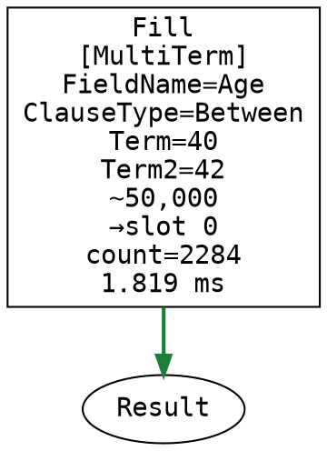

Generated C#:

```csharp
// Uses 1 result bitmaps
[SkipLocalsInit]
static void CompiledQuery(CompiledQueryMatch ctx)
{
    Span<long> buffer = stackalloc long[4096];
    cursor = 0;
    ctx.Token.ThrowIfCancellationRequested();
    QueryPrimitives.CtxFillFromTreeScan(ctx, cursor, bitmapSlot: 0);    // Age [Between]
Done:
    return;
}
```

Executed strategy: `BitmapPipeline`

<details><summary>Query plan (JSON)</summary>

```json
{
  "Operation": "CompiledQuery",
  "Parameters": {
    "OptimizationHint": "BitmapPipeline",
    "StrategyCandidate": "BitmapPipeline",
    "ScannedEntries": "2284"
  },
  "Children": [
    {
      "Operation": "Fill",
      "Parameters": {
        "DestSlot": "0",
        "Dispatch": "MultiTerm",
        "FieldName": "Age",
        "Term": "40",
        "Term2": "42",
        "ClauseType": "Between",
        "EstimatedRows": "50,000",
        "Count": "2284",
        "Ms": "1.819"
      }
    }
  ]
}
```

</details>

Query timings (wall-clock, illustrative):

```
{"DurationInMs":16,"Timings":{"Query":{"DurationInMs":16,"Timings":{"Corax":{"DurationInMs":0,"Timings":{"Optimizer":{"DurationInMs":0,"Timings":null}}},"Retriever":{"DurationInMs":3,"Timings":{"Storage":{"DurationInMs":3,"Timings":null}}}}},"Staleness":{"DurationInMs":0,"Timings":null}}}
```

</details>

<details>
<summary><b>params: wide</b> — $lo=18, $hi=79</summary>

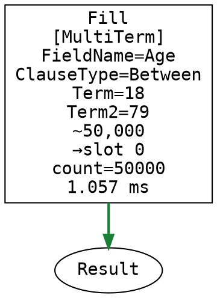

Generated C#:

```csharp
// Uses 1 result bitmaps
[SkipLocalsInit]
static void CompiledQuery(CompiledQueryMatch ctx)
{
    Span<long> buffer = stackalloc long[4096];
    cursor = 0;
    ctx.Token.ThrowIfCancellationRequested();
    QueryPrimitives.CtxFillFromTreeScan(ctx, cursor, bitmapSlot: 0);    // Age [Between]
Done:
    return;
}
```

Executed strategy: `BitmapPipeline`

<details><summary>Query plan (JSON)</summary>

```json
{
  "Operation": "CompiledQuery",
  "Parameters": {
    "OptimizationHint": "BitmapPipeline",
    "StrategyCandidate": "BitmapPipeline",
    "ScannedEntries": "50000"
  },
  "Children": [
    {
      "Operation": "Fill",
      "Parameters": {
        "DestSlot": "0",
        "Dispatch": "MultiTerm",
        "FieldName": "Age",
        "Term": "18",
        "Term2": "79",
        "ClauseType": "Between",
        "EstimatedRows": "50,000",
        "Count": "50000",
        "Ms": "1.057"
      }
    }
  ]
}
```

</details>

Query timings (wall-clock, illustrative):

```
{"DurationInMs":247,"Timings":{"Query":{"DurationInMs":247,"Timings":{"Corax":{"DurationInMs":0,"Timings":{"Optimizer":{"DurationInMs":0,"Timings":null}}},"Retriever":{"DurationInMs":92,"Timings":{"Storage":{"DurationInMs":89,"Timings":null}}}}},"Staleness":{"DurationInMs":0,"Timings":null}}}
```

</details>

---

## in — set membership

```rql
from index 'Items/Index' where City in ($a, $b, $c)
```

IN over a posting-list field. Duplicate values collapse to the same posting source.

<details>
<summary><b>params: three-distinct</b> — $a="London", $b="Paris", $c="Berlin"</summary>

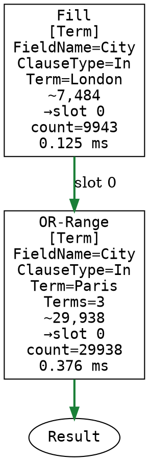

Generated C#:

```csharp
// Uses 1 result bitmaps
[SkipLocalsInit]
static void CompiledQuery(CompiledQueryMatch ctx)
{
    Span<long> buffer = stackalloc long[4096];
    cursor = 0;
    ctx.Token.ThrowIfCancellationRequested();
    QueryPrimitives.CtxFillFromPostingSource(ctx, cursor, bitmapSlot: 0);    // City [In]
    cursor++;
    if (ctx.Bitmaps[0].Count >= ctx.Limit) goto Done;
    end_1 = cursor + ctx.InRangeCounts[0];
    for (j_1 = cursor; j_1 < end_1; j_1++)
    {
        ctx.Token.ThrowIfCancellationRequested();
        QueryPrimitives.CtxOrFillFromPostingSource(ctx, j_1, 0);    // City [In]
    }
    cursor = end_1;
Done:
    return;
}
```

Executed strategy: `BitmapPipeline`

<details><summary>Query plan (JSON)</summary>

```json
{
  "Operation": "CompiledQuery",
  "Parameters": {
    "OptimizationHint": "BitmapPipeline",
    "StrategyCandidate": "BitmapPipeline",
    "ScannedEntries": "29938"
  },
  "Children": [
    {
      "Operation": "Fill",
      "Parameters": {
        "DestSlot": "0",
        "Dispatch": "Term",
        "FieldName": "City",
        "Term": "London",
        "ClauseType": "In",
        "EstimatedRows": "7,484",
        "Count": "9943",
        "Ms": "0.125"
      }
    },
    {
      "Operation": "OR-Range",
      "Parameters": {
        "DestSlot": "0",
        "Dispatch": "Term",
        "FieldName": "City",
        "Term": "Paris",
        "ClauseType": "In",
        "EstimatedRows": "29,938",
        "Count": "29938",
        "Ms": "0.376",
        "Terms": "3"
      }
    }
  ]
}
```

</details>

Query timings (wall-clock, illustrative):

```
{"DurationInMs":204,"Timings":{"Query":{"DurationInMs":203,"Timings":{"Corax":{"DurationInMs":2,"Timings":{"Optimizer":{"DurationInMs":2,"Timings":null}}},"Retriever":{"DurationInMs":52,"Timings":{"Storage":{"DurationInMs":49,"Timings":null}}}}},"Staleness":{"DurationInMs":0,"Timings":null}}}
```

</details>

<details>
<summary><b>params: all-same</b> — $a="Rome", $b="Rome", $c="Rome"</summary>

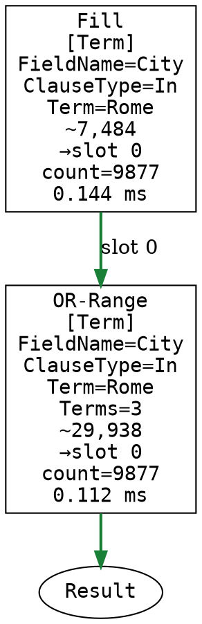

Generated C#:

```csharp
// Uses 1 result bitmaps
[SkipLocalsInit]
static void CompiledQuery(CompiledQueryMatch ctx)
{
    Span<long> buffer = stackalloc long[4096];
    cursor = 0;
    ctx.Token.ThrowIfCancellationRequested();
    QueryPrimitives.CtxFillFromPostingSource(ctx, cursor, bitmapSlot: 0);    // City [In]
    cursor++;
    if (ctx.Bitmaps[0].Count >= ctx.Limit) goto Done;
    end_1 = cursor + ctx.InRangeCounts[0];
    for (j_1 = cursor; j_1 < end_1; j_1++)
    {
        ctx.Token.ThrowIfCancellationRequested();
        QueryPrimitives.CtxOrFillFromPostingSource(ctx, j_1, 0);    // City [In]
    }
    cursor = end_1;
Done:
    return;
}
```

Executed strategy: `BitmapPipeline`

<details><summary>Query plan (JSON)</summary>

```json
{
  "Operation": "CompiledQuery",
  "Parameters": {
    "OptimizationHint": "BitmapPipeline",
    "StrategyCandidate": "BitmapPipeline",
    "ScannedEntries": "9877"
  },
  "Children": [
    {
      "Operation": "Fill",
      "Parameters": {
        "DestSlot": "0",
        "Dispatch": "Term",
        "FieldName": "City",
        "Term": "Rome",
        "ClauseType": "In",
        "EstimatedRows": "7,484",
        "Count": "9877",
        "Ms": "0.144"
      }
    },
    {
      "Operation": "OR-Range",
      "Parameters": {
        "DestSlot": "0",
        "Dispatch": "Term",
        "FieldName": "City",
        "Term": "Rome",
        "ClauseType": "In",
        "EstimatedRows": "29,938",
        "Count": "9877",
        "Ms": "0.112",
        "Terms": "3"
      }
    }
  ]
}
```

</details>

Query timings (wall-clock, illustrative):

```
{"DurationInMs":48,"Timings":{"Query":{"DurationInMs":47,"Timings":{"Corax":{"DurationInMs":0,"Timings":{"Optimizer":{"DurationInMs":0,"Timings":null}}},"Retriever":{"DurationInMs":9,"Timings":{"Storage":{"DurationInMs":9,"Timings":null}}}}},"Staleness":{"DurationInMs":0,"Timings":null}}}
```

</details>

---

## in-single — list-valued IN parameter

```rql
from index 'Items/Index' where City in ($a)
```

A single list-valued parameter expands to the IN set at runtime. With values it is an ordinary posting-list IN; when `$a` is empty the set is unsatisfiable, so the clause resolves to match-nothing and the query returns no documents. Emptiness is a property of the value set, resolved when the plan is instantiated for these parameters.

<details>
<summary><b>params: with-values</b> — $a=["London", "Paris"]</summary>

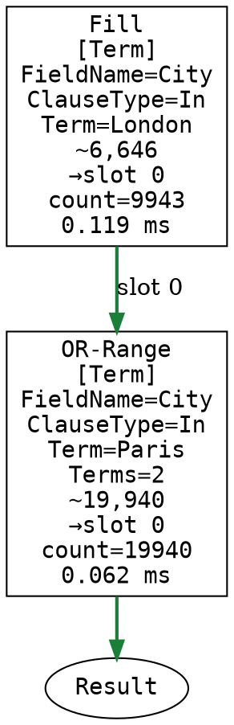

Generated C#:

```csharp
// Uses 1 result bitmaps
[SkipLocalsInit]
static void CompiledQuery(CompiledQueryMatch ctx)
{
    Span<long> buffer = stackalloc long[4096];
    cursor = 0;
    ctx.Token.ThrowIfCancellationRequested();
    QueryPrimitives.CtxFillFromPostingSource(ctx, cursor, bitmapSlot: 0);    // City [In]
    cursor++;
    if (ctx.Bitmaps[0].Count >= ctx.Limit) goto Done;
    end_1 = cursor + ctx.InRangeCounts[0];
    for (j_1 = cursor; j_1 < end_1; j_1++)
    {
        ctx.Token.ThrowIfCancellationRequested();
        QueryPrimitives.CtxOrFillFromPostingSource(ctx, j_1, 0);    // City [In]
    }
    cursor = end_1;
Done:
    return;
}
```

Executed strategy: `BitmapPipeline`

<details><summary>Query plan (JSON)</summary>

```json
{
  "Operation": "CompiledQuery",
  "Parameters": {
    "OptimizationHint": "BitmapPipeline",
    "StrategyCandidate": "BitmapPipeline",
    "ScannedEntries": "19940"
  },
  "Children": [
    {
      "Operation": "Fill",
      "Parameters": {
        "DestSlot": "0",
        "Dispatch": "Term",
        "FieldName": "City",
        "Term": "London",
        "ClauseType": "In",
        "EstimatedRows": "6,646",
        "Count": "9943",
        "Ms": "0.119"
      }
    },
    {
      "Operation": "OR-Range",
      "Parameters": {
        "DestSlot": "0",
        "Dispatch": "Term",
        "FieldName": "City",
        "Term": "Paris",
        "ClauseType": "In",
        "EstimatedRows": "19,940",
        "Count": "19940",
        "Ms": "0.062",
        "Terms": "2"
      }
    }
  ]
}
```

</details>

Query timings (wall-clock, illustrative):

```
{"DurationInMs":127,"Timings":{"Query":{"DurationInMs":127,"Timings":{"Corax":{"DurationInMs":0,"Timings":{"Optimizer":{"DurationInMs":0,"Timings":null}}},"Retriever":{"DurationInMs":18,"Timings":{"Storage":{"DurationInMs":17,"Timings":null}}}}},"Staleness":{"DurationInMs":0,"Timings":null}}}
```

</details>

<details>
<summary><b>params: empty</b> — $a=[] (no values → match-nothing)</summary>

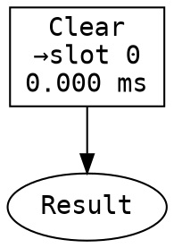

Generated C#:

```csharp
// Uses 1 result bitmaps
[SkipLocalsInit]
static void CompiledQuery(CompiledQueryMatch ctx)
{
    Span<long> buffer = stackalloc long[4096];
    cursor = 0;
    ctx.Bitmaps[0].Clear();
Done:
    return;
}
```

Executed strategy: `BitmapPipeline`

<details><summary>Query plan (JSON)</summary>

```json
{
  "Operation": "CompiledQuery",
  "Parameters": {
    "OptimizationHint": "BitmapPipeline",
    "StrategyCandidate": "BitmapPipeline",
    "ScannedEntries": "0"
  },
  "Children": [
    {
      "Operation": "Clear",
      "Parameters": {
        "DestSlot": "0",
        "Ms": "0.000"
      }
    },
    {
      "Operation": "ResolvedClauses",
      "Children": [
        {
          "Operation": "StaticallyResolved",
          "Parameters": {
            "FieldName": "City",
            "ClauseType": "In",
            "ResolvedTo": "MatchNothing",
            "Answer": "always false (contradiction, not scanned)"
          }
        }
      ]
    }
  ]
}
```

</details>

Query timings (wall-clock, illustrative):

```
{"DurationInMs":2,"Timings":{"Query":{"DurationInMs":2,"Timings":{"Corax":{"DurationInMs":0,"Timings":{"Optimizer":{"DurationInMs":0,"Timings":null}}},"Retriever":{"DurationInMs":0,"Timings":null}}},"Staleness":{"DurationInMs":0,"Timings":null}}}
```

</details>

---

## when — compile-time clause gating

```rql
from index 'Items/Index' where when($flag = true, City = $c)
```

`when(cond, expr)` gates a clause on a constant condition evaluated against the query parameters. When the condition holds the leaf is compiled normally (`City = $c`); when it fails the leaf is dropped entirely — and since it is the only clause, the query collapses to match-all (every document). The two cases compile to **different** plans: the WHEN survival mask is part of the plan-cache key, so each parameter set gets its own compiled plan rather than a runtime branch.

<details>
<summary><b>params: enabled</b> — $flag=true -> keep `City = $c`</summary>

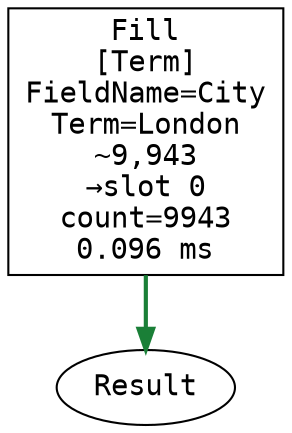

Generated C#:

```csharp
// Uses 1 result bitmaps
[SkipLocalsInit]
static void CompiledQuery(CompiledQueryMatch ctx)
{
    Span<long> buffer = stackalloc long[4096];
    cursor = 0;
    ctx.Token.ThrowIfCancellationRequested();
    QueryPrimitives.CtxFillFromPostingSource(ctx, cursor, bitmapSlot: 0);    // City [Equals]
Done:
    return;
}
```

Executed strategy: `BitmapPipeline`

<details><summary>Query plan (JSON)</summary>

```json
{
  "Operation": "CompiledQuery",
  "Parameters": {
    "OptimizationHint": "BitmapPipeline",
    "StrategyCandidate": "BitmapPipeline",
    "ScannedEntries": "9943"
  },
  "Children": [
    {
      "Operation": "Fill",
      "Parameters": {
        "DestSlot": "0",
        "Dispatch": "Term",
        "FieldName": "City",
        "Term": "London",
        "EstimatedRows": "9,943",
        "Count": "9943",
        "Ms": "0.096"
      }
    }
  ]
}
```

</details>

Query timings (wall-clock, illustrative):

```
{"DurationInMs":24,"Timings":{"Query":{"DurationInMs":24,"Timings":{"Corax":{"DurationInMs":1,"Timings":{"Optimizer":{"DurationInMs":1,"Timings":null}}},"Retriever":{"DurationInMs":8,"Timings":{"Storage":{"DurationInMs":8,"Timings":null}}}}},"Staleness":{"DurationInMs":0,"Timings":null}}}
```

</details>

<details>
<summary><b>params: disabled</b> — $flag=false -> clause dropped -> match-all</summary>

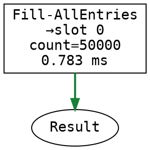

Generated C#:

```csharp
// Uses 1 result bitmaps
[SkipLocalsInit]
static void CompiledQuery(CompiledQueryMatch ctx)
{
    Span<long> buffer = stackalloc long[4096];
    cursor = 0;
    ctx.Token.ThrowIfCancellationRequested();
    QueryPrimitives.CtxFillAllEntries(ctx, 0);
Done:
    return;
}
```

Executed strategy: `BitmapPipeline`

<details><summary>Query plan (JSON)</summary>

```json
{
  "Operation": "CompiledQuery",
  "Parameters": {
    "OptimizationHint": "BitmapPipeline",
    "StrategyCandidate": "BitmapPipeline",
    "ScannedEntries": "50000"
  },
  "Children": [
    {
      "Operation": "Fill-AllEntries",
      "Parameters": {
        "DestSlot": "0",
        "Count": "50000",
        "Ms": "0.783"
      }
    },
    {
      "Operation": "ResolvedClauses",
      "Children": [
        {
          "Operation": "StaticallyResolved",
          "Parameters": {
            "FieldName": "City",
            "ClauseType": "Equals",
            "ResolvedTo": "MatchAll",
            "Answer": "always true (clause dropped, not scanned)"
          }
        }
      ]
    }
  ]
}
```

</details>

Query timings (wall-clock, illustrative):

```
{"DurationInMs":138,"Timings":{"Query":{"DurationInMs":138,"Timings":{"Corax":{"DurationInMs":0,"Timings":{"Optimizer":{"DurationInMs":0,"Timings":null}}},"Retriever":{"DurationInMs":50,"Timings":{"Storage":{"DurationInMs":48,"Timings":null}}}}},"Staleness":{"DurationInMs":0,"Timings":null}}}
```

</details>

---

## nested-group — OR of two ANDs

```rql
from index 'Items/Index' where (City = $c and Age > $a) or (Name = $n and Age < $b)
```

Two AND groups OR-ed together. Each group intersects into scratch, then the two scratch bitmaps are OR-ed. No sort drive (top-level OR).

<details>
<summary><b>params: set1</b> — $c="London", $a=30, $n="alice", $b=70</summary>

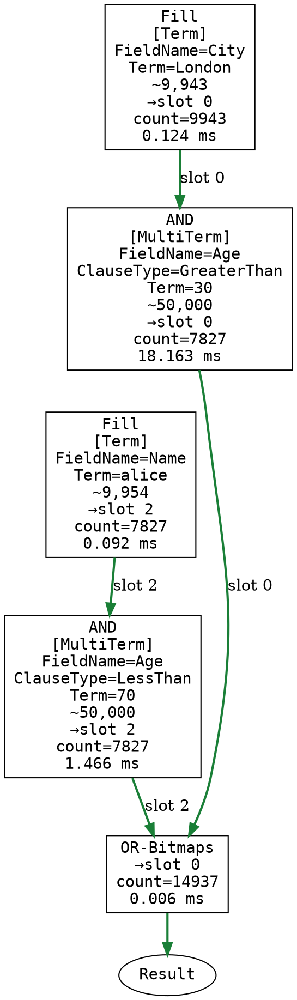

Generated C#:

```csharp
// Uses 3 result bitmaps
[SkipLocalsInit]
static void CompiledQuery(CompiledQueryMatch ctx)
{
    Span<long> buffer = stackalloc long[4096];
    cursor = 0;
    ctx.Token.ThrowIfCancellationRequested();
    QueryPrimitives.CtxFillFromPostingSource(ctx, cursor, bitmapSlot: 0);    // City [Equals]
    cursor++;
    ctx.Token.ThrowIfCancellationRequested();
    QueryPrimitives.CtxAndFromTreeScan(ctx, cursor, bitmapSlot: 0);    // Age [GreaterThan]
    cursor++;
    ctx.Token.ThrowIfCancellationRequested();
    QueryPrimitives.CtxFillFromPostingSource(ctx, cursor, bitmapSlot: 2);    // Name [Equals]
    cursor++;
    ctx.Token.ThrowIfCancellationRequested();
    QueryPrimitives.CtxAndFromTreeScan(ctx, cursor, bitmapSlot: 2);    // Age [LessThan]
    cursor++;
    ctx.Bitmaps[0].LazyOrWith(ref ctx.Bitmaps[2]);
Done:
    ctx.Bitmaps[0].RepairAfterLazy();
    return;
}
```

Executed strategy: `BitmapPipeline`

<details><summary>Query plan (JSON)</summary>

```json
{
  "Operation": "CompiledQuery",
  "Parameters": {
    "OptimizationHint": "BitmapPipeline",
    "StrategyCandidate": "BitmapPipeline",
    "ScannedEntries": "14937"
  },
  "Children": [
    {
      "Operation": "Fill",
      "Parameters": {
        "DestSlot": "0",
        "Dispatch": "Term",
        "FieldName": "City",
        "Term": "London",
        "EstimatedRows": "9,943",
        "Count": "9943",
        "Ms": "0.124"
      }
    },
    {
      "Operation": "AND",
      "Parameters": {
        "DestSlot": "0",
        "Dispatch": "MultiTerm",
        "FieldName": "Age",
        "Term": "30",
        "ClauseType": "GreaterThan",
        "EstimatedRows": "50,000",
        "Count": "7827",
        "Ms": "18.163"
      }
    },
    {
      "Operation": "Fill",
      "Parameters": {
        "DestSlot": "2",
        "Dispatch": "Term",
        "FieldName": "Name",
        "Term": "alice",
        "EstimatedRows": "9,954",
        "Count": "7827",
        "Ms": "0.092"
      }
    },
    {
      "Operation": "AND",
      "Parameters": {
        "DestSlot": "2",
        "Dispatch": "MultiTerm",
        "FieldName": "Age",
        "Term": "70",
        "ClauseType": "LessThan",
        "EstimatedRows": "50,000",
        "Count": "7827",
        "Ms": "1.466"
      }
    },
    {
      "Operation": "OR-Bitmaps",
      "Parameters": {
        "DestSlot": "0",
        "SourceSlot": "2",
        "Count": "14937",
        "Ms": "0.006"
      }
    }
  ]
}
```

</details>

Query timings (wall-clock, illustrative):

```
{"DurationInMs":88,"Timings":{"Query":{"DurationInMs":87,"Timings":{"Corax":{"DurationInMs":1,"Timings":{"Optimizer":{"DurationInMs":1,"Timings":null}}},"Retriever":{"DurationInMs":47,"Timings":{"Storage":{"DurationInMs":46,"Timings":null}}}}},"Staleness":{"DurationInMs":0,"Timings":null}}}
```

</details>

<details>
<summary><b>params: set2</b> — $c="Berlin", $a=50, $n="bob", $b=25</summary>

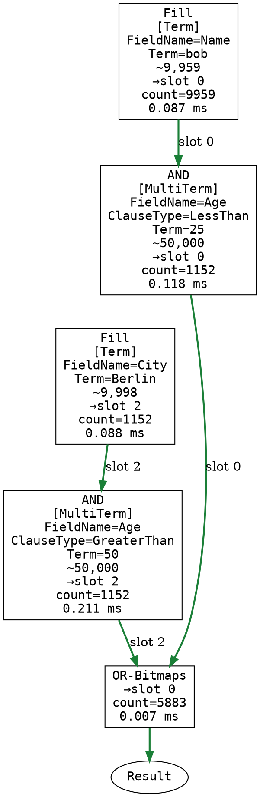

Generated C#:

```csharp
// Uses 3 result bitmaps
[SkipLocalsInit]
static void CompiledQuery(CompiledQueryMatch ctx)
{
    Span<long> buffer = stackalloc long[4096];
    cursor = 0;
    ctx.Token.ThrowIfCancellationRequested();
    QueryPrimitives.CtxFillFromPostingSource(ctx, cursor, bitmapSlot: 0);    // Name [Equals]
    cursor++;
    ctx.Token.ThrowIfCancellationRequested();
    QueryPrimitives.CtxAndFromTreeScan(ctx, cursor, bitmapSlot: 0);    // Age [LessThan]
    cursor++;
    ctx.Token.ThrowIfCancellationRequested();
    QueryPrimitives.CtxFillFromPostingSource(ctx, cursor, bitmapSlot: 2);    // City [Equals]
    cursor++;
    ctx.Token.ThrowIfCancellationRequested();
    QueryPrimitives.CtxAndFromTreeScan(ctx, cursor, bitmapSlot: 2);    // Age [GreaterThan]
    cursor++;
    ctx.Bitmaps[0].LazyOrWith(ref ctx.Bitmaps[2]);
Done:
    ctx.Bitmaps[0].RepairAfterLazy();
    return;
}
```

Executed strategy: `BitmapPipeline`

<details><summary>Query plan (JSON)</summary>

```json
{
  "Operation": "CompiledQuery",
  "Parameters": {
    "OptimizationHint": "BitmapPipeline",
    "StrategyCandidate": "BitmapPipeline",
    "ScannedEntries": "5883"
  },
  "Children": [
    {
      "Operation": "Fill",
      "Parameters": {
        "DestSlot": "0",
        "Dispatch": "Term",
        "FieldName": "Name",
        "Term": "bob",
        "EstimatedRows": "9,959",
        "Count": "9959",
        "Ms": "0.087"
      }
    },
    {
      "Operation": "AND",
      "Parameters": {
        "DestSlot": "0",
        "Dispatch": "MultiTerm",
        "FieldName": "Age",
        "Term": "25",
        "ClauseType": "LessThan",
        "EstimatedRows": "50,000",
        "Count": "1152",
        "Ms": "0.118"
      }
    },
    {
      "Operation": "Fill",
      "Parameters": {
        "DestSlot": "2",
        "Dispatch": "Term",
        "FieldName": "City",
        "Term": "Berlin",
        "EstimatedRows": "9,998",
        "Count": "1152",
        "Ms": "0.088"
      }
    },
    {
      "Operation": "AND",
      "Parameters": {
        "DestSlot": "2",
        "Dispatch": "MultiTerm",
        "FieldName": "Age",
        "Term": "50",
        "ClauseType": "GreaterThan",
        "EstimatedRows": "50,000",
        "Count": "1152",
        "Ms": "0.211"
      }
    },
    {
      "Operation": "OR-Bitmaps",
      "Parameters": {
        "DestSlot": "0",
        "SourceSlot": "2",
        "Count": "5883",
        "Ms": "0.007"
      }
    }
  ]
}
```

</details>

Query timings (wall-clock, illustrative):

```
{"DurationInMs":16,"Timings":{"Query":{"DurationInMs":16,"Timings":{"Corax":{"DurationInMs":0,"Timings":{"Optimizer":{"DurationInMs":0,"Timings":null}}},"Retriever":{"DurationInMs":5,"Timings":{"Storage":{"DurationInMs":4,"Timings":null}}}}},"Staleness":{"DurationInMs":0,"Timings":null}}}
```

</details>

---

## and-two — selectivity flip drives operand order

```rql
from index 'Items/Index' where Age > $a and City = $c
```

One compiled plan serves both parameter sets. `City = $c` fills the accumulator and the `Age >` predicate is applied as an AND. Selectivity is handled at runtime: the `ShouldSwitchToEntryScan` gate switches between a tree-scan intersection and a per-entry residual scan based on the live cardinality.

<details>
<summary><b>params: age-selective</b> — $a=78, $c="London"</summary>

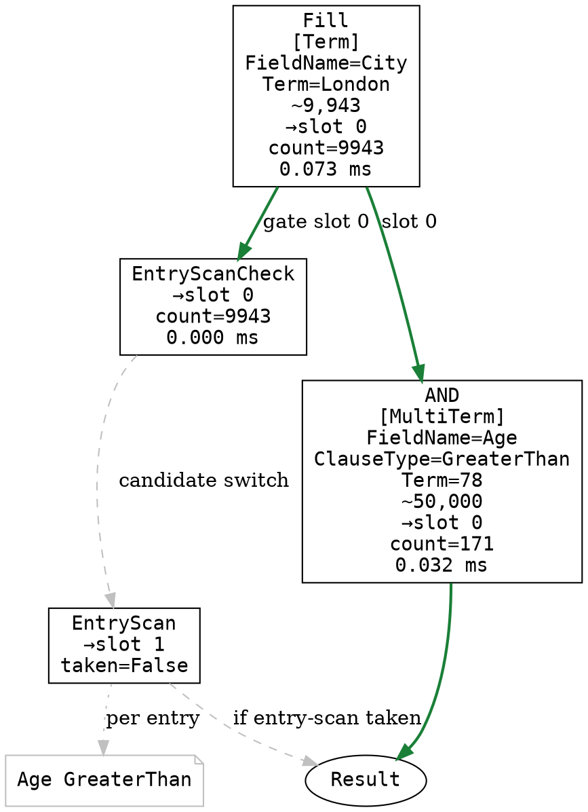

Generated C#:

```csharp
// Uses 2 result bitmaps
[SkipLocalsInit]
static void CompiledQuery(CompiledQueryMatch ctx)
{
    Span<long> buffer = stackalloc long[4096];
    cursor = 0;
    ctx.Token.ThrowIfCancellationRequested();
    QueryPrimitives.CtxFillFromPostingSource(ctx, cursor, bitmapSlot: 0);    // City [Equals]
    cursor++;
    if (QueryPrimitives.ShouldSwitchToEntryScan((long)ctx.Bitmaps[0].Count, ctx.Cardinalities[cursor]))
        goto EntryScan;
    ctx.Token.ThrowIfCancellationRequested();
    QueryPrimitives.CtxAndFromTreeScan(ctx, cursor, bitmapSlot: 0);    // Age [GreaterThan]
Done:
    return;
EntryScan:
    ctx.EntryScanTakenAtOp = cursor;
    CompiledQueryHelper.RunEntryScan(ctx, ref ctx.Bitmaps[0], ref ctx.Bitmaps[1]);
    return;
}

// --- Entry-scan per-entry residual filter (bitmap cost-gate path) ---
static int ResidualScan(QueryExecution exec, Span<EntryTermsReader> readers, Span<long> entryIds, Span<int> originalIndexes)
{
    length = entryIds.Length;
    writeIdx = 0;
    for (i = 0; i < length; i++)
    {
        ref var reader = ref readers[i];

        // Age [GreaterThan]
        reader.Reset();
        while (reader.FindNext(exec.FieldRootPages[0]))
        {
            if (reader.IsNull) continue;
            if ((reader.CurrentLong > exec.LongValues[0])) goto matchPass_4;
        }
        continue;
    matchPass_4:
        entryIds[writeIdx] = entryIds[i];
        if (originalIndexes.Length != 0)
            originalIndexes[writeIdx] = originalIndexes[i];
        writeIdx++;
    }
    return writeIdx;
}
```

Executed strategy: `BitmapPipeline`

<details><summary>Query plan (JSON)</summary>

```json
{
  "Operation": "CompiledQuery",
  "Parameters": {
    "OptimizationHint": "BitmapPipeline",
    "StrategyCandidate": "BitmapPipeline",
    "ScannedEntries": "171"
  },
  "Children": [
    {
      "Operation": "Fill",
      "Parameters": {
        "DestSlot": "0",
        "Dispatch": "Term",
        "FieldName": "City",
        "Term": "London",
        "EstimatedRows": "9,943",
        "Count": "9943",
        "Ms": "0.073"
      }
    },
    {
      "Operation": "EntryScanCheck",
      "Parameters": {
        "DestSlot": "0",
        "Count": "9943",
        "Ms": "0.000"
      }
    },
    {
      "Operation": "AND",
      "Parameters": {
        "DestSlot": "0",
        "Dispatch": "MultiTerm",
        "FieldName": "Age",
        "Term": "78",
        "ClauseType": "GreaterThan",
        "EstimatedRows": "50,000",
        "Count": "171",
        "Ms": "0.032"
      }
    },
    {
      "Operation": "EntryScan",
      "Parameters": {
        "DestSlot": "1",
        "SourceSlot": "0",
        "Taken": "False"
      },
      "Children": [
        {
          "Operation": "Residual",
          "Parameters": {
            "FieldName": "Age",
            "Compare": "GreaterThan",
            "ValueType": "Long"
          }
        }
      ]
    }
  ]
}
```

</details>

Query timings (wall-clock, illustrative):

```
{"DurationInMs":11,"Timings":{"Query":{"DurationInMs":11,"Timings":{"Corax":{"DurationInMs":3,"Timings":{"Optimizer":{"DurationInMs":3,"Timings":null}}},"Retriever":{"DurationInMs":0,"Timings":{"Storage":{"DurationInMs":0,"Timings":null}}}}},"Staleness":{"DurationInMs":0,"Timings":null}}}
```

</details>

<details>
<summary><b>params: age-broad</b> — $a=18, $c="London"</summary>


Generated C#:

```csharp
// Uses 2 result bitmaps
[SkipLocalsInit]
static void CompiledQuery(CompiledQueryMatch ctx)
{
    Span<long> buffer = stackalloc long[4096];
    cursor = 0;
    ctx.Token.ThrowIfCancellationRequested();
    QueryPrimitives.CtxFillFromPostingSource(ctx, cursor, bitmapSlot: 0);    // City [Equals]
    cursor++;
    if (QueryPrimitives.ShouldSwitchToEntryScan((long)ctx.Bitmaps[0].Count, ctx.Cardinalities[cursor]))
        goto EntryScan;
    ctx.Token.ThrowIfCancellationRequested();
    QueryPrimitives.CtxAndFromTreeScan(ctx, cursor, bitmapSlot: 0);    // Age [GreaterThan]
Done:
    return;
EntryScan:
    ctx.EntryScanTakenAtOp = cursor;
    CompiledQueryHelper.RunEntryScan(ctx, ref ctx.Bitmaps[0], ref ctx.Bitmaps[1]);
    return;
}

// --- Entry-scan per-entry residual filter (bitmap cost-gate path) ---
static int ResidualScan(QueryExecution exec, Span<EntryTermsReader> readers, Span<long> entryIds, Span<int> originalIndexes)
{
    length = entryIds.Length;
    writeIdx = 0;
    for (i = 0; i < length; i++)
    {
        ref var reader = ref readers[i];

        // Age [GreaterThan]
        reader.Reset();
        while (reader.FindNext(exec.FieldRootPages[0]))
        {
            if (reader.IsNull) continue;
            if ((reader.CurrentLong > exec.LongValues[0])) goto matchPass_4;
        }
        continue;
    matchPass_4:
        entryIds[writeIdx] = entryIds[i];
        if (originalIndexes.Length != 0)
            originalIndexes[writeIdx] = originalIndexes[i];
        writeIdx++;
    }
    return writeIdx;
}
```

Executed strategy: `BitmapPipeline`

<details><summary>Query plan (JSON)</summary>

```json
{
  "Operation": "CompiledQuery",
  "Parameters": {
    "OptimizationHint": "BitmapPipeline",
    "StrategyCandidate": "BitmapPipeline",
    "ScannedEntries": "9778"
  },
  "Children": [
    {
      "Operation": "Fill",
      "Parameters": {
        "DestSlot": "0",
        "Dispatch": "Term",
        "FieldName": "City",
        "Term": "London",
        "EstimatedRows": "9,943",
        "Count": "9943",
        "Ms": "0.104"
      }
    },
    {
      "Operation": "EntryScanCheck",
      "Parameters": {
        "DestSlot": "0",
        "Count": "9943",
        "Ms": "0.000"
      }
    },
    {
      "Operation": "AND",
      "Parameters": {
        "DestSlot": "0",
        "Dispatch": "MultiTerm",
        "FieldName": "Age",
        "Term": "18",
        "ClauseType": "GreaterThan",
        "EstimatedRows": "50,000",
        "Count": "9778",
        "Ms": "0.317"
      }
    },
    {
      "Operation": "EntryScan",
      "Parameters": {
        "DestSlot": "1",
        "SourceSlot": "0",
        "Taken": "False"
      },
      "Children": [
        {
          "Operation": "Residual",
          "Parameters": {
            "FieldName": "Age",
            "Compare": "GreaterThan",
            "ValueType": "Long"
          }
        }
      ]
    }
  ]
}
```

</details>

Query timings (wall-clock, illustrative):

```
{"DurationInMs":22,"Timings":{"Query":{"DurationInMs":21,"Timings":{"Corax":{"DurationInMs":0,"Timings":{"Optimizer":{"DurationInMs":0,"Timings":null}}},"Retriever":{"DurationInMs":7,"Timings":{"Storage":{"DurationInMs":6,"Timings":null}}}}},"Staleness":{"DurationInMs":0,"Timings":null}}}
```

</details>

---

## order-by — FieldSortedScan candidacy vs fallback

```rql
from index 'Items/Index' where Age > $a order by Age as long
```

A range predicate sorted on the same field is a `FieldSortedScan` candidate — the trail shows it **accepted** for both bounds — yet here it **falls back to `BitmapPipeline` for both**, and the lesson is *why*. This query has **no page limit** and the range is the **only** clause: with no `limit` the direct tree-walk has no early-stop, and with no second filter there is no residual to make the walk pay off, so it must produce every matching entry in order. But a single range clause is decoded just as completely by one posting-list fill (the bitmap path), and the cost gate charges the direct walk `entries_to_scan × 64` against that — so the scan is strictly more expensive no matter how selective the bound is. The selective bound ($a=78, ~820 rows) and the broad bound ($a=18, ~all rows) therefore reach the **same** decision; selectivity changes the result size, not the strategy. Contrast `filtered-sort`, which adds `limit 16` (early-stop) and a `City` residual — that is what lets the scan beat the bitmap.

<details>
<summary><b>params: selective</b> — $a=78</summary>

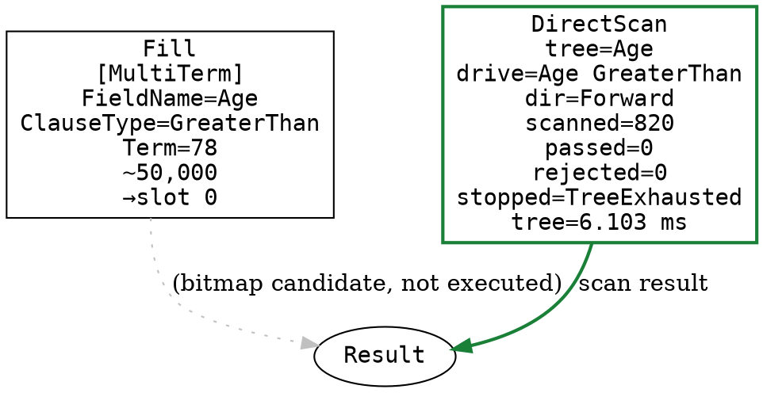

Generated C# — **bitmap-pipeline fallback, NOT executed**: this run took the `FieldSortedScan` strategy, which is built separately and does not go through this IL. The listing below is the path the planner would have used had it fallen back to the bitmap pipeline:

```csharp
// Uses 1 result bitmaps
[SkipLocalsInit]
static void CompiledQuery(CompiledQueryMatch ctx)
{
    Span<long> buffer = stackalloc long[4096];
    cursor = 0;
    ctx.Token.ThrowIfCancellationRequested();
    QueryPrimitives.CtxFillFromTreeScan(ctx, cursor, bitmapSlot: 0);    // Age [GreaterThan]
Done:
    return;
}
```

Executed strategy: `FieldSortedScan`

Decision trail:

- `CompoundSortedScan` → **rejected**: no compound-field candidate identified at template time
- `FieldSortedScan` → **accepted**: direct tree scan candidate on sort field (cost gated per-execution)

<details><summary>Query plan (JSON)</summary>

```json
{
  "Operation": "CompiledQuery",
  "Parameters": {
    "OptimizationHint": "FieldSortedScan",
    "StrategyCandidate": "FieldSortedScan"
  },
  "Children": [
    {
      "Operation": "Fill",
      "Parameters": {
        "DestSlot": "0",
        "Dispatch": "MultiTerm",
        "FieldName": "Age",
        "Term": "78",
        "ClauseType": "GreaterThan",
        "EstimatedRows": "50,000"
      }
    },
    {
      "Operation": "DecisionTrail",
      "Children": [
        {
          "Operation": "CompoundSortedScan",
          "Parameters": {
            "Accepted": "False",
            "Reason": "no compound-field candidate identified at template time"
          }
        },
        {
          "Operation": "FieldSortedScan",
          "Parameters": {
            "Accepted": "True",
            "Reason": "direct tree scan candidate on sort field (cost gated per-execution)"
          }
        }
      ]
    },
    {
      "Operation": "DirectScan",
      "Parameters": {
        "DrivingTree": "Age",
        "DrivingClause": "Age GreaterThan",
        "TreeDirection": "Forward",
        "ResidualPredicates": "",
        "Reason": "sorted walk, no residual filter (no stored-entry reads, sort is free)",
        "TreeScan_ms": "6.103",
        "TreeEntriesScanned": "820",
        "EntriesPassedFilter": "0",
        "EntriesRejected": "0",
        "StoppedAt": "TreeExhausted"
      }
    }
  ]
}
```

</details>

Query timings (wall-clock, illustrative):

```
{"DurationInMs":16,"Timings":{"Query":{"DurationInMs":16,"Timings":{"Corax":{"DurationInMs":2,"Timings":{"Optimizer":{"DurationInMs":2,"Timings":null}}},"Retriever":{"DurationInMs":1,"Timings":{"Storage":{"DurationInMs":1,"Timings":null}}}}},"Staleness":{"DurationInMs":0,"Timings":null}}}
```

</details>

<details>
<summary><b>params: broad</b> — $a=18</summary>

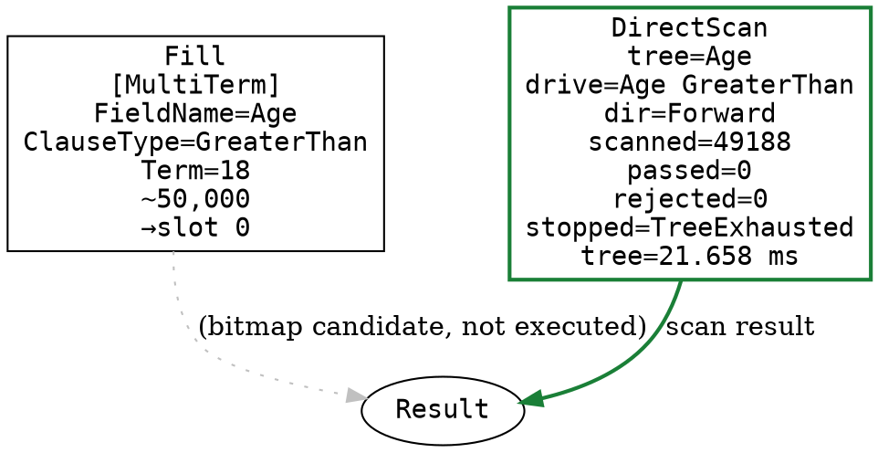

Generated C# — **bitmap-pipeline fallback, NOT executed**: this run took the `FieldSortedScan` strategy, which is built separately and does not go through this IL. The listing below is the path the planner would have used had it fallen back to the bitmap pipeline:

```csharp
// Uses 1 result bitmaps
[SkipLocalsInit]
static void CompiledQuery(CompiledQueryMatch ctx)
{
    Span<long> buffer = stackalloc long[4096];
    cursor = 0;
    ctx.Token.ThrowIfCancellationRequested();
    QueryPrimitives.CtxFillFromTreeScan(ctx, cursor, bitmapSlot: 0);    // Age [GreaterThan]
Done:
    return;
}
```

Executed strategy: `FieldSortedScan`

Decision trail:

- `CompoundSortedScan` → **rejected**: no compound-field candidate identified at template time
- `FieldSortedScan` → **accepted**: direct tree scan candidate on sort field (cost gated per-execution)

<details><summary>Query plan (JSON)</summary>

```json
{
  "Operation": "CompiledQuery",
  "Parameters": {
    "OptimizationHint": "FieldSortedScan",
    "StrategyCandidate": "FieldSortedScan"
  },
  "Children": [
    {
      "Operation": "Fill",
      "Parameters": {
        "DestSlot": "0",
        "Dispatch": "MultiTerm",
        "FieldName": "Age",
        "Term": "18",
        "ClauseType": "GreaterThan",
        "EstimatedRows": "50,000"
      }
    },
    {
      "Operation": "DecisionTrail",
      "Children": [
        {
          "Operation": "CompoundSortedScan",
          "Parameters": {
            "Accepted": "False",
            "Reason": "no compound-field candidate identified at template time"
          }
        },
        {
          "Operation": "FieldSortedScan",
          "Parameters": {
            "Accepted": "True",
            "Reason": "direct tree scan candidate on sort field (cost gated per-execution)"
          }
        }
      ]
    },
    {
      "Operation": "DirectScan",
      "Parameters": {
        "DrivingTree": "Age",
        "DrivingClause": "Age GreaterThan",
        "TreeDirection": "Forward",
        "ResidualPredicates": "",
        "Reason": "sorted walk, no residual filter (no stored-entry reads, sort is free)",
        "TreeScan_ms": "21.658",
        "TreeEntriesScanned": "49188",
        "EntriesPassedFilter": "0",
        "EntriesRejected": "0",
        "StoppedAt": "TreeExhausted"
      }
    }
  ]
}
```

</details>

Query timings (wall-clock, illustrative):

```
{"DurationInMs":195,"Timings":{"Query":{"DurationInMs":195,"Timings":{"Corax":{"DurationInMs":0,"Timings":{"Optimizer":{"DurationInMs":0,"Timings":null}}},"Retriever":{"DurationInMs":56,"Timings":{"Storage":{"DurationInMs":54,"Timings":null}}}}},"Staleness":{"DurationInMs":0,"Timings":null}}}
```

</details>

---

## filtered-sort — FieldSortedScan actually executes

```rql
from index 'Items/Index' where Age > $a and City = $c order by Age as long limit 16
```

A range predicate **on the sort field** plus a second equality filter, with a small page. This is the shape where the direct tree scan WINS: `Age > $a` is the sort-driving clause, so the scan walks the `Age` term tree in ascending order and applies `City = $c` as a per-entry residual, stopping as soon as the 16-row page is full. The cost gate estimates entries_to_scan = page(16) / City_pass_rate(~0.2) ≈ 80; that × the 64 entry-scan multiplier (~5,120) is far below the bitmap cost of decoding the whole `Age` range plus the full `City` posting list (~50K+), so `FieldSortedScan` executes. The graph shows the `DirectScan` node as the real producer (solid-green `scan result` edge), with `City = $c` listed as its residual; the bitmap pipeline's slot-0 exit is greyed `(bitmap candidate, not executed)`. Note the C# listing below is flagged as the non-executed bitmap fallback — the direct scan is built separately and never runs this IL. Contrast `bare-sort` (`order by Age` with no WHERE): that is ALSO a `FieldSortedScan` candidate (a full-scan direct sort), but with no filter to narrow the set and no productive limit the cost gate makes it scan all 50K entries, so `entries_to_scan × 64` blows past `bitmap_cost` and the 32,768 cap, and the gate falls back to the bitmap pipeline every time. The difference here is the WHERE filter and the small page, which shrink `entries_to_scan` to ~80 so the scan wins.

<details>
<summary><b>params: broad-age</b> — $a=18, $c="London"</summary>

```dot
digraph QueryPlan {
  rankdir=TB;
  node [shape=box, fontname="monospace"];
  op0 [label="Fill\n[Term]\nFieldName=City\nTerm=London\n~9,943\n→slot 0", data_destslot="0", data_dispatch="Term", data_fieldname="City", data_term="London", data_estimatedrows="9,943"];
  op1 [label="EntryScanCheck\n→slot 0", data_destslot="0"];
  op2 [label="AND\n[MultiTerm]\nFieldName=Age\nClauseType=GreaterThan\nTerm=18\n~50,000\n→slot 0", data_destslot="0", data_dispatch="MultiTerm", data_fieldname="Age", data_term="18", data_clausetype="GreaterThan", data_estimatedrows="50,000"];
  op3 [label="EntryScan\n→slot 1", data_destslot="1", data_sourceslot="0"];
  directscan [shape=box, style=bold, color="#1a7f37", label="DirectScan\ntree=Age\ndrive=Age GreaterThan\ndir=Forward\nresiduals: City Equal\nscanned=96\npassed=16\nrejected=77\nstopped=_take(16)\ntree=0.065 ms\nentry=4.939 ms", data_drivingtree="Age", data_drivingclause="Age GreaterThan", data_treedirection="Forward", data_residualpredicates="City Equal", data_reason="entries_to_scan(80) × 64 < bitmap_cost(59943)", data_treescan_ms="0.065", data_entryscans_ms="4.939", data_treeentriesscanned="96", data_entriespassedfilter="16", data_entriesrejected="77", data_stoppedat="_take(16)"];
  result [shape=ellipse, label="Result"];
  op0 -> op1 [style=dashed, label="gate slot 0"];
  op0 -> op2 [label="slot 0"];
  op2 -> result [style=dotted, color=grey, label="(bitmap candidate, not executed)"];
  directscan -> result [style=bold, color="#1a7f37", label="scan result"];
  res_direct [shape=note, color="#1a7f37", label="City Equal"];
  directscan -> res_direct [style=bold, color="#1a7f37", label="per entry"];
  op1 -> op3 [style=dashed, color=grey, label="candidate switch"];
  op3 -> result [style=dashed, color=grey, label="if entry-scan taken"];
  res_entry [shape=note, color=grey, label="Age GreaterThan"];
  op3 -> res_entry [style=dotted, color=grey, label="per entry"];
}
```

Generated C# — **bitmap-pipeline fallback, NOT executed**: this run took the `FieldSortedScan` strategy, which is built separately and does not go through this IL. The listing below is the path the planner would have used had it fallen back to the bitmap pipeline:

```csharp
// Uses 2 result bitmaps
[SkipLocalsInit]
static void CompiledQuery(CompiledQueryMatch ctx)
{
    Span<long> buffer = stackalloc long[4096];
    cursor = 0;
    ctx.Token.ThrowIfCancellationRequested();
    QueryPrimitives.CtxFillFromPostingSource(ctx, cursor, bitmapSlot: 0);    // City [Equals]
    cursor++;
    if (QueryPrimitives.ShouldSwitchToEntryScan((long)ctx.Bitmaps[0].Count, ctx.Cardinalities[cursor]))
        goto EntryScan;
    ctx.Token.ThrowIfCancellationRequested();
    QueryPrimitives.CtxAndFromTreeScan(ctx, cursor, bitmapSlot: 0);    // Age [GreaterThan]
Done:
    return;
EntryScan:
    ctx.EntryScanTakenAtOp = cursor;
    CompiledQueryHelper.RunEntryScan(ctx, ref ctx.Bitmaps[0], ref ctx.Bitmaps[1]);
    return;
}

// --- Entry-scan per-entry residual filter (bitmap cost-gate path) ---
static int ResidualScan(QueryExecution exec, Span<EntryTermsReader> readers, Span<long> entryIds, Span<int> originalIndexes)
{
    length = entryIds.Length;
    writeIdx = 0;
    for (i = 0; i < length; i++)
    {
        ref var reader = ref readers[i];

        // Age [GreaterThan]
        reader.Reset();
        while (reader.FindNext(exec.FieldRootPages[0]))
        {
            if (reader.IsNull) continue;
            if ((reader.CurrentLong > exec.LongValues[0])) goto matchPass_4;
        }
        continue;
    matchPass_4:
        entryIds[writeIdx] = entryIds[i];
        if (originalIndexes.Length != 0)
            originalIndexes[writeIdx] = originalIndexes[i];
        writeIdx++;
    }
    return writeIdx;
}

// --- Direct-scan per-entry residual filter (FieldSortedScan path) ---
static int ResidualScan(QueryExecution exec, Span<EntryTermsReader> readers, Span<long> entryIds, Span<int> originalIndexes)
{
    length = entryIds.Length;
    writeIdx = 0;
    for (i = 0; i < length; i++)
    {
        ref var reader = ref readers[i];

        // City [Equal]
        reader.Reset();
        while (reader.FindNext(exec.FieldRootPages[0]))
        {
            if (reader.IsNull) continue;
            if (reader.Current.Decoded().SequenceEqual(exec.AnalyzedSlices[0].AsReadOnlySpan())) goto matchPass_4;
        }
        continue;
    matchPass_4:
        entryIds[writeIdx] = entryIds[i];
        if (originalIndexes.Length != 0)
            originalIndexes[writeIdx] = originalIndexes[i];
        writeIdx++;
    }
    return writeIdx;
}
```

Executed strategy: `FieldSortedScan`

Decision trail:

- `CompoundSortedScan` → **rejected**: no compound-field candidate identified at template time
- `FieldSortedScan` → **accepted**: direct tree scan candidate on sort field (cost gated per-execution)

<details><summary>Query plan (JSON)</summary>

```json
{
  "Operation": "CompiledQuery",
  "Parameters": {
    "OptimizationHint": "FieldSortedScan",
    "StrategyCandidate": "FieldSortedScan"
  },
  "Children": [
    {
      "Operation": "Fill",
      "Parameters": {
        "DestSlot": "0",
        "Dispatch": "Term",
        "FieldName": "City",
        "Term": "London",
        "EstimatedRows": "9,943"
      }
    },
    {
      "Operation": "EntryScanCheck",
      "Parameters": {
        "DestSlot": "0"
      }
    },
    {
      "Operation": "AND",
      "Parameters": {
        "DestSlot": "0",
        "Dispatch": "MultiTerm",
        "FieldName": "Age",
        "Term": "18",
        "ClauseType": "GreaterThan",
        "EstimatedRows": "50,000"
      }
    },
    {
      "Operation": "EntryScan",
      "Parameters": {
        "DestSlot": "1",
        "SourceSlot": "0"
      },
      "Children": [
        {
          "Operation": "Residual",
          "Parameters": {
            "FieldName": "Age",
            "Compare": "GreaterThan",
            "ValueType": "Long"
          }
        }
      ]
    },
    {
      "Operation": "DecisionTrail",
      "Children": [
        {
          "Operation": "CompoundSortedScan",
          "Parameters": {
            "Accepted": "False",
            "Reason": "no compound-field candidate identified at template time"
          }
        },
        {
          "Operation": "FieldSortedScan",
          "Parameters": {
            "Accepted": "True",
            "Reason": "direct tree scan candidate on sort field (cost gated per-execution)"
          }
        }
      ]
    },
    {
      "Operation": "DirectScan",
      "Parameters": {
        "DrivingTree": "Age",
        "DrivingClause": "Age GreaterThan",
        "TreeDirection": "Forward",
        "ResidualPredicates": "City Equal",
        "Reason": "entries_to_scan(80) \u00D7 64 \u003C bitmap_cost(59943)",
        "TreeScan_ms": "0.065",
        "EntryScans_ms": "4.939",
        "TreeEntriesScanned": "96",
        "EntriesPassedFilter": "16",
        "EntriesRejected": "77",
        "StoppedAt": "_take(16)"
      },
      "Children": [
        {
          "Operation": "Residual",
          "Parameters": {
            "FieldName": "City",
            "Compare": "Equal",
            "ValueType": "Slice"
          }
        }
      ]
    }
  ]
}
```

</details>

Query timings (wall-clock, illustrative):

```
{"DurationInMs":14,"Timings":{"Query":{"DurationInMs":14,"Timings":{"Corax":{"DurationInMs":2,"Timings":{"Optimizer":{"DurationInMs":2,"Timings":null}}},"Retriever":{"DurationInMs":0,"Timings":{"Storage":{"DurationInMs":0,"Timings":null}}}}},"Staleness":{"DurationInMs":0,"Timings":null}}}
```

</details>

<details>
<summary><b>params: selective-age</b> — $a=70, $c="Rome"</summary>

```dot
digraph QueryPlan {
  rankdir=TB;
  node [shape=box, fontname="monospace"];
  op0 [label="Fill\n[Term]\nFieldName=City\nTerm=Rome\n~9,943\n→slot 0", data_destslot="0", data_dispatch="Term", data_fieldname="City", data_term="Rome", data_estimatedrows="9,943"];
  op1 [label="EntryScanCheck\n→slot 0", data_destslot="0"];
  op2 [label="AND\n[MultiTerm]\nFieldName=Age\nClauseType=GreaterThan\nTerm=70\n~50,000\n→slot 0", data_destslot="0", data_dispatch="MultiTerm", data_fieldname="Age", data_term="70", data_clausetype="GreaterThan", data_estimatedrows="50,000"];
  op3 [label="EntryScan\n→slot 1", data_destslot="1", data_sourceslot="0"];
  directscan [shape=box, style=bold, color="#1a7f37", label="DirectScan\ntree=Age\ndrive=Age GreaterThan\ndir=Forward\nresiduals: City Equal\nscanned=128\npassed=16\nrejected=110\nstopped=_take(16)\ntree=0.060 ms\nentry=0.337 ms", data_drivingtree="Age", data_drivingclause="Age GreaterThan", data_treedirection="Forward", data_residualpredicates="City Equal", data_reason="entries_to_scan(80) × 64 < bitmap_cost(59877)", data_treescan_ms="0.060", data_entryscans_ms="0.337", data_treeentriesscanned="128", data_entriespassedfilter="16", data_entriesrejected="110", data_stoppedat="_take(16)"];
  result [shape=ellipse, label="Result"];
  op0 -> op1 [style=dashed, label="gate slot 0"];
  op0 -> op2 [label="slot 0"];
  op2 -> result [style=dotted, color=grey, label="(bitmap candidate, not executed)"];
  directscan -> result [style=bold, color="#1a7f37", label="scan result"];
  res_direct [shape=note, color="#1a7f37", label="City Equal"];
  directscan -> res_direct [style=bold, color="#1a7f37", label="per entry"];
  op1 -> op3 [style=dashed, color=grey, label="candidate switch"];
  op3 -> result [style=dashed, color=grey, label="if entry-scan taken"];
  res_entry [shape=note, color=grey, label="Age GreaterThan"];
  op3 -> res_entry [style=dotted, color=grey, label="per entry"];
}
```

Generated C# — **bitmap-pipeline fallback, NOT executed**: this run took the `FieldSortedScan` strategy, which is built separately and does not go through this IL. The listing below is the path the planner would have used had it fallen back to the bitmap pipeline:

```csharp
// Uses 2 result bitmaps
[SkipLocalsInit]
static void CompiledQuery(CompiledQueryMatch ctx)
{
    Span<long> buffer = stackalloc long[4096];
    cursor = 0;
    ctx.Token.ThrowIfCancellationRequested();
    QueryPrimitives.CtxFillFromPostingSource(ctx, cursor, bitmapSlot: 0);    // City [Equals]
    cursor++;
    if (QueryPrimitives.ShouldSwitchToEntryScan((long)ctx.Bitmaps[0].Count, ctx.Cardinalities[cursor]))
        goto EntryScan;
    ctx.Token.ThrowIfCancellationRequested();
    QueryPrimitives.CtxAndFromTreeScan(ctx, cursor, bitmapSlot: 0);    // Age [GreaterThan]
Done:
    return;
EntryScan:
    ctx.EntryScanTakenAtOp = cursor;
    CompiledQueryHelper.RunEntryScan(ctx, ref ctx.Bitmaps[0], ref ctx.Bitmaps[1]);
    return;
}

// --- Entry-scan per-entry residual filter (bitmap cost-gate path) ---
static int ResidualScan(QueryExecution exec, Span<EntryTermsReader> readers, Span<long> entryIds, Span<int> originalIndexes)
{
    length = entryIds.Length;
    writeIdx = 0;
    for (i = 0; i < length; i++)
    {
        ref var reader = ref readers[i];

        // Age [GreaterThan]
        reader.Reset();
        while (reader.FindNext(exec.FieldRootPages[0]))
        {
            if (reader.IsNull) continue;
            if ((reader.CurrentLong > exec.LongValues[0])) goto matchPass_4;
        }
        continue;
    matchPass_4:
        entryIds[writeIdx] = entryIds[i];
        if (originalIndexes.Length != 0)
            originalIndexes[writeIdx] = originalIndexes[i];
        writeIdx++;
    }
    return writeIdx;
}

// --- Direct-scan per-entry residual filter (FieldSortedScan path) ---
static int ResidualScan(QueryExecution exec, Span<EntryTermsReader> readers, Span<long> entryIds, Span<int> originalIndexes)
{
    length = entryIds.Length;
    writeIdx = 0;
    for (i = 0; i < length; i++)
    {
        ref var reader = ref readers[i];

        // City [Equal]
        reader.Reset();
        while (reader.FindNext(exec.FieldRootPages[0]))
        {
            if (reader.IsNull) continue;
            if (reader.Current.Decoded().SequenceEqual(exec.AnalyzedSlices[0].AsReadOnlySpan())) goto matchPass_4;
        }
        continue;
    matchPass_4:
        entryIds[writeIdx] = entryIds[i];
        if (originalIndexes.Length != 0)
            originalIndexes[writeIdx] = originalIndexes[i];
        writeIdx++;
    }
    return writeIdx;
}
```

Executed strategy: `FieldSortedScan`

Decision trail:

- `CompoundSortedScan` → **rejected**: no compound-field candidate identified at template time
- `FieldSortedScan` → **accepted**: direct tree scan candidate on sort field (cost gated per-execution)

<details><summary>Query plan (JSON)</summary>

```json
{
  "Operation": "CompiledQuery",
  "Parameters": {
    "OptimizationHint": "FieldSortedScan",
    "StrategyCandidate": "FieldSortedScan"
  },
  "Children": [
    {
      "Operation": "Fill",
      "Parameters": {
        "DestSlot": "0",
        "Dispatch": "Term",
        "FieldName": "City",
        "Term": "Rome",
        "EstimatedRows": "9,943"
      }
    },
    {
      "Operation": "EntryScanCheck",
      "Parameters": {
        "DestSlot": "0"
      }
    },
    {
      "Operation": "AND",
      "Parameters": {
        "DestSlot": "0",
        "Dispatch": "MultiTerm",
        "FieldName": "Age",
        "Term": "70",
        "ClauseType": "GreaterThan",
        "EstimatedRows": "50,000"
      }
    },
    {
      "Operation": "EntryScan",
      "Parameters": {
        "DestSlot": "1",
        "SourceSlot": "0"
      },
      "Children": [
        {
          "Operation": "Residual",
          "Parameters": {
            "FieldName": "Age",
            "Compare": "GreaterThan",
            "ValueType": "Long"
          }
        }
      ]
    },
    {
      "Operation": "DecisionTrail",
      "Children": [
        {
          "Operation": "CompoundSortedScan",
          "Parameters": {
            "Accepted": "False",
            "Reason": "no compound-field candidate identified at template time"
          }
        },
        {
          "Operation": "FieldSortedScan",
          "Parameters": {
            "Accepted": "True",
            "Reason": "direct tree scan candidate on sort field (cost gated per-execution)"
          }
        }
      ]
    },
    {
      "Operation": "DirectScan",
      "Parameters": {
        "DrivingTree": "Age",
        "DrivingClause": "Age GreaterThan",
        "TreeDirection": "Forward",
        "ResidualPredicates": "City Equal",
        "Reason": "entries_to_scan(80) \u00D7 64 \u003C bitmap_cost(59877)",
        "TreeScan_ms": "0.060",
        "EntryScans_ms": "0.337",
        "TreeEntriesScanned": "128",
        "EntriesPassedFilter": "16",
        "EntriesRejected": "110",
        "StoppedAt": "_take(16)"
      },
      "Children": [
        {
          "Operation": "Residual",
          "Parameters": {
            "FieldName": "City",
            "Compare": "Equal",
            "ValueType": "Slice"
          }
        }
      ]
    }
  ]
}
```

</details>

Query timings (wall-clock, illustrative):

```
{"DurationInMs":0,"Timings":{"Query":{"DurationInMs":0,"Timings":{"Corax":{"DurationInMs":0,"Timings":{"Optimizer":{"DurationInMs":0,"Timings":null}}},"Retriever":{"DurationInMs":0,"Timings":{"Storage":{"DurationInMs":0,"Timings":null}}}}},"Staleness":{"DurationInMs":0,"Timings":null}}}
```

</details>

---

## and-negation — AndNot

```rql
from index 'Items/Index' where City = $c and Name != $n
```

A positive leaf intersected with a negated leaf. `City = $c` fills the accumulator, then `Name != $n` is applied as an AndNot against the positive `Name = $n` posting list — no full negated bitmap is built. The same `ShouldSwitchToEntryScan` gate may instead run a per-entry residual scan (the `ResidualScan` method rejects rows whose `Name` equals the analyzed term).

<details>
<summary><b>params: london-not-alice</b> — $c="London", $n="alice"</summary>

```dot
digraph QueryPlan {
  rankdir=TB;
  node [shape=box, fontname="monospace"];
  op0 [label="Fill\n[Term]\nFieldName=City\nTerm=London\n~9,943\n→slot 0\ncount=9943\n0.055 ms", data_destslot="0", data_dispatch="Term", data_fieldname="City", data_term="London", data_estimatedrows="9,943", data_count="9943", data_ms="0.055"];
  op1 [label="EntryScanCheck\n→slot 0\ncount=9943\n0.000 ms", data_destslot="0", data_count="9943", data_ms="0.000"];
  op2 [label="ANDNOT\n[Term]\nFieldName=Name\nClauseType=NotEquals\nTerm=alice\nNEGATED\n~50,000\n→slot 0\ncount=7971\n1.406 ms", data_destslot="0", data_dispatch="Term", data_fieldname="Name", data_term="alice", data_clausetype="NotEquals", data_negated="true", data_estimatedrows="50,000", data_count="7971", data_ms="1.406"];
  op3 [label="EntryScan\n→slot 1\ntaken=False", data_destslot="1", data_sourceslot="0", data_taken="False"];
  result [shape=ellipse, label="Result"];
  op0 -> op1 [style=bold, color="#1a7f37", label="gate slot 0"];
  op0 -> op2 [style=bold, color="#1a7f37", label="slot 0"];
  op2 -> result [style=bold, color="#1a7f37"];
  op1 -> op3 [style=dashed, color=grey, label="candidate switch"];
  op3 -> result [style=dashed, color=grey, label="if entry-scan taken"];
  res_entry [shape=note, color=grey, label="Name NotEqual"];
  op3 -> res_entry [style=dotted, color=grey, label="per entry"];
}
```

Generated C#:

```csharp
// Uses 2 result bitmaps
[SkipLocalsInit]
static void CompiledQuery(CompiledQueryMatch ctx)
{
    Span<long> buffer = stackalloc long[4096];
    cursor = 0;
    ctx.Token.ThrowIfCancellationRequested();
    QueryPrimitives.CtxFillFromPostingSource(ctx, cursor, bitmapSlot: 0);    // City [Equals]
    cursor++;
    if (QueryPrimitives.ShouldSwitchToEntryScan((long)ctx.Bitmaps[0].Count, ctx.Cardinalities[cursor]))
        goto EntryScan;
    ctx.Token.ThrowIfCancellationRequested();
    QueryPrimitives.CtxAndNotFromPostingSource(ctx, cursor, bitmapSlot: 0);    // Name [NotEquals]
Done:
    return;
EntryScan:
    ctx.EntryScanTakenAtOp = cursor;
    CompiledQueryHelper.RunEntryScan(ctx, ref ctx.Bitmaps[0], ref ctx.Bitmaps[1]);
    return;
}

// --- Entry-scan per-entry residual filter (bitmap cost-gate path) ---
static int ResidualScan(QueryExecution exec, Span<EntryTermsReader> readers, Span<long> entryIds, Span<int> originalIndexes)
{
    length = entryIds.Length;
    writeIdx = 0;
    for (i = 0; i < length; i++)
    {
        ref var reader = ref readers[i];

        // Name [NotEqual]
        reader.Reset();
        while (reader.FindNext(exec.FieldRootPages[0]))
        {
            if (reader.IsNull) continue;
            if (reader.Current.Decoded().SequenceEqual(exec.AnalyzedSlices[1].AsReadOnlySpan())) goto rejected;
        }
        entryIds[writeIdx] = entryIds[i];
        if (originalIndexes.Length != 0)
            originalIndexes[writeIdx] = originalIndexes[i];
        writeIdx++;
    rejected:;
    }
    return writeIdx;
}
```

Executed strategy: `BitmapPipeline`

<details><summary>Query plan (JSON)</summary>

```json
{
  "Operation": "CompiledQuery",
  "Parameters": {
    "OptimizationHint": "BitmapPipeline",
    "StrategyCandidate": "BitmapPipeline",
    "ScannedEntries": "7971"
  },
  "Children": [
    {
      "Operation": "Fill",
      "Parameters": {
        "DestSlot": "0",
        "Dispatch": "Term",
        "FieldName": "City",
        "Term": "London",
        "EstimatedRows": "9,943",
        "Count": "9943",
        "Ms": "0.055"
      }
    },
    {
      "Operation": "EntryScanCheck",
      "Parameters": {
        "DestSlot": "0",
        "Count": "9943",
        "Ms": "0.000"
      }
    },
    {
      "Operation": "ANDNOT",
      "Parameters": {
        "DestSlot": "0",
        "Dispatch": "Term",
        "FieldName": "Name",
        "Term": "alice",
        "ClauseType": "NotEquals",
        "Negated": "true",
        "EstimatedRows": "50,000",
        "Count": "7971",
        "Ms": "1.406"
      }
    },
    {
      "Operation": "EntryScan",
      "Parameters": {
        "DestSlot": "1",
        "SourceSlot": "0",
        "Taken": "False"
      },
      "Children": [
        {
          "Operation": "Residual",
          "Parameters": {
            "FieldName": "Name",
            "Compare": "NotEqual",
            "ValueType": "Slice"
          }
        }
      ]
    }
  ]
}
```

</details>

Query timings (wall-clock, illustrative):

```
{"DurationInMs":21,"Timings":{"Query":{"DurationInMs":21,"Timings":{"Corax":{"DurationInMs":0,"Timings":{"Optimizer":{"DurationInMs":0,"Timings":null}}},"Retriever":{"DurationInMs":6,"Timings":{"Storage":{"DurationInMs":5,"Timings":null}}}}},"Staleness":{"DurationInMs":0,"Timings":null}}}
```

</details>

<details>
<summary><b>params: paris-not-bob</b> — $c="Paris", $n="bob"</summary>

```dot
digraph QueryPlan {
  rankdir=TB;
  node [shape=box, fontname="monospace"];
  op0 [label="Fill\n[Term]\nFieldName=City\nTerm=Paris\n~9,943\n→slot 0\ncount=9997\n0.086 ms", data_destslot="0", data_dispatch="Term", data_fieldname="City", data_term="Paris", data_estimatedrows="9,943", data_count="9997", data_ms="0.086"];
  op1 [label="EntryScanCheck\n→slot 0\ncount=9997\n0.000 ms", data_destslot="0", data_count="9997", data_ms="0.000"];
  op2 [label="ANDNOT\n[Term]\nFieldName=Name\nClauseType=NotEquals\nTerm=bob\nNEGATED\n~50,000\n→slot 0\ncount=7975\n0.084 ms", data_destslot="0", data_dispatch="Term", data_fieldname="Name", data_term="bob", data_clausetype="NotEquals", data_negated="true", data_estimatedrows="50,000", data_count="7975", data_ms="0.084"];
  op3 [label="EntryScan\n→slot 1\ntaken=False", data_destslot="1", data_sourceslot="0", data_taken="False"];
  result [shape=ellipse, label="Result"];
  op0 -> op1 [style=bold, color="#1a7f37", label="gate slot 0"];
  op0 -> op2 [style=bold, color="#1a7f37", label="slot 0"];
  op2 -> result [style=bold, color="#1a7f37"];
  op1 -> op3 [style=dashed, color=grey, label="candidate switch"];
  op3 -> result [style=dashed, color=grey, label="if entry-scan taken"];
  res_entry [shape=note, color=grey, label="Name NotEqual"];
  op3 -> res_entry [style=dotted, color=grey, label="per entry"];
}
```

Generated C#:

```csharp
// Uses 2 result bitmaps
[SkipLocalsInit]
static void CompiledQuery(CompiledQueryMatch ctx)
{
    Span<long> buffer = stackalloc long[4096];
    cursor = 0;
    ctx.Token.ThrowIfCancellationRequested();
    QueryPrimitives.CtxFillFromPostingSource(ctx, cursor, bitmapSlot: 0);    // City [Equals]
    cursor++;
    if (QueryPrimitives.ShouldSwitchToEntryScan((long)ctx.Bitmaps[0].Count, ctx.Cardinalities[cursor]))
        goto EntryScan;
    ctx.Token.ThrowIfCancellationRequested();
    QueryPrimitives.CtxAndNotFromPostingSource(ctx, cursor, bitmapSlot: 0);    // Name [NotEquals]
Done:
    return;
EntryScan:
    ctx.EntryScanTakenAtOp = cursor;
    CompiledQueryHelper.RunEntryScan(ctx, ref ctx.Bitmaps[0], ref ctx.Bitmaps[1]);
    return;
}

// --- Entry-scan per-entry residual filter (bitmap cost-gate path) ---
static int ResidualScan(QueryExecution exec, Span<EntryTermsReader> readers, Span<long> entryIds, Span<int> originalIndexes)
{
    length = entryIds.Length;
    writeIdx = 0;
    for (i = 0; i < length; i++)
    {
        ref var reader = ref readers[i];

        // Name [NotEqual]
        reader.Reset();
        while (reader.FindNext(exec.FieldRootPages[0]))
        {
            if (reader.IsNull) continue;
            if (reader.Current.Decoded().SequenceEqual(exec.AnalyzedSlices[1].AsReadOnlySpan())) goto rejected;
        }
        entryIds[writeIdx] = entryIds[i];
        if (originalIndexes.Length != 0)
            originalIndexes[writeIdx] = originalIndexes[i];
        writeIdx++;
    rejected:;
    }
    return writeIdx;
}
```

Executed strategy: `BitmapPipeline`

<details><summary>Query plan (JSON)</summary>

```json
{
  "Operation": "CompiledQuery",
  "Parameters": {
    "OptimizationHint": "BitmapPipeline",
    "StrategyCandidate": "BitmapPipeline",
    "ScannedEntries": "7975"
  },
  "Children": [
    {
      "Operation": "Fill",
      "Parameters": {
        "DestSlot": "0",
        "Dispatch": "Term",
        "FieldName": "City",
        "Term": "Paris",
        "EstimatedRows": "9,943",
        "Count": "9997",
        "Ms": "0.086"
      }
    },
    {
      "Operation": "EntryScanCheck",
      "Parameters": {
        "DestSlot": "0",
        "Count": "9997",
        "Ms": "0.000"
      }
    },
    {
      "Operation": "ANDNOT",
      "Parameters": {
        "DestSlot": "0",
        "Dispatch": "Term",
        "FieldName": "Name",
        "Term": "bob",
        "ClauseType": "NotEquals",
        "Negated": "true",
        "EstimatedRows": "50,000",
        "Count": "7975",
        "Ms": "0.084"
      }
    },
    {
      "Operation": "EntryScan",
      "Parameters": {
        "DestSlot": "1",
        "SourceSlot": "0",
        "Taken": "False"
      },
      "Children": [
        {
          "Operation": "Residual",
          "Parameters": {
            "FieldName": "Name",
            "Compare": "NotEqual",
            "ValueType": "Slice"
          }
        }
      ]
    }
  ]
}
```

</details>

Query timings (wall-clock, illustrative):

```
{"DurationInMs":18,"Timings":{"Query":{"DurationInMs":18,"Timings":{"Corax":{"DurationInMs":0,"Timings":{"Optimizer":{"DurationInMs":0,"Timings":null}}},"Retriever":{"DurationInMs":6,"Timings":{"Storage":{"DurationInMs":5,"Timings":null}}}}},"Staleness":{"DurationInMs":0,"Timings":null}}}
```

</details>

---

## all-negated-or — De Morgan

```rql
from index 'Items/Index' where Name != $n or City != $c
```

An OR of two negations, folded by De Morgan: `Name != $n or City != $c` ≡ `NOT(Name = $n and City = $c)`. The generated code computes the positive intersection `Name = $n AND City = $c` into scratch (`bitmap[2]`), fills all entries into the accumulator, then `AndNotWith` subtracts the scratch — i.e. `AllEntries ANDNOT (Name = $n AND City = $c)`.

<details>
<summary><b>params: set1</b> — $n="alice", $c="London"</summary>

```dot
digraph QueryPlan {
  rankdir=TB;
  node [shape=box, fontname="monospace"];
  op0 [label="Fill\n[Term]\nFieldName=Name\nClauseType=NotEquals\nTerm=alice\nNEGATED\n~50,000\n→slot 2\n0.073 ms", data_destslot="2", data_dispatch="Term", data_fieldname="Name", data_term="alice", data_clausetype="NotEquals", data_negated="true", data_estimatedrows="50,000", data_ms="0.073"];
  op1 [label="AND\n[Term]\nFieldName=City\nClauseType=NotEquals\nTerm=London\nNEGATED\n~50,000\n→slot 2\n1.526 ms", data_destslot="2", data_dispatch="Term", data_fieldname="City", data_term="London", data_clausetype="NotEquals", data_negated="true", data_estimatedrows="50,000", data_ms="1.526"];
  op2 [label="Fill-AllEntries\n→slot 0\ncount=50000\n0.118 ms", data_destslot="0", data_count="50000", data_ms="0.118"];
  op3 [label="ANDNOT-Bitmaps\n→slot 0\ncount=48028\n0.128 ms", data_destslot="0", data_sourceslot="2", data_count="48028", data_ms="0.128"];
  result [shape=ellipse, label="Result"];
  op0 -> op1 [style=bold, color="#1a7f37", label="slot 2"];
  op2 -> op3 [style=bold, color="#1a7f37", label="slot 0"];
  op1 -> op3 [style=bold, color="#1a7f37", label="slot 2"];
  op3 -> result [style=bold, color="#1a7f37"];
  op1 -> op2 [style=invis];
}
```

Generated C#:

```csharp
// Uses 3 result bitmaps
[SkipLocalsInit]
static void CompiledQuery(CompiledQueryMatch ctx)
{
    Span<long> buffer = stackalloc long[4096];
    cursor = 0;
    ctx.Token.ThrowIfCancellationRequested();
    QueryPrimitives.CtxFillFromPostingSource(ctx, cursor, bitmapSlot: 2);    // Name [NotEquals]
    cursor++;
    ctx.Token.ThrowIfCancellationRequested();
    QueryPrimitives.CtxAndFromPostingSource(ctx, cursor, bitmapSlot: 2);    // City [NotEquals]
    cursor++;
    ctx.Token.ThrowIfCancellationRequested();
    QueryPrimitives.CtxFillAllEntries(ctx, 0);
    ctx.Bitmaps[0].AndNotWith(ref ctx.Bitmaps[2]);
Done:
    return;
}
```

Executed strategy: `BitmapPipeline`

<details><summary>Query plan (JSON)</summary>

```json
{
  "Operation": "CompiledQuery",
  "Parameters": {
    "OptimizationHint": "BitmapPipeline",
    "StrategyCandidate": "BitmapPipeline",
    "AllNegated": "true",
    "ScannedEntries": "48028"
  },
  "Children": [
    {
      "Operation": "Fill",
      "Parameters": {
        "DestSlot": "2",
        "Dispatch": "Term",
        "FieldName": "Name",
        "Term": "alice",
        "ClauseType": "NotEquals",
        "Negated": "true",
        "EstimatedRows": "50,000",
        "Ms": "0.073"
      }
    },
    {
      "Operation": "AND",
      "Parameters": {
        "DestSlot": "2",
        "Dispatch": "Term",
        "FieldName": "City",
        "Term": "London",
        "ClauseType": "NotEquals",
        "Negated": "true",
        "EstimatedRows": "50,000",
        "Ms": "1.526"
      }
    },
    {
      "Operation": "Fill-AllEntries",
      "Parameters": {
        "DestSlot": "0",
        "Count": "50000",
        "Ms": "0.118"
      }
    },
    {
      "Operation": "ANDNOT-Bitmaps",
      "Parameters": {
        "DestSlot": "0",
        "SourceSlot": "2",
        "Count": "48028",
        "Ms": "0.128"
      }
    }
  ]
}
```

</details>

Query timings (wall-clock, illustrative):

```
{"DurationInMs":124,"Timings":{"Query":{"DurationInMs":124,"Timings":{"Corax":{"DurationInMs":0,"Timings":{"Optimizer":{"DurationInMs":0,"Timings":null}}},"Retriever":{"DurationInMs":35,"Timings":{"Storage":{"DurationInMs":33,"Timings":null}}}}},"Staleness":{"DurationInMs":0,"Timings":null}}}
```

</details>

<details>
<summary><b>params: set2</b> — $n="erin", $c="Rome"</summary>

```dot
digraph QueryPlan {
  rankdir=TB;
  node [shape=box, fontname="monospace"];
  op0 [label="Fill\n[Term]\nFieldName=Name\nClauseType=NotEquals\nTerm=erin\nNEGATED\n~50,000\n→slot 2\n0.124 ms", data_destslot="2", data_dispatch="Term", data_fieldname="Name", data_term="erin", data_clausetype="NotEquals", data_negated="true", data_estimatedrows="50,000", data_ms="0.124"];
  op1 [label="AND\n[Term]\nFieldName=City\nClauseType=NotEquals\nTerm=Rome\nNEGATED\n~50,000\n→slot 2\n0.516 ms", data_destslot="2", data_dispatch="Term", data_fieldname="City", data_term="Rome", data_clausetype="NotEquals", data_negated="true", data_estimatedrows="50,000", data_ms="0.516"];
  op2 [label="Fill-AllEntries\n→slot 0\ncount=50000\n0.216 ms", data_destslot="0", data_count="50000", data_ms="0.216"];
  op3 [label="ANDNOT-Bitmaps\n→slot 0\ncount=48011\n0.045 ms", data_destslot="0", data_sourceslot="2", data_count="48011", data_ms="0.045"];
  result [shape=ellipse, label="Result"];
  op0 -> op1 [style=bold, color="#1a7f37", label="slot 2"];
  op2 -> op3 [style=bold, color="#1a7f37", label="slot 0"];
  op1 -> op3 [style=bold, color="#1a7f37", label="slot 2"];
  op3 -> result [style=bold, color="#1a7f37"];
  op1 -> op2 [style=invis];
}
```

Generated C#:

```csharp
// Uses 3 result bitmaps
[SkipLocalsInit]
static void CompiledQuery(CompiledQueryMatch ctx)
{
    Span<long> buffer = stackalloc long[4096];
    cursor = 0;
    ctx.Token.ThrowIfCancellationRequested();
    QueryPrimitives.CtxFillFromPostingSource(ctx, cursor, bitmapSlot: 2);    // Name [NotEquals]
    cursor++;
    ctx.Token.ThrowIfCancellationRequested();
    QueryPrimitives.CtxAndFromPostingSource(ctx, cursor, bitmapSlot: 2);    // City [NotEquals]
    cursor++;
    ctx.Token.ThrowIfCancellationRequested();
    QueryPrimitives.CtxFillAllEntries(ctx, 0);
    ctx.Bitmaps[0].AndNotWith(ref ctx.Bitmaps[2]);
Done:
    return;
}
```

Executed strategy: `BitmapPipeline`

<details><summary>Query plan (JSON)</summary>

```json
{
  "Operation": "CompiledQuery",
  "Parameters": {
    "OptimizationHint": "BitmapPipeline",
    "StrategyCandidate": "BitmapPipeline",
    "AllNegated": "true",
    "ScannedEntries": "48011"
  },
  "Children": [
    {
      "Operation": "Fill",
      "Parameters": {
        "DestSlot": "2",
        "Dispatch": "Term",
        "FieldName": "Name",
        "Term": "erin",
        "ClauseType": "NotEquals",
        "Negated": "true",
        "EstimatedRows": "50,000",
        "Ms": "0.124"
      }
    },
    {
      "Operation": "AND",
      "Parameters": {
        "DestSlot": "2",
        "Dispatch": "Term",
        "FieldName": "City",
        "Term": "Rome",
        "ClauseType": "NotEquals",
        "Negated": "true",
        "EstimatedRows": "50,000",
        "Ms": "0.516"
      }
    },
    {
      "Operation": "Fill-AllEntries",
      "Parameters": {
        "DestSlot": "0",
        "Count": "50000",
        "Ms": "0.216"
      }
    },
    {
      "Operation": "ANDNOT-Bitmaps",
      "Parameters": {
        "DestSlot": "0",
        "SourceSlot": "2",
        "Count": "48011",
        "Ms": "0.045"
      }
    }
  ]
}
```

</details>

Query timings (wall-clock, illustrative):

```
{"DurationInMs":114,"Timings":{"Query":{"DurationInMs":114,"Timings":{"Corax":{"DurationInMs":0,"Timings":{"Optimizer":{"DurationInMs":0,"Timings":null}}},"Retriever":{"DurationInMs":49,"Timings":{"Storage":{"DurationInMs":47,"Timings":null}}}}},"Staleness":{"DurationInMs":0,"Timings":null}}}
```

</details>

---

## search — full-text leaf

```rql
from index 'Items/Index' where search(Name, $term)
```

A `search()` leaf tokenises the term through the analyzer pipeline and fills from a match (`CtxFillFromMatch`). A multi-token term (`alice bob`) expands internally to an OR over the analyzed tokens — handled inside the search match, so it surfaces as one `Fill` op with a higher count, not as separate plan ops.

<details>
<summary><b>params: single</b> — $term="alice"</summary>

```dot
digraph QueryPlan {
  rankdir=TB;
  node [shape=box, fontname="monospace"];
  op0 [label="Fill\n[Match]\nFieldName=Name\nClauseType=Search\nTerm=alice\n~50,000\n→slot 0\ncount=9954\n0.025 ms", data_destslot="0", data_dispatch="Match", data_fieldname="Name", data_term="alice", data_clausetype="Search", data_estimatedrows="50,000", data_count="9954", data_ms="0.025"];
  result [shape=ellipse, label="Result"];
  op0 -> result [style=bold, color="#1a7f37"];
}
```

Generated C#:

```csharp
// Uses 1 result bitmaps
[SkipLocalsInit]
static void CompiledQuery(CompiledQueryMatch ctx)
{
    Span<long> buffer = stackalloc long[4096];
    cursor = 0;
    ctx.Token.ThrowIfCancellationRequested();
    QueryPrimitives.CtxFillFromMatch(ctx, cursor, bitmapSlot: 0);    // Name [Search]
Done:
    return;
}
```

Executed strategy: `BitmapPipeline`

<details><summary>Query plan (JSON)</summary>

```json
{
  "Operation": "CompiledQuery",
  "Parameters": {
    "OptimizationHint": "BitmapPipeline",
    "StrategyCandidate": "BitmapPipeline",
    "ScannedEntries": "9954"
  },
  "Children": [
    {
      "Operation": "Fill",
      "Parameters": {
        "DestSlot": "0",
        "Dispatch": "Match",
        "FieldName": "Name",
        "Term": "alice",
        "ClauseType": "Search",
        "EstimatedRows": "50,000",
        "Count": "9954",
        "Ms": "0.025"
      }
    }
  ]
}
```

</details>

Query timings (wall-clock, illustrative):

```
{"DurationInMs":28,"Timings":{"Query":{"DurationInMs":28,"Timings":{"Corax":{"DurationInMs":5,"Timings":{"Optimizer":{"DurationInMs":5,"Timings":null}}},"Retriever":{"DurationInMs":7,"Timings":{"Storage":{"DurationInMs":6,"Timings":null}}}}},"Staleness":{"DurationInMs":0,"Timings":null}}}
```

</details>

<details>
<summary><b>params: multi</b> — $term="alice bob"</summary>

```dot
digraph QueryPlan {
  rankdir=TB;
  node [shape=box, fontname="monospace"];
  op0 [label="Fill\n[Match]\nFieldName=Name\nClauseType=Search\nTerm=alice bob\n~50,000\n→slot 0\ncount=19913\n0.001 ms", data_destslot="0", data_dispatch="Match", data_fieldname="Name", data_term="alice bob", data_clausetype="Search", data_estimatedrows="50,000", data_count="19913", data_ms="0.001"];
  result [shape=ellipse, label="Result"];
  op0 -> result [style=bold, color="#1a7f37"];
}
```

Generated C#:

```csharp
// Uses 1 result bitmaps
[SkipLocalsInit]
static void CompiledQuery(CompiledQueryMatch ctx)
{
    Span<long> buffer = stackalloc long[4096];
    cursor = 0;
    ctx.Token.ThrowIfCancellationRequested();
    QueryPrimitives.CtxFillFromMatch(ctx, cursor, bitmapSlot: 0);    // Name [Search]
Done:
    return;
}
```

Executed strategy: `BitmapPipeline`

<details><summary>Query plan (JSON)</summary>

```json
{
  "Operation": "CompiledQuery",
  "Parameters": {
    "OptimizationHint": "BitmapPipeline",
    "StrategyCandidate": "BitmapPipeline",
    "ScannedEntries": "19913"
  },
  "Children": [
    {
      "Operation": "Fill",
      "Parameters": {
        "DestSlot": "0",
        "Dispatch": "Match",
        "FieldName": "Name",
        "Term": "alice bob",
        "ClauseType": "Search",
        "EstimatedRows": "50,000",
        "Count": "19913",
        "Ms": "0.001"
      }
    }
  ]
}
```

</details>

Query timings (wall-clock, illustrative):

```
{"DurationInMs":35,"Timings":{"Query":{"DurationInMs":35,"Timings":{"Corax":{"DurationInMs":0,"Timings":{"Optimizer":{"DurationInMs":0,"Timings":null}}},"Retriever":{"DurationInMs":13,"Timings":{"Storage":{"DurationInMs":12,"Timings":null}}}}},"Staleness":{"DurationInMs":0,"Timings":null}}}
```

</details>

---

## startsWith — prefix scan

```rql
from index 'Items/Index' where startsWith(City, $p)
```

A prefix predicate scans the term tree from the prefix boundary. A matching prefix vs a non-matching one share the compiled shape.

<details>
<summary><b>params: lon</b> — $p="Lon"</summary>

```dot
digraph QueryPlan {
  rankdir=TB;
  node [shape=box, fontname="monospace"];
  op0 [label="Fill\n[MultiTerm]\nFieldName=City\nClauseType=StartsWith\nTerm=Lon\n~50,000\n→slot 0\ncount=9943\n1.673 ms", data_destslot="0", data_dispatch="MultiTerm", data_fieldname="City", data_term="Lon", data_clausetype="StartsWith", data_estimatedrows="50,000", data_count="9943", data_ms="1.673"];
  result [shape=ellipse, label="Result"];
  op0 -> result [style=bold, color="#1a7f37"];
}
```

Generated C#:

```csharp
// Uses 1 result bitmaps
[SkipLocalsInit]
static void CompiledQuery(CompiledQueryMatch ctx)
{
    Span<long> buffer = stackalloc long[4096];
    cursor = 0;
    ctx.Token.ThrowIfCancellationRequested();
    QueryPrimitives.CtxFillFromTreeScan(ctx, cursor, bitmapSlot: 0);    // City [StartsWith]
Done:
    return;
}
```

Executed strategy: `BitmapPipeline`

<details><summary>Query plan (JSON)</summary>

```json
{
  "Operation": "CompiledQuery",
  "Parameters": {
    "OptimizationHint": "BitmapPipeline",
    "StrategyCandidate": "BitmapPipeline",
    "ScannedEntries": "9943"
  },
  "Children": [
    {
      "Operation": "Fill",
      "Parameters": {
        "DestSlot": "0",
        "Dispatch": "MultiTerm",
        "FieldName": "City",
        "Term": "Lon",
        "ClauseType": "StartsWith",
        "EstimatedRows": "50,000",
        "Count": "9943",
        "Ms": "1.673"
      }
    }
  ]
}
```

</details>

Query timings (wall-clock, illustrative):

```
{"DurationInMs":57,"Timings":{"Query":{"DurationInMs":57,"Timings":{"Corax":{"DurationInMs":0,"Timings":{"Optimizer":{"DurationInMs":0,"Timings":null}}},"Retriever":{"DurationInMs":32,"Timings":{"Storage":{"DurationInMs":32,"Timings":null}}}}},"Staleness":{"DurationInMs":0,"Timings":null}}}
```

</details>

<details>
<summary><b>params: none</b> — $p="Zzz"</summary>

```dot
digraph QueryPlan {
  rankdir=TB;
  node [shape=box, fontname="monospace"];
  op0 [label="Fill\n[MultiTerm]\nFieldName=City\nClauseType=StartsWith\nTerm=Zzz\n~50,000\n→slot 0\n0.032 ms", data_destslot="0", data_dispatch="MultiTerm", data_fieldname="City", data_term="Zzz", data_clausetype="StartsWith", data_estimatedrows="50,000", data_ms="0.032"];
  result [shape=ellipse, label="Result"];
  op0 -> result;
}
```

Generated C#:

```csharp
// Uses 1 result bitmaps
[SkipLocalsInit]
static void CompiledQuery(CompiledQueryMatch ctx)
{
    Span<long> buffer = stackalloc long[4096];
    cursor = 0;
    ctx.Token.ThrowIfCancellationRequested();
    QueryPrimitives.CtxFillFromTreeScan(ctx, cursor, bitmapSlot: 0);    // City [StartsWith]
Done:
    return;
}
```

Executed strategy: `BitmapPipeline`

<details><summary>Query plan (JSON)</summary>

```json
{
  "Operation": "CompiledQuery",
  "Parameters": {
    "OptimizationHint": "BitmapPipeline",
    "StrategyCandidate": "BitmapPipeline",
    "ScannedEntries": "0"
  },
  "Children": [
    {
      "Operation": "Fill",
      "Parameters": {
        "DestSlot": "0",
        "Dispatch": "MultiTerm",
        "FieldName": "City",
        "Term": "Zzz",
        "ClauseType": "StartsWith",
        "EstimatedRows": "50,000",
        "Ms": "0.032"
      }
    }
  ]
}
```

</details>

Query timings (wall-clock, illustrative):

```
{"DurationInMs":0,"Timings":{"Query":{"DurationInMs":0,"Timings":{"Corax":{"DurationInMs":0,"Timings":{"Optimizer":{"DurationInMs":0,"Timings":null}}},"Retriever":{"DurationInMs":0,"Timings":null}}},"Staleness":{"DurationInMs":0,"Timings":null}}}
```

</details>

---

## compound-sort — exact + tie-break order

```rql
from index 'Items/Index' where City = $c order by City, Age as long
```

An equality leaf sorted by a two-field key. `City = $c` fills the accumulator (a FieldSortedScan candidate), then a `SortingMultiMatch` applies the (City, Age) comparer on top. Note the CompoundKeyLookup / CompoundSortedScan optimizations are *not* triggered here (`CompoundSortedScan` rejected) — ordering is done by the multi-field sort heap, even though the first sort field is constant within the result. This index has no compound field; see `compound-sorted` for the same query shape on an index that does, where `CompoundSortedScan` is accepted and the sort heap disappears.

<details>
<summary><b>params: london</b> — $c="London"</summary>

```dot
digraph QueryPlan {
  rankdir=TB;
  node [shape=box, fontname="monospace"];
  op0 [label="Fill\n[Term]\nFieldName=City\nTerm=London\n~9,943\n→slot 0", data_destslot="0", data_dispatch="Term", data_fieldname="City", data_term="London", data_estimatedrows="9,943"];
  directscan [shape=box, style=bold, color="#1a7f37", label="DirectScan\ntree=City\ndrive=City Equals\ndir=Forward\nscanned=9943\npassed=0\nrejected=0\nstopped=TreeExhausted\ntree=6.562 ms", data_drivingtree="City", data_drivingclause="City Equals", data_treedirection="Forward", data_reason="sorted walk, no residual filter (no stored-entry reads, sort is free)", data_treescan_ms="6.562", data_treeentriesscanned="9943", data_entriespassedfilter="0", data_entriesrejected="0", data_stoppedat="TreeExhausted"];
  result [shape=ellipse, label="Result"];
  op0 -> result [style=dotted, color=grey, label="(bitmap candidate, not executed)"];
  directscan -> result [style=bold, color="#1a7f37", label="scan result"];
}
```

Generated C# — **bitmap-pipeline fallback, NOT executed**: this run took the `FieldSortedScan` strategy, which is built separately and does not go through this IL. The listing below is the path the planner would have used had it fallen back to the bitmap pipeline:

```csharp
// Uses 1 result bitmaps
[SkipLocalsInit]
static void CompiledQuery(CompiledQueryMatch ctx)
{
    Span<long> buffer = stackalloc long[4096];
    cursor = 0;
    ctx.Token.ThrowIfCancellationRequested();
    QueryPrimitives.CtxFillFromPostingSource(ctx, cursor, bitmapSlot: 0);    // City [Equals]
Done:
    return;
}
```

Executed strategy: `FieldSortedScan`

Decision trail:

- `CompoundSortedScan` → **rejected**: no compound-field candidate identified at template time
- `FieldSortedScan` → **accepted**: direct tree scan candidate on sort field (cost gated per-execution)

<details><summary>Query plan (JSON)</summary>

```json
{
  "Operation": "CompiledQuery",
  "Parameters": {
    "OptimizationHint": "FieldSortedScan",
    "StrategyCandidate": "FieldSortedScan"
  },
  "Children": [
    {
      "Operation": "Fill",
      "Parameters": {
        "DestSlot": "0",
        "Dispatch": "Term",
        "FieldName": "City",
        "Term": "London",
        "EstimatedRows": "9,943"
      }
    },
    {
      "Operation": "DecisionTrail",
      "Children": [
        {
          "Operation": "CompoundSortedScan",
          "Parameters": {
            "Accepted": "False",
            "Reason": "no compound-field candidate identified at template time"
          }
        },
        {
          "Operation": "FieldSortedScan",
          "Parameters": {
            "Accepted": "True",
            "Reason": "direct tree scan candidate on sort field (cost gated per-execution)"
          }
        }
      ]
    },
    {
      "Operation": "DirectScan",
      "Parameters": {
        "DrivingTree": "City",
        "DrivingClause": "City Equals",
        "TreeDirection": "Forward",
        "ResidualPredicates": "",
        "Reason": "sorted walk, no residual filter (no stored-entry reads, sort is free)",
        "TreeScan_ms": "6.562",
        "TreeEntriesScanned": "9943",
        "EntriesPassedFilter": "0",
        "EntriesRejected": "0",
        "StoppedAt": "TreeExhausted"
      }
    }
  ]
}
```

</details>

Query timings (wall-clock, illustrative):

```
{"DurationInMs":65,"Timings":{"Query":{"DurationInMs":65,"Timings":{"Corax":{"DurationInMs":3,"Timings":{"Optimizer":{"DurationInMs":3,"Timings":null}}},"Retriever":{"DurationInMs":14,"Timings":{"Storage":{"DurationInMs":13,"Timings":null}}}}},"Staleness":{"DurationInMs":0,"Timings":null}}}
```

</details>

<details>
<summary><b>params: rome</b> — $c="Rome"</summary>

```dot
digraph QueryPlan {
  rankdir=TB;
  node [shape=box, fontname="monospace"];
  op0 [label="Fill\n[Term]\nFieldName=City\nTerm=Rome\n~9,943\n→slot 0", data_destslot="0", data_dispatch="Term", data_fieldname="City", data_term="Rome", data_estimatedrows="9,943"];
  directscan [shape=box, style=bold, color="#1a7f37", label="DirectScan\ntree=City\ndrive=City Equals\ndir=Forward\nscanned=9877\npassed=0\nrejected=0\nstopped=TreeExhausted\ntree=4.343 ms", data_drivingtree="City", data_drivingclause="City Equals", data_treedirection="Forward", data_reason="sorted walk, no residual filter (no stored-entry reads, sort is free)", data_treescan_ms="4.343", data_treeentriesscanned="9877", data_entriespassedfilter="0", data_entriesrejected="0", data_stoppedat="TreeExhausted"];
  result [shape=ellipse, label="Result"];
  op0 -> result [style=dotted, color=grey, label="(bitmap candidate, not executed)"];
  directscan -> result [style=bold, color="#1a7f37", label="scan result"];
}
```

Generated C# — **bitmap-pipeline fallback, NOT executed**: this run took the `FieldSortedScan` strategy, which is built separately and does not go through this IL. The listing below is the path the planner would have used had it fallen back to the bitmap pipeline:

```csharp
// Uses 1 result bitmaps
[SkipLocalsInit]
static void CompiledQuery(CompiledQueryMatch ctx)
{
    Span<long> buffer = stackalloc long[4096];
    cursor = 0;
    ctx.Token.ThrowIfCancellationRequested();
    QueryPrimitives.CtxFillFromPostingSource(ctx, cursor, bitmapSlot: 0);    // City [Equals]
Done:
    return;
}
```

Executed strategy: `FieldSortedScan`

Decision trail:

- `CompoundSortedScan` → **rejected**: no compound-field candidate identified at template time
- `FieldSortedScan` → **accepted**: direct tree scan candidate on sort field (cost gated per-execution)

<details><summary>Query plan (JSON)</summary>

```json
{
  "Operation": "CompiledQuery",
  "Parameters": {
    "OptimizationHint": "FieldSortedScan",
    "StrategyCandidate": "FieldSortedScan"
  },
  "Children": [
    {
      "Operation": "Fill",
      "Parameters": {
        "DestSlot": "0",
        "Dispatch": "Term",
        "FieldName": "City",
        "Term": "Rome",
        "EstimatedRows": "9,943"
      }
    },
    {
      "Operation": "DecisionTrail",
      "Children": [
        {
          "Operation": "CompoundSortedScan",
          "Parameters": {
            "Accepted": "False",
            "Reason": "no compound-field candidate identified at template time"
          }
        },
        {
          "Operation": "FieldSortedScan",
          "Parameters": {
            "Accepted": "True",
            "Reason": "direct tree scan candidate on sort field (cost gated per-execution)"
          }
        }
      ]
    },
    {
      "Operation": "DirectScan",
      "Parameters": {
        "DrivingTree": "City",
        "DrivingClause": "City Equals",
        "TreeDirection": "Forward",
        "ResidualPredicates": "",
        "Reason": "sorted walk, no residual filter (no stored-entry reads, sort is free)",
        "TreeScan_ms": "4.343",
        "TreeEntriesScanned": "9877",
        "EntriesPassedFilter": "0",
        "EntriesRejected": "0",
        "StoppedAt": "TreeExhausted"
      }
    }
  ]
}
```

</details>

Query timings (wall-clock, illustrative):

```
{"DurationInMs":56,"Timings":{"Query":{"DurationInMs":56,"Timings":{"Corax":{"DurationInMs":0,"Timings":{"Optimizer":{"DurationInMs":0,"Timings":null}}},"Retriever":{"DurationInMs":14,"Timings":{"Storage":{"DurationInMs":13,"Timings":null}}}}},"Staleness":{"DurationInMs":0,"Timings":null}}}
```

</details>

---

## mixed-3-level — AND of (OR, range)

```rql
from index 'Items/Index' where (City = $c or Name = $n) and (Age between $lo and $hi)
```

A two-level tree: an OR group intersected with a range. `City = $c` fills the accumulator, `Name = $n` is OR-ed into it, then the `Age between` range is AND-ed — with the runtime `ShouldSwitchToEntryScan` gate choosing tree-scan intersection vs. per-entry residual scan (the `ResidualScan` method applies the between bounds). Narrow vs wide bounds run the same plan, differing only in the runtime gate decision.

<details>
<summary><b>params: narrow-age</b> — $c="London", $n="alice", $lo=40, $hi=42</summary>

```dot
digraph QueryPlan {
  rankdir=TB;
  node [shape=box, fontname="monospace"];
  op0 [label="Fill\n[Term]\nFieldName=City\nTerm=London\n~9,943\n→slot 0\ncount=9943\n0.060 ms", data_destslot="0", data_dispatch="Term", data_fieldname="City", data_term="London", data_estimatedrows="9,943", data_count="9943", data_ms="0.060"];
  op1 [label="OR\n[Term]\nFieldName=Name\nTerm=alice\n~9,954\n→slot 0\ncount=17925\n0.030 ms", data_destslot="0", data_dispatch="Term", data_fieldname="Name", data_term="alice", data_estimatedrows="9,954", data_count="17925", data_ms="0.030"];
  op2 [label="EntryScanCheck\n→slot 0\ncount=17925\n0.000 ms", data_destslot="0", data_count="17925", data_ms="0.000"];
  op3 [label="AND\n[MultiTerm]\nFieldName=Age\nClauseType=Between\nTerm=40\nTerm2=42\n~50,000\n→slot 0\ncount=794\n0.041 ms", data_destslot="0", data_dispatch="MultiTerm", data_fieldname="Age", data_term="40", data_term2="42", data_clausetype="Between", data_estimatedrows="50,000", data_count="794", data_ms="0.041"];
  op4 [label="EntryScan\n→slot 1\ntaken=False", data_destslot="1", data_sourceslot="0", data_taken="False"];
  result [shape=ellipse, label="Result"];
  op0 -> op1 [style=bold, color="#1a7f37", label="slot 0"];
  op1 -> op2 [style=bold, color="#1a7f37", label="gate slot 0"];
  op1 -> op3 [style=bold, color="#1a7f37", label="slot 0"];
  op3 -> result [style=bold, color="#1a7f37"];
  op2 -> op4 [style=dashed, color=grey, label="candidate switch"];
  op4 -> result [style=dashed, color=grey, label="if entry-scan taken"];
  res_entry [shape=note, color=grey, label="Age Between"];
  op4 -> res_entry [style=dotted, color=grey, label="per entry"];
}
```

Generated C#:

```csharp
// Uses 2 result bitmaps
[SkipLocalsInit]
static void CompiledQuery(CompiledQueryMatch ctx)
{
    Span<long> buffer = stackalloc long[4096];
    cursor = 0;
    ctx.Token.ThrowIfCancellationRequested();
    QueryPrimitives.CtxFillFromPostingSource(ctx, cursor, bitmapSlot: 0);    // City [Equals]
    cursor++;
    ctx.Token.ThrowIfCancellationRequested();
    QueryPrimitives.CtxOrFillFromPostingSource(ctx, cursor, bitmapSlot: 0);    // Name [Equals]
    cursor++;
    if (ctx.Bitmaps[0].Count >= ctx.Limit) goto Done;
    if (QueryPrimitives.ShouldSwitchToEntryScan((long)ctx.Bitmaps[0].Count, ctx.Cardinalities[cursor]))
        goto EntryScan;
    ctx.Token.ThrowIfCancellationRequested();
    QueryPrimitives.CtxAndFromTreeScan(ctx, cursor, bitmapSlot: 0);    // Age [Between]
Done:
    return;
EntryScan:
    ctx.EntryScanTakenAtOp = cursor;
    CompiledQueryHelper.RunEntryScan(ctx, ref ctx.Bitmaps[0], ref ctx.Bitmaps[1]);
    return;
}

// --- Entry-scan per-entry residual filter (bitmap cost-gate path) ---
static int ResidualScan(QueryExecution exec, Span<EntryTermsReader> readers, Span<long> entryIds, Span<int> originalIndexes)
{
    length = entryIds.Length;
    writeIdx = 0;
    for (i = 0; i < length; i++)
    {
        ref var reader = ref readers[i];

        // Age [Between]
        reader.Reset();
        while (reader.FindNext(exec.FieldRootPages[0]))
        {
            if (reader.IsNull) continue;
            if (reader.CurrentLong < exec.LongValues[0]) goto betweenFail_5;
            if (reader.CurrentLong > exec.LongValues[1]) goto betweenFail_5;
            bool between_0;
            between_0 = true;
            goto betweenDone_6;
        betweenFail_5:
            between_0 = false;
        betweenDone_6:
            if (between_0) goto matchPass_4;
        }
        continue;
    matchPass_4:
        entryIds[writeIdx] = entryIds[i];
        if (originalIndexes.Length != 0)
            originalIndexes[writeIdx] = originalIndexes[i];
        writeIdx++;
    }
    return writeIdx;
}
```

Executed strategy: `BitmapPipeline`

<details><summary>Query plan (JSON)</summary>

```json
{
  "Operation": "CompiledQuery",
  "Parameters": {
    "OptimizationHint": "BitmapPipeline",
    "StrategyCandidate": "BitmapPipeline",
    "ScannedEntries": "794"
  },
  "Children": [
    {
      "Operation": "Fill",
      "Parameters": {
        "DestSlot": "0",
        "Dispatch": "Term",
        "FieldName": "City",
        "Term": "London",
        "EstimatedRows": "9,943",
        "Count": "9943",
        "Ms": "0.060"
      }
    },
    {
      "Operation": "OR",
      "Parameters": {
        "DestSlot": "0",
        "Dispatch": "Term",
        "FieldName": "Name",
        "Term": "alice",
        "EstimatedRows": "9,954",
        "Count": "17925",
        "Ms": "0.030"
      }
    },
    {
      "Operation": "EntryScanCheck",
      "Parameters": {
        "DestSlot": "0",
        "Count": "17925",
        "Ms": "0.000"
      }
    },
    {
      "Operation": "AND",
      "Parameters": {
        "DestSlot": "0",
        "Dispatch": "MultiTerm",
        "FieldName": "Age",
        "Term": "40",
        "Term2": "42",
        "ClauseType": "Between",
        "EstimatedRows": "50,000",
        "Count": "794",
        "Ms": "0.041"
      }
    },
    {
      "Operation": "EntryScan",
      "Parameters": {
        "DestSlot": "1",
        "SourceSlot": "0",
        "Taken": "False"
      },
      "Children": [
        {
          "Operation": "Residual",
          "Parameters": {
            "FieldName": "Age",
            "Compare": "Between",
            "ValueType": "Long"
          }
        }
      ]
    }
  ]
}
```

</details>

Query timings (wall-clock, illustrative):

```
{"DurationInMs":7,"Timings":{"Query":{"DurationInMs":7,"Timings":{"Corax":{"DurationInMs":1,"Timings":{"Optimizer":{"DurationInMs":1,"Timings":null}}},"Retriever":{"DurationInMs":1,"Timings":{"Storage":{"DurationInMs":1,"Timings":null}}}}},"Staleness":{"DurationInMs":0,"Timings":null}}}
```

</details>

<details>
<summary><b>params: wide-age</b> — $c="Berlin", $n="bob", $lo=18, $hi=79</summary>

```dot
digraph QueryPlan {
  rankdir=TB;
  node [shape=box, fontname="monospace"];
  op0 [label="Fill\n[Term]\nFieldName=City\nTerm=Berlin\n~9,943\n→slot 0\ncount=9998\n0.051 ms", data_destslot="0", data_dispatch="Term", data_fieldname="City", data_term="Berlin", data_estimatedrows="9,943", data_count="9998", data_ms="0.051"];
  op1 [label="OR\n[Term]\nFieldName=Name\nTerm=bob\n~9,954\n→slot 0\ncount=17934\n0.024 ms", data_destslot="0", data_dispatch="Term", data_fieldname="Name", data_term="bob", data_estimatedrows="9,954", data_count="17934", data_ms="0.024"];
  op2 [label="EntryScanCheck\n→slot 0\ncount=17934\n0.000 ms", data_destslot="0", data_count="17934", data_ms="0.000"];
  op3 [label="AND\n[MultiTerm]\nFieldName=Age\nClauseType=Between\nTerm=18\nTerm2=79\n~50,000\n→slot 0\ncount=17934\n0.281 ms", data_destslot="0", data_dispatch="MultiTerm", data_fieldname="Age", data_term="18", data_term2="79", data_clausetype="Between", data_estimatedrows="50,000", data_count="17934", data_ms="0.281"];
  op4 [label="EntryScan\n→slot 1\ntaken=False", data_destslot="1", data_sourceslot="0", data_taken="False"];
  result [shape=ellipse, label="Result"];
  op0 -> op1 [style=bold, color="#1a7f37", label="slot 0"];
  op1 -> op2 [style=bold, color="#1a7f37", label="gate slot 0"];
  op1 -> op3 [style=bold, color="#1a7f37", label="slot 0"];
  op3 -> result [style=bold, color="#1a7f37"];
  op2 -> op4 [style=dashed, color=grey, label="candidate switch"];
  op4 -> result [style=dashed, color=grey, label="if entry-scan taken"];
  res_entry [shape=note, color=grey, label="Age Between"];
  op4 -> res_entry [style=dotted, color=grey, label="per entry"];
}
```

Generated C#:

```csharp
// Uses 2 result bitmaps
[SkipLocalsInit]
static void CompiledQuery(CompiledQueryMatch ctx)
{
    Span<long> buffer = stackalloc long[4096];
    cursor = 0;
    ctx.Token.ThrowIfCancellationRequested();
    QueryPrimitives.CtxFillFromPostingSource(ctx, cursor, bitmapSlot: 0);    // City [Equals]
    cursor++;
    ctx.Token.ThrowIfCancellationRequested();
    QueryPrimitives.CtxOrFillFromPostingSource(ctx, cursor, bitmapSlot: 0);    // Name [Equals]
    cursor++;
    if (ctx.Bitmaps[0].Count >= ctx.Limit) goto Done;
    if (QueryPrimitives.ShouldSwitchToEntryScan((long)ctx.Bitmaps[0].Count, ctx.Cardinalities[cursor]))
        goto EntryScan;
    ctx.Token.ThrowIfCancellationRequested();
    QueryPrimitives.CtxAndFromTreeScan(ctx, cursor, bitmapSlot: 0);    // Age [Between]
Done:
    return;
EntryScan:
    ctx.EntryScanTakenAtOp = cursor;
    CompiledQueryHelper.RunEntryScan(ctx, ref ctx.Bitmaps[0], ref ctx.Bitmaps[1]);
    return;
}

// --- Entry-scan per-entry residual filter (bitmap cost-gate path) ---
static int ResidualScan(QueryExecution exec, Span<EntryTermsReader> readers, Span<long> entryIds, Span<int> originalIndexes)
{
    length = entryIds.Length;
    writeIdx = 0;
    for (i = 0; i < length; i++)
    {
        ref var reader = ref readers[i];

        // Age [Between]
        reader.Reset();
        while (reader.FindNext(exec.FieldRootPages[0]))
        {
            if (reader.IsNull) continue;
            if (reader.CurrentLong < exec.LongValues[0]) goto betweenFail_5;
            if (reader.CurrentLong > exec.LongValues[1]) goto betweenFail_5;
            bool between_0;
            between_0 = true;
            goto betweenDone_6;
        betweenFail_5:
            between_0 = false;
        betweenDone_6:
            if (between_0) goto matchPass_4;
        }
        continue;
    matchPass_4:
        entryIds[writeIdx] = entryIds[i];
        if (originalIndexes.Length != 0)
            originalIndexes[writeIdx] = originalIndexes[i];
        writeIdx++;
    }
    return writeIdx;
}
```

Executed strategy: `BitmapPipeline`

<details><summary>Query plan (JSON)</summary>

```json
{
  "Operation": "CompiledQuery",
  "Parameters": {
    "OptimizationHint": "BitmapPipeline",
    "StrategyCandidate": "BitmapPipeline",
    "ScannedEntries": "17934"
  },
  "Children": [
    {
      "Operation": "Fill",
      "Parameters": {
        "DestSlot": "0",
        "Dispatch": "Term",
        "FieldName": "City",
        "Term": "Berlin",
        "EstimatedRows": "9,943",
        "Count": "9998",
        "Ms": "0.051"
      }
    },
    {
      "Operation": "OR",
      "Parameters": {
        "DestSlot": "0",
        "Dispatch": "Term",
        "FieldName": "Name",
        "Term": "bob",
        "EstimatedRows": "9,954",
        "Count": "17934",
        "Ms": "0.024"
      }
    },
    {
      "Operation": "EntryScanCheck",
      "Parameters": {
        "DestSlot": "0",
        "Count": "17934",
        "Ms": "0.000"
      }
    },
    {
      "Operation": "AND",
      "Parameters": {
        "DestSlot": "0",
        "Dispatch": "MultiTerm",
        "FieldName": "Age",
        "Term": "18",
        "Term2": "79",
        "ClauseType": "Between",
        "EstimatedRows": "50,000",
        "Count": "17934",
        "Ms": "0.281"
      }
    },
    {
      "Operation": "EntryScan",
      "Parameters": {
        "DestSlot": "1",
        "SourceSlot": "0",
        "Taken": "False"
      },
      "Children": [
        {
          "Operation": "Residual",
          "Parameters": {
            "FieldName": "Age",
            "Compare": "Between",
            "ValueType": "Long"
          }
        }
      ]
    }
  ]
}
```

</details>

Query timings (wall-clock, illustrative):

```
{"DurationInMs":65,"Timings":{"Query":{"DurationInMs":65,"Timings":{"Corax":{"DurationInMs":0,"Timings":{"Optimizer":{"DurationInMs":0,"Timings":null}}},"Retriever":{"DurationInMs":12,"Timings":{"Storage":{"DurationInMs":11,"Timings":null}}}}},"Staleness":{"DurationInMs":0,"Timings":null}}}
```

</details>

---

## many-residuals — four predicates collapse to one entry scan

```rql
from index 'Items/Index' where Created between $from and $to and City = $c and Age > $a and Score < $s and Name != $n
```

The selectivity-driven entry-scan path with *multiple* residuals — and a demonstration that **the same compiled plan switches to the entry scan at different clauses depending on the data**. The plan is fixed: `City = $c` fills the accumulator (~10K entries), then `Created between`, `Age > $a`, `Score < $s` are AND-ed in order, and `Name != $n` is an AndNot tail. Before every AND the `ShouldSwitchToEntryScan` gate asks `bitmapCount * 64 < nextClauseCardinality`; the *first* AND that shrinks the accumulator below that threshold triggers the jump to the per-entry residual tail. **`tight-window`** uses a 12-day `Created` range (`Created` has ~5-6 docs/day across a 9000-day span), so the very first AND collapses the accumulator to ~15 entries and the switch happens right after `Created` (`SwitchedAfterClauses=2`) — `Age`, `Score`, `Name` are the residuals. **`wide-window`** opens `Created` to two full years, so that AND barely dents the ~10K accumulator and the gate stays shut; the selective `Age > 75` is what finally collapses it, so the switch happens one clause later, after `Age` (`SwitchedAfterClauses=3`) — now `Score` and `Name` are the residuals. Same generated `ResidualScan` body (four predicates) in both; only the live cardinality decides where execution leaves the tree-scan pipeline.

<details>
<summary><b>params: tight-window</b> — $from=2000-01-01, $to=2000-01-12, $c="London", $a=30, $s=500, $n="erin" (Created collapses first → switch after Created)</summary>

```dot
digraph QueryPlan {
  rankdir=TB;
  node [shape=box, fontname="monospace"];
  op0 [label="Fill\n[Term]\nFieldName=City\nTerm=London\n~9,943\n→slot 0\ncount=9943\n0.097 ms", data_destslot="0", data_dispatch="Term", data_fieldname="City", data_term="London", data_estimatedrows="9,943", data_count="9943", data_ms="0.097"];
  op1 [label="EntryScanCheck\n→slot 0\ncount=9943\n0.000 ms", data_destslot="0", data_count="9943", data_ms="0.000"];
  op2 [label="AND\n[MultiTerm]\nFieldName=Created\nClauseType=Between\nTerm=630822816000000000\nTerm2=630832320000000000\n~50,000\n→slot 0\ncount=15\n28.354 ms", data_destslot="0", data_dispatch="MultiTerm", data_fieldname="Created", data_term="630822816000000000", data_term2="630832320000000000", data_clausetype="Between", data_estimatedrows="50,000", data_count="15", data_ms="28.354"];
  op3 [label="EntryScanCheck\n→slot 0", data_destslot="0"];
  op4 [label="AND\n[MultiTerm]\nFieldName=Age\nClauseType=GreaterThan\nTerm=30\n~50,000\n→slot 0", data_destslot="0", data_dispatch="MultiTerm", data_fieldname="Age", data_term="30", data_clausetype="GreaterThan", data_estimatedrows="50,000"];
  op5 [label="EntryScanCheck\n→slot 0", data_destslot="0"];
  op6 [label="AND\n[MultiTerm]\nFieldName=Score\nClauseType=LessThan\nTerm=500\n~50,000\n→slot 0", data_destslot="0", data_dispatch="MultiTerm", data_fieldname="Score", data_term="500", data_clausetype="LessThan", data_estimatedrows="50,000"];
  op7 [label="EntryScanCheck\n→slot 0", data_destslot="0"];
  op8 [label="ANDNOT\n[Term]\nFieldName=Name\nClauseType=NotEquals\nTerm=erin\nNEGATED\n~50,000\n→slot 0", data_destslot="0", data_dispatch="Term", data_fieldname="Name", data_term="erin", data_clausetype="NotEquals", data_negated="true", data_estimatedrows="50,000"];
  op9 [label="EntryScan\n→slot 1\ntaken=True\nafter=2\nscanned=15\npassed=2", data_destslot="1", data_sourceslot="0", data_taken="True", data_switchedafterclauses="2", data_entriesscanned="15", data_entriespassed="2"];
  result [shape=ellipse, label="Result"];
  op0 -> op1 [style=bold, color="#1a7f37", label="gate slot 0"];
  op0 -> op2 [style=bold, color="#1a7f37", label="slot 0"];
  op2 -> op3 [style=bold, color="#1a7f37", label="gate slot 0"];
  op2 -> op4 [style=dotted, color=grey, label="slot 0"];
  op4 -> op5 [style=dotted, color=grey, label="gate slot 0"];
  op4 -> op6 [style=dotted, color=grey, label="slot 0"];
  op6 -> op7 [style=dotted, color=grey, label="gate slot 0"];
  op6 -> op8 [style=dotted, color=grey, label="slot 0"];
  op8 -> result [style=dotted, color=grey, label="(not taken)"];
  op1 -> op9 [style=dashed, color=grey, label="candidate switch"];
  op3 -> op9 [style=bold, color="#1a7f37", label="switched here"];
  op5 -> op9 [style=dashed, color=grey, label="candidate switch"];
  op7 -> op9 [style=dashed, color=grey, label="candidate switch"];
  op9 -> result [style=bold, color="#1a7f37", label="entry-scan TAKEN"];
  res_entry [shape=note, color="#1a7f37", label="Created Between AND Age GreaterThan AND Score LessThan AND Name NotEqual"];
  op9 -> res_entry [style=bold, color="#1a7f37", label="per entry"];
}
```

Generated C#:

```csharp
// Uses 2 result bitmaps
[SkipLocalsInit]
static void CompiledQuery(CompiledQueryMatch ctx)
{
    Span<long> buffer = stackalloc long[4096];
    cursor = 0;
    ctx.Token.ThrowIfCancellationRequested();
    QueryPrimitives.CtxFillFromPostingSource(ctx, cursor, bitmapSlot: 0);    // City [Equals]
    cursor++;
    if (QueryPrimitives.ShouldSwitchToEntryScan((long)ctx.Bitmaps[0].Count, ctx.Cardinalities[cursor]))
        goto EntryScan;
    ctx.Token.ThrowIfCancellationRequested();
    QueryPrimitives.CtxAndFromTreeScan(ctx, cursor, bitmapSlot: 0);    // Created [Between]
    cursor++;
    if (ctx.Bitmaps[0].IsEmpty) goto Done;
    if (QueryPrimitives.ShouldSwitchToEntryScan((long)ctx.Bitmaps[0].Count, ctx.Cardinalities[cursor]))
        goto EntryScan;
    ctx.Token.ThrowIfCancellationRequested();
    QueryPrimitives.CtxAndFromTreeScan(ctx, cursor, bitmapSlot: 0);    // Age [GreaterThan]
    cursor++;
    if (ctx.Bitmaps[0].IsEmpty) goto Done;
    if (QueryPrimitives.ShouldSwitchToEntryScan((long)ctx.Bitmaps[0].Count, ctx.Cardinalities[cursor]))
        goto EntryScan;
    ctx.Token.ThrowIfCancellationRequested();
    QueryPrimitives.CtxAndFromTreeScan(ctx, cursor, bitmapSlot: 0);    // Score [LessThan]
    cursor++;
    if (ctx.Bitmaps[0].IsEmpty) goto Done;
    if (QueryPrimitives.ShouldSwitchToEntryScan((long)ctx.Bitmaps[0].Count, ctx.Cardinalities[cursor]))
        goto EntryScan;
    ctx.Token.ThrowIfCancellationRequested();
    QueryPrimitives.CtxAndNotFromPostingSource(ctx, cursor, bitmapSlot: 0);    // Name [NotEquals]
Done:
    return;
EntryScan:
    ctx.EntryScanTakenAtOp = cursor;
    CompiledQueryHelper.RunEntryScan(ctx, ref ctx.Bitmaps[0], ref ctx.Bitmaps[1]);
    return;
}

// --- Entry-scan per-entry residual filter (bitmap cost-gate path) ---
static int ResidualScan(QueryExecution exec, Span<EntryTermsReader> readers, Span<long> entryIds, Span<int> originalIndexes)
{
    length = entryIds.Length;
    writeIdx = 0;
    for (i = 0; i < length; i++)
    {
        ref var reader = ref readers[i];

        // Created [Between]
        reader.Reset();
        while (reader.FindNext(exec.FieldRootPages[0]))
        {
            if (reader.IsNull) continue;
            if (reader.CurrentLong < exec.LongValues[0]) goto betweenFail_5;
            if (reader.CurrentLong > exec.LongValues[1]) goto betweenFail_5;
            bool between_0;
            between_0 = true;
            goto betweenDone_6;
        betweenFail_5:
            between_0 = false;
        betweenDone_6:
            if (between_0) goto matchPass_4;
        }
        continue;
    matchPass_4:

        // Age [GreaterThan]
        reader.Reset();
        while (reader.FindNext(exec.FieldRootPages[1]))
        {
            if (reader.IsNull) continue;
            if ((reader.CurrentLong > exec.LongValues[2])) goto matchPass_8;
        }
        continue;
    matchPass_8:

        // Score [LessThan]
        reader.Reset();
        while (reader.FindNext(exec.FieldRootPages[2]))
        {
            if (reader.IsNull) continue;
            if ((reader.CurrentDouble < exec.DoubleValues[0])) goto matchPass_10;
        }
        continue;
    matchPass_10:

        // Name [NotEqual]
        reader.Reset();
        while (reader.FindNext(exec.FieldRootPages[3]))
        {
            if (reader.IsNull) continue;
            if (reader.Current.Decoded().SequenceEqual(exec.AnalyzedSlices[1].AsReadOnlySpan())) goto rejected;
        }
        entryIds[writeIdx] = entryIds[i];
        if (originalIndexes.Length != 0)
            originalIndexes[writeIdx] = originalIndexes[i];
        writeIdx++;
    rejected:;
    }
    return writeIdx;
}
```

Executed strategy: `BitmapPipeline`

<details><summary>Query plan (JSON)</summary>

```json
{
  "Operation": "CompiledQuery",
  "Parameters": {
    "OptimizationHint": "BitmapPipeline",
    "StrategyCandidate": "BitmapPipeline",
    "ScannedEntries": "2"
  },
  "Children": [
    {
      "Operation": "Fill",
      "Parameters": {
        "DestSlot": "0",
        "Dispatch": "Term",
        "FieldName": "City",
        "Term": "London",
        "EstimatedRows": "9,943",
        "Count": "9943",
        "Ms": "0.097"
      }
    },
    {
      "Operation": "EntryScanCheck",
      "Parameters": {
        "DestSlot": "0",
        "Count": "9943",
        "Ms": "0.000"
      }
    },
    {
      "Operation": "AND",
      "Parameters": {
        "DestSlot": "0",
        "Dispatch": "MultiTerm",
        "FieldName": "Created",
        "Term": "630822816000000000",
        "Term2": "630832320000000000",
        "ClauseType": "Between",
        "EstimatedRows": "50,000",
        "Count": "15",
        "Ms": "28.354"
      }
    },
    {
      "Operation": "EntryScanCheck",
      "Parameters": {
        "DestSlot": "0"
      }
    },
    {
      "Operation": "AND",
      "Parameters": {
        "DestSlot": "0",
        "Dispatch": "MultiTerm",
        "FieldName": "Age",
        "Term": "30",
        "ClauseType": "GreaterThan",
        "EstimatedRows": "50,000"
      }
    },
    {
      "Operation": "EntryScanCheck",
      "Parameters": {
        "DestSlot": "0"
      }
    },
    {
      "Operation": "AND",
      "Parameters": {
        "DestSlot": "0",
        "Dispatch": "MultiTerm",
        "FieldName": "Score",
        "Term": "500",
        "ClauseType": "LessThan",
        "EstimatedRows": "50,000"
      }
    },
    {
      "Operation": "EntryScanCheck",
      "Parameters": {
        "DestSlot": "0"
      }
    },
    {
      "Operation": "ANDNOT",
      "Parameters": {
        "DestSlot": "0",
        "Dispatch": "Term",
        "FieldName": "Name",
        "Term": "erin",
        "ClauseType": "NotEquals",
        "Negated": "true",
        "EstimatedRows": "50,000"
      }
    },
    {
      "Operation": "EntryScan",
      "Parameters": {
        "DestSlot": "1",
        "SourceSlot": "0",
        "Taken": "True",
        "SwitchedAfterClauses": "2",
        "EntriesScanned": "15",
        "EntriesPassed": "2"
      },
      "Children": [
        {
          "Operation": "Residual",
          "Parameters": {
            "FieldName": "Created",
            "Compare": "Between",
            "ValueType": "Long"
          }
        },
        {
          "Operation": "Residual",
          "Parameters": {
            "FieldName": "Age",
            "Compare": "GreaterThan",
            "ValueType": "Long"
          }
        },
        {
          "Operation": "Residual",
          "Parameters": {
            "FieldName": "Score",
            "Compare": "LessThan",
            "ValueType": "Double"
          }
        },
        {
          "Operation": "Residual",
          "Parameters": {
            "FieldName": "Name",
            "Compare": "NotEqual",
            "ValueType": "Slice"
          }
        }
      ]
    }
  ]
}
```

</details>

Query timings (wall-clock, illustrative):

```
{"DurationInMs":38,"Timings":{"Query":{"DurationInMs":38,"Timings":{"Corax":{"DurationInMs":1,"Timings":{"Optimizer":{"DurationInMs":1,"Timings":null}}},"Retriever":{"DurationInMs":0,"Timings":{"Storage":{"DurationInMs":0,"Timings":null}}}}},"Staleness":{"DurationInMs":0,"Timings":null}}}
```

</details>

<details>
<summary><b>params: wide-window</b> — $from=2000-01-01, $to=2002-01-01, $c="Paris", $a=75, $s=200, $n="bob" (Created stays wide → Age collapses → switch after Age)</summary>

```dot
digraph QueryPlan {
  rankdir=TB;
  node [shape=box, fontname="monospace"];
  op0 [label="Fill\n[Term]\nFieldName=City\nTerm=Paris\n~9,943\n→slot 0\ncount=9997\n0.043 ms", data_destslot="0", data_dispatch="Term", data_fieldname="City", data_term="Paris", data_estimatedrows="9,943", data_count="9997", data_ms="0.043"];
  op1 [label="EntryScanCheck\n→slot 0\ncount=9997\n0.000 ms", data_destslot="0", data_count="9997", data_ms="0.000"];
  op2 [label="AND\n[MultiTerm]\nFieldName=Created\nClauseType=Between\nTerm=630822816000000000\nTerm2=631454400000000000\n~50,000\n→slot 0\ncount=783\n127.248 ms", data_destslot="0", data_dispatch="MultiTerm", data_fieldname="Created", data_term="630822816000000000", data_term2="631454400000000000", data_clausetype="Between", data_estimatedrows="50,000", data_count="783", data_ms="127.248"];
  op3 [label="EntryScanCheck\n→slot 0\ncount=783\n0.000 ms", data_destslot="0", data_count="783", data_ms="0.000"];
  op4 [label="AND\n[MultiTerm]\nFieldName=Age\nClauseType=GreaterThan\nTerm=75\n~50,000\n→slot 0\ncount=60\n0.037 ms", data_destslot="0", data_dispatch="MultiTerm", data_fieldname="Age", data_term="75", data_clausetype="GreaterThan", data_estimatedrows="50,000", data_count="60", data_ms="0.037"];
  op5 [label="EntryScanCheck\n→slot 0", data_destslot="0"];
  op6 [label="AND\n[MultiTerm]\nFieldName=Score\nClauseType=LessThan\nTerm=200\n~50,000\n→slot 0", data_destslot="0", data_dispatch="MultiTerm", data_fieldname="Score", data_term="200", data_clausetype="LessThan", data_estimatedrows="50,000"];
  op7 [label="EntryScanCheck\n→slot 0", data_destslot="0"];
  op8 [label="ANDNOT\n[Term]\nFieldName=Name\nClauseType=NotEquals\nTerm=bob\nNEGATED\n~50,000\n→slot 0", data_destslot="0", data_dispatch="Term", data_fieldname="Name", data_term="bob", data_clausetype="NotEquals", data_negated="true", data_estimatedrows="50,000"];
  op9 [label="EntryScan\n→slot 1\ntaken=True\nafter=3\nscanned=60\npassed=11", data_destslot="1", data_sourceslot="0", data_taken="True", data_switchedafterclauses="3", data_entriesscanned="60", data_entriespassed="11"];
  result [shape=ellipse, label="Result"];
  op0 -> op1 [style=bold, color="#1a7f37", label="gate slot 0"];
  op0 -> op2 [style=bold, color="#1a7f37", label="slot 0"];
  op2 -> op3 [style=bold, color="#1a7f37", label="gate slot 0"];
  op2 -> op4 [style=bold, color="#1a7f37", label="slot 0"];
  op4 -> op5 [style=bold, color="#1a7f37", label="gate slot 0"];
  op4 -> op6 [style=dotted, color=grey, label="slot 0"];
  op6 -> op7 [style=dotted, color=grey, label="gate slot 0"];
  op6 -> op8 [style=dotted, color=grey, label="slot 0"];
  op8 -> result [style=dotted, color=grey, label="(not taken)"];
  op1 -> op9 [style=dashed, color=grey, label="candidate switch"];
  op3 -> op9 [style=dashed, color=grey, label="candidate switch"];
  op5 -> op9 [style=bold, color="#1a7f37", label="switched here"];
  op7 -> op9 [style=dashed, color=grey, label="candidate switch"];
  op9 -> result [style=bold, color="#1a7f37", label="entry-scan TAKEN"];
  res_entry [shape=note, color="#1a7f37", label="Created Between AND Age GreaterThan AND Score LessThan AND Name NotEqual"];
  op9 -> res_entry [style=bold, color="#1a7f37", label="per entry"];
}
```

Generated C#:

```csharp
// Uses 2 result bitmaps
[SkipLocalsInit]
static void CompiledQuery(CompiledQueryMatch ctx)
{
    Span<long> buffer = stackalloc long[4096];
    cursor = 0;
    ctx.Token.ThrowIfCancellationRequested();
    QueryPrimitives.CtxFillFromPostingSource(ctx, cursor, bitmapSlot: 0);    // City [Equals]
    cursor++;
    if (QueryPrimitives.ShouldSwitchToEntryScan((long)ctx.Bitmaps[0].Count, ctx.Cardinalities[cursor]))
        goto EntryScan;
    ctx.Token.ThrowIfCancellationRequested();
    QueryPrimitives.CtxAndFromTreeScan(ctx, cursor, bitmapSlot: 0);    // Created [Between]
    cursor++;
    if (ctx.Bitmaps[0].IsEmpty) goto Done;
    if (QueryPrimitives.ShouldSwitchToEntryScan((long)ctx.Bitmaps[0].Count, ctx.Cardinalities[cursor]))
        goto EntryScan;
    ctx.Token.ThrowIfCancellationRequested();
    QueryPrimitives.CtxAndFromTreeScan(ctx, cursor, bitmapSlot: 0);    // Age [GreaterThan]
    cursor++;
    if (ctx.Bitmaps[0].IsEmpty) goto Done;
    if (QueryPrimitives.ShouldSwitchToEntryScan((long)ctx.Bitmaps[0].Count, ctx.Cardinalities[cursor]))
        goto EntryScan;
    ctx.Token.ThrowIfCancellationRequested();
    QueryPrimitives.CtxAndFromTreeScan(ctx, cursor, bitmapSlot: 0);    // Score [LessThan]
    cursor++;
    if (ctx.Bitmaps[0].IsEmpty) goto Done;
    if (QueryPrimitives.ShouldSwitchToEntryScan((long)ctx.Bitmaps[0].Count, ctx.Cardinalities[cursor]))
        goto EntryScan;
    ctx.Token.ThrowIfCancellationRequested();
    QueryPrimitives.CtxAndNotFromPostingSource(ctx, cursor, bitmapSlot: 0);    // Name [NotEquals]
Done:
    return;
EntryScan:
    ctx.EntryScanTakenAtOp = cursor;
    CompiledQueryHelper.RunEntryScan(ctx, ref ctx.Bitmaps[0], ref ctx.Bitmaps[1]);
    return;
}

// --- Entry-scan per-entry residual filter (bitmap cost-gate path) ---
static int ResidualScan(QueryExecution exec, Span<EntryTermsReader> readers, Span<long> entryIds, Span<int> originalIndexes)
{
    length = entryIds.Length;
    writeIdx = 0;
    for (i = 0; i < length; i++)
    {
        ref var reader = ref readers[i];

        // Created [Between]
        reader.Reset();
        while (reader.FindNext(exec.FieldRootPages[0]))
        {
            if (reader.IsNull) continue;
            if (reader.CurrentLong < exec.LongValues[0]) goto betweenFail_5;
            if (reader.CurrentLong > exec.LongValues[1]) goto betweenFail_5;
            bool between_0;
            between_0 = true;
            goto betweenDone_6;
        betweenFail_5:
            between_0 = false;
        betweenDone_6:
            if (between_0) goto matchPass_4;
        }
        continue;
    matchPass_4:

        // Age [GreaterThan]
        reader.Reset();
        while (reader.FindNext(exec.FieldRootPages[1]))
        {
            if (reader.IsNull) continue;
            if ((reader.CurrentLong > exec.LongValues[2])) goto matchPass_8;
        }
        continue;
    matchPass_8:

        // Score [LessThan]
        reader.Reset();
        while (reader.FindNext(exec.FieldRootPages[2]))
        {
            if (reader.IsNull) continue;
            if ((reader.CurrentDouble < exec.DoubleValues[0])) goto matchPass_10;
        }
        continue;
    matchPass_10:

        // Name [NotEqual]
        reader.Reset();
        while (reader.FindNext(exec.FieldRootPages[3]))
        {
            if (reader.IsNull) continue;
            if (reader.Current.Decoded().SequenceEqual(exec.AnalyzedSlices[1].AsReadOnlySpan())) goto rejected;
        }
        entryIds[writeIdx] = entryIds[i];
        if (originalIndexes.Length != 0)
            originalIndexes[writeIdx] = originalIndexes[i];
        writeIdx++;
    rejected:;
    }
    return writeIdx;
}
```

Executed strategy: `BitmapPipeline`

<details><summary>Query plan (JSON)</summary>

```json
{
  "Operation": "CompiledQuery",
  "Parameters": {
    "OptimizationHint": "BitmapPipeline",
    "StrategyCandidate": "BitmapPipeline",
    "ScannedEntries": "11"
  },
  "Children": [
    {
      "Operation": "Fill",
      "Parameters": {
        "DestSlot": "0",
        "Dispatch": "Term",
        "FieldName": "City",
        "Term": "Paris",
        "EstimatedRows": "9,943",
        "Count": "9997",
        "Ms": "0.043"
      }
    },
    {
      "Operation": "EntryScanCheck",
      "Parameters": {
        "DestSlot": "0",
        "Count": "9997",
        "Ms": "0.000"
      }
    },
    {
      "Operation": "AND",
      "Parameters": {
        "DestSlot": "0",
        "Dispatch": "MultiTerm",
        "FieldName": "Created",
        "Term": "630822816000000000",
        "Term2": "631454400000000000",
        "ClauseType": "Between",
        "EstimatedRows": "50,000",
        "Count": "783",
        "Ms": "127.248"
      }
    },
    {
      "Operation": "EntryScanCheck",
      "Parameters": {
        "DestSlot": "0",
        "Count": "783",
        "Ms": "0.000"
      }
    },
    {
      "Operation": "AND",
      "Parameters": {
        "DestSlot": "0",
        "Dispatch": "MultiTerm",
        "FieldName": "Age",
        "Term": "75",
        "ClauseType": "GreaterThan",
        "EstimatedRows": "50,000",
        "Count": "60",
        "Ms": "0.037"
      }
    },
    {
      "Operation": "EntryScanCheck",
      "Parameters": {
        "DestSlot": "0"
      }
    },
    {
      "Operation": "AND",
      "Parameters": {
        "DestSlot": "0",
        "Dispatch": "MultiTerm",
        "FieldName": "Score",
        "Term": "200",
        "ClauseType": "LessThan",
        "EstimatedRows": "50,000"
      }
    },
    {
      "Operation": "EntryScanCheck",
      "Parameters": {
        "DestSlot": "0"
      }
    },
    {
      "Operation": "ANDNOT",
      "Parameters": {
        "DestSlot": "0",
        "Dispatch": "Term",
        "FieldName": "Name",
        "Term": "bob",
        "ClauseType": "NotEquals",
        "Negated": "true",
        "EstimatedRows": "50,000"
      }
    },
    {
      "Operation": "EntryScan",
      "Parameters": {
        "DestSlot": "1",
        "SourceSlot": "0",
        "Taken": "True",
        "SwitchedAfterClauses": "3",
        "EntriesScanned": "60",
        "EntriesPassed": "11"
      },
      "Children": [
        {
          "Operation": "Residual",
          "Parameters": {
            "FieldName": "Created",
            "Compare": "Between",
            "ValueType": "Long"
          }
        },
        {
          "Operation": "Residual",
          "Parameters": {
            "FieldName": "Age",
            "Compare": "GreaterThan",
            "ValueType": "Long"
          }
        },
        {
          "Operation": "Residual",
          "Parameters": {
            "FieldName": "Score",
            "Compare": "LessThan",
            "ValueType": "Double"
          }
        },
        {
          "Operation": "Residual",
          "Parameters": {
            "FieldName": "Name",
            "Compare": "NotEqual",
            "ValueType": "Slice"
          }
        }
      ]
    }
  ]
}
```

</details>

Query timings (wall-clock, illustrative):

```
{"DurationInMs":127,"Timings":{"Query":{"DurationInMs":127,"Timings":{"Corax":{"DurationInMs":0,"Timings":{"Optimizer":{"DurationInMs":0,"Timings":null}}},"Retriever":{"DurationInMs":0,"Timings":{"Storage":{"DurationInMs":0,"Timings":null}}}}},"Staleness":{"DurationInMs":0,"Timings":null}}}
```

</details>

---

## exists — field-presence leaf

```rql
from index 'Items/Index' where exists(Tags)
```

A bare `exists(field)` leaf. It does not look at any value — it fills the accumulator with every entry that indexed a `Tags` term at all (`ExistsQuery` / the `Fill … Exists` op). In this dataset every document has tags, so it matches all 50K; on a sparse field it would be the cheap way to find the documents that have the field. There are no parameters — the plan is value-independent — so a single parameter set is shown.

<details>
<summary><b>params: all</b> — (no parameters)</summary>

```dot
digraph QueryPlan {
  rankdir=TB;
  node [shape=box, fontname="monospace"];
  op0 [label="Fill\n[MultiTerm]\nFieldName=Tags\nClauseType=Exists\n~50,000\n→slot 0\ncount=50000\n1.690 ms", data_destslot="0", data_dispatch="MultiTerm", data_fieldname="Tags", data_clausetype="Exists", data_estimatedrows="50,000", data_count="50000", data_ms="1.690"];
  result [shape=ellipse, label="Result"];
  op0 -> result [style=bold, color="#1a7f37"];
}
```

Generated C#:

```csharp
// Uses 1 result bitmaps
[SkipLocalsInit]
static void CompiledQuery(CompiledQueryMatch ctx)
{
    Span<long> buffer = stackalloc long[4096];
    cursor = 0;
    ctx.Token.ThrowIfCancellationRequested();
    QueryPrimitives.CtxFillFromTreeScan(ctx, cursor, bitmapSlot: 0);    // Tags [Exists]
Done:
    return;
}
```

Executed strategy: `BitmapPipeline`

<details><summary>Query plan (JSON)</summary>

```json
{
  "Operation": "CompiledQuery",
  "Parameters": {
    "OptimizationHint": "BitmapPipeline",
    "StrategyCandidate": "BitmapPipeline",
    "ScannedEntries": "50000"
  },
  "Children": [
    {
      "Operation": "Fill",
      "Parameters": {
        "DestSlot": "0",
        "Dispatch": "MultiTerm",
        "FieldName": "Tags",
        "ClauseType": "Exists",
        "EstimatedRows": "50,000",
        "Count": "50000",
        "Ms": "1.690"
      }
    }
  ]
}
```

</details>

Query timings (wall-clock, illustrative):

```
{"DurationInMs":129,"Timings":{"Query":{"DurationInMs":129,"Timings":{"Corax":{"DurationInMs":0,"Timings":{"Optimizer":{"DurationInMs":0,"Timings":null}}},"Retriever":{"DurationInMs":53,"Timings":{"Storage":{"DurationInMs":51,"Timings":null}}}}},"Staleness":{"DurationInMs":0,"Timings":null}}}
```

</details>

---

## tags-all-in — array ALL IN — conjunctive membership

```rql
from index 'Items/Index' where Tags all in ($a, $b)
```

`all in` over a multi-valued field requires the document's `Tags` array to contain **every** listed value (conjunction), unlike plain `in` which needs only one (disjunction). The first term fills the accumulator (slot 0); the listed values are then folded into that same slot by a single **`AND-Range`** op — a fill-and-AND loop over the expanded term slots (`Terms=2` = the two listed values), each one **intersected** (`AllIn` ∩) so the accumulator shrinks toward the documents that carry all of them, short-circuiting the moment it empties. With two distinct tags the result is documents tagged with both; repeating a tag collapses to the single-term set (`Tags all in (red, red)` ≡ `Tags = red`), which is why the duplicate set returns more documents than the distinct one.

<details>
<summary><b>params: two-distinct</b> — $a="red", $b="green"</summary>

```dot
digraph QueryPlan {
  rankdir=TB;
  node [shape=box, fontname="monospace"];
  op0 [label="Fill\n[Term]\nFieldName=Tags\nClauseType=AllIn\nTerm=red\n~14,559\n→slot 0\ncount=21818\n0.083 ms", data_destslot="0", data_dispatch="Term", data_fieldname="Tags", data_term="red", data_clausetype="AllIn", data_estimatedrows="14,559", data_count="21818", data_ms="0.083"];
  op1 [label="AND-Range\n[Term]\nFieldName=Tags\nClauseType=AllIn\nTerm=green\nTerms=2\n~43,679\n→slot 0\ncount=6284\n0.378 ms", data_destslot="0", data_dispatch="Term", data_fieldname="Tags", data_term="green", data_clausetype="AllIn", data_estimatedrows="43,679", data_count="6284", data_ms="0.378", data_terms="2"];
  result [shape=ellipse, label="Result"];
  op0 -> op1 [style=bold, color="#1a7f37", label="slot 0"];
  op1 -> result [style=bold, color="#1a7f37"];
}
```

Generated C#:

```csharp
// Uses 1 result bitmaps
[SkipLocalsInit]
static void CompiledQuery(CompiledQueryMatch ctx)
{
    Span<long> buffer = stackalloc long[4096];
    cursor = 0;
    ctx.Token.ThrowIfCancellationRequested();
    QueryPrimitives.CtxFillFromPostingSource(ctx, cursor, bitmapSlot: 0);    // Tags [AllIn]
    cursor++;
    end_1 = cursor + ctx.InRangeCounts[0];
    for (j_1 = cursor; j_1 < end_1; j_1++)
    {
        ctx.Token.ThrowIfCancellationRequested();
        QueryPrimitives.CtxAndFromPostingSource(ctx, j_1, 0);    // Tags [AllIn]
        if (ctx.Bitmaps[0].IsEmpty) goto Done;
    }
    cursor = end_1;
Done:
    return;
}
```

Executed strategy: `BitmapPipeline`

<details><summary>Query plan (JSON)</summary>

```json
{
  "Operation": "CompiledQuery",
  "Parameters": {
    "OptimizationHint": "BitmapPipeline",
    "StrategyCandidate": "BitmapPipeline",
    "ScannedEntries": "6284"
  },
  "Children": [
    {
      "Operation": "Fill",
      "Parameters": {
        "DestSlot": "0",
        "Dispatch": "Term",
        "FieldName": "Tags",
        "Term": "red",
        "ClauseType": "AllIn",
        "EstimatedRows": "14,559",
        "Count": "21818",
        "Ms": "0.083"
      }
    },
    {
      "Operation": "AND-Range",
      "Parameters": {
        "DestSlot": "0",
        "Dispatch": "Term",
        "FieldName": "Tags",
        "Term": "green",
        "ClauseType": "AllIn",
        "EstimatedRows": "43,679",
        "Count": "6284",
        "Ms": "0.378",
        "Terms": "2"
      }
    }
  ]
}
```

</details>

Query timings (wall-clock, illustrative):

```
{"DurationInMs":17,"Timings":{"Query":{"DurationInMs":17,"Timings":{"Corax":{"DurationInMs":0,"Timings":{"Optimizer":{"DurationInMs":0,"Timings":null}}},"Retriever":{"DurationInMs":5,"Timings":{"Storage":{"DurationInMs":4,"Timings":null}}}}},"Staleness":{"DurationInMs":0,"Timings":null}}}
```

</details>

<details>
<summary><b>params: duplicate</b> — $a="red", $b="red" (collapses to Tags = red)</summary>

```dot
digraph QueryPlan {
  rankdir=TB;
  node [shape=box, fontname="monospace"];
  op0 [label="Fill\n[Term]\nFieldName=Tags\nClauseType=AllIn\nTerm=red\n~14,559\n→slot 0\ncount=21818\n0.082 ms", data_destslot="0", data_dispatch="Term", data_fieldname="Tags", data_term="red", data_clausetype="AllIn", data_estimatedrows="14,559", data_count="21818", data_ms="0.082"];
  op1 [label="AND-Range\n[Term]\nFieldName=Tags\nClauseType=AllIn\nTerm=red\nTerms=2\n~43,679\n→slot 0\ncount=21818\n0.193 ms", data_destslot="0", data_dispatch="Term", data_fieldname="Tags", data_term="red", data_clausetype="AllIn", data_estimatedrows="43,679", data_count="21818", data_ms="0.193", data_terms="2"];
  result [shape=ellipse, label="Result"];
  op0 -> op1 [style=bold, color="#1a7f37", label="slot 0"];
  op1 -> result [style=bold, color="#1a7f37"];
}
```

Generated C#:

```csharp
// Uses 1 result bitmaps
[SkipLocalsInit]
static void CompiledQuery(CompiledQueryMatch ctx)
{
    Span<long> buffer = stackalloc long[4096];
    cursor = 0;
    ctx.Token.ThrowIfCancellationRequested();
    QueryPrimitives.CtxFillFromPostingSource(ctx, cursor, bitmapSlot: 0);    // Tags [AllIn]
    cursor++;
    end_1 = cursor + ctx.InRangeCounts[0];
    for (j_1 = cursor; j_1 < end_1; j_1++)
    {
        ctx.Token.ThrowIfCancellationRequested();
        QueryPrimitives.CtxAndFromPostingSource(ctx, j_1, 0);    // Tags [AllIn]
        if (ctx.Bitmaps[0].IsEmpty) goto Done;
    }
    cursor = end_1;
Done:
    return;
}
```

Executed strategy: `BitmapPipeline`

<details><summary>Query plan (JSON)</summary>

```json
{
  "Operation": "CompiledQuery",
  "Parameters": {
    "OptimizationHint": "BitmapPipeline",
    "StrategyCandidate": "BitmapPipeline",
    "ScannedEntries": "21818"
  },
  "Children": [
    {
      "Operation": "Fill",
      "Parameters": {
        "DestSlot": "0",
        "Dispatch": "Term",
        "FieldName": "Tags",
        "Term": "red",
        "ClauseType": "AllIn",
        "EstimatedRows": "14,559",
        "Count": "21818",
        "Ms": "0.082"
      }
    },
    {
      "Operation": "AND-Range",
      "Parameters": {
        "DestSlot": "0",
        "Dispatch": "Term",
        "FieldName": "Tags",
        "Term": "red",
        "ClauseType": "AllIn",
        "EstimatedRows": "43,679",
        "Count": "21818",
        "Ms": "0.193",
        "Terms": "2"
      }
    }
  ]
}
```

</details>

Query timings (wall-clock, illustrative):

```
{"DurationInMs":96,"Timings":{"Query":{"DurationInMs":96,"Timings":{"Corax":{"DurationInMs":0,"Timings":{"Optimizer":{"DurationInMs":0,"Timings":null}}},"Retriever":{"DurationInMs":50,"Timings":{"Storage":{"DurationInMs":49,"Timings":null}}}}},"Staleness":{"DurationInMs":0,"Timings":null}}}
```

</details>

---

## bare-sort — ORDER BY with no WHERE

```rql
from index 'Items/Index' order by Age as long
```

A pure ordering with no filter. `FieldSortedScan` IS still a structural candidate — the trail shows it **accepted** — because the `Age` tree can be walked in sorted order directly (a full-scan direct sort). But candidacy is not execution: the per-execution cost gate (`scannedEntries × 64 < bitmapCost && scannedEntries ≤ 32,768`) rejects it here. With no WHERE to narrow the set and no `limit` to cap the walk, the direct scan would have to read **all 50,000** entries (`ScannedEntries: 50000`), and `50000 × 64` is both far above `bitmapCost` and over the 32,768 hard cap — so it falls back to `BitmapPipeline`: fill all entries, then a `SortingMatch` heap on `Age`. Hence `Executed strategy: BitmapPipeline (cached candidate: FieldSortedScan)`. Contrast `filtered-sort` (`City = $c and Age > $a order by Age limit N`), where a WHERE narrows the driving set and a `limit` caps the walk, so the same cost gate **accepts** and `FieldSortedScan` actually executes. No parameters.

<details>
<summary><b>params: all</b> — (no parameters)</summary>

```dot
digraph QueryPlan {
  rankdir=TB;
  node [shape=box, fontname="monospace"];
  op0 [label="Fill\n[Match]\n→slot 0", data_destslot="0", data_dispatch="Match"];
  directscan [shape=box, style=bold, color="#1a7f37", label="DirectScan\ntree=Age\ndrive=Age [all]\ndir=Forward\nscanned=50000\npassed=0\nrejected=0\nstopped=TreeExhausted\ntree=19.832 ms", data_drivingtree="Age", data_drivingclause="Age [all]", data_treedirection="Forward", data_reason="full index-only scan (no WHERE clause)", data_treescan_ms="19.832", data_treeentriesscanned="50000", data_entriespassedfilter="0", data_entriesrejected="0", data_stoppedat="TreeExhausted"];
  result [shape=ellipse, label="Result"];
  op0 -> result [style=dotted, color=grey, label="(bitmap candidate, not executed)"];
  directscan -> result [style=bold, color="#1a7f37", label="scan result"];
}
```

Generated C# — **bitmap-pipeline fallback, NOT executed**: this run took the `FieldSortedScan` strategy, which is built separately and does not go through this IL. The listing below is the path the planner would have used had it fallen back to the bitmap pipeline:

```csharp
// Uses 1 result bitmaps
[SkipLocalsInit]
static void CompiledQuery(CompiledQueryMatch ctx)
{
    Span<long> buffer = stackalloc long[4096];
    cursor = 0;
    ctx.Token.ThrowIfCancellationRequested();
    QueryPrimitives.CtxFillFromMatch(ctx, cursor, bitmapSlot: 0);
Done:
    return;
}
```

Executed strategy: `FieldSortedScan`

Decision trail:

- `CompoundSortedScan` → **rejected**: no compound-field candidate identified at template time
- `FieldSortedScan` → **accepted**: direct tree scan candidate on sort field (cost gated per-execution)

<details><summary>Query plan (JSON)</summary>

```json
{
  "Operation": "CompiledQuery",
  "Parameters": {
    "OptimizationHint": "FieldSortedScan",
    "StrategyCandidate": "FieldSortedScan"
  },
  "Children": [
    {
      "Operation": "Fill",
      "Parameters": {
        "DestSlot": "0",
        "Dispatch": "Match"
      }
    },
    {
      "Operation": "DecisionTrail",
      "Children": [
        {
          "Operation": "CompoundSortedScan",
          "Parameters": {
            "Accepted": "False",
            "Reason": "no compound-field candidate identified at template time"
          }
        },
        {
          "Operation": "FieldSortedScan",
          "Parameters": {
            "Accepted": "True",
            "Reason": "direct tree scan candidate on sort field (cost gated per-execution)"
          }
        }
      ]
    },
    {
      "Operation": "DirectScan",
      "Parameters": {
        "DrivingTree": "Age",
        "DrivingClause": "Age [all]",
        "TreeDirection": "Forward",
        "Reason": "full index-only scan (no WHERE clause)",
        "TreeScan_ms": "19.832",
        "TreeEntriesScanned": "50000",
        "EntriesPassedFilter": "0",
        "EntriesRejected": "0",
        "StoppedAt": "TreeExhausted"
      }
    }
  ]
}
```

</details>

Query timings (wall-clock, illustrative):

```
{"DurationInMs":204,"Timings":{"Query":{"DurationInMs":204,"Timings":{"Corax":{"DurationInMs":0,"Timings":{"Optimizer":{"DurationInMs":0,"Timings":null}}},"Retriever":{"DurationInMs":83,"Timings":{"Storage":{"DurationInMs":81,"Timings":null}}}}},"Staleness":{"DurationInMs":0,"Timings":null}}}
```

</details>

---

## compound-key — CompoundKeyLookup actually fires

```rql
from index 'Items/Compound' where City = $c and Age = $a
```

Run against `Items/Compound`, which declares a Corax compound field on **(City, Age)**. Two equality clauses whose fields are exactly that compound pair — and which together ARE the whole query — collapse into a **single composite-key term lookup**: the engine builds one `compound(City,Age)` key and does a single term seek, instead of filling `City = $c` (~10K) and intersecting `Age = $a` (~800). `Executed strategy: CompoundKeyLookup` confirms this fired; on the plain `Items/Index` (see `and-two`/`compound-sort`) the same shape is always rejected for lack of a compound field. **Read the generated C# carefully**: the compiler always emits the bitmap-pipeline IL (Fill `Age` + AND `City`) from the plan template, but that is NOT what ran here — the compound-key seek is built separately and never goes through this IL, which is why the block is flagged as a non-executed fallback and the graph nodes carry **no `count=`/`ms=`** (those ops never executed). Contrast the two param sets: identical plan, different key value.

<details>
<summary><b>params: london-40</b> — $c="London", $a=40</summary>

```dot
digraph QueryPlan {
  rankdir=TB;
  node [shape=box, fontname="monospace"];
  op0 [label="Fill\n[Term]\nFieldName=Age\nTerm=40\n~770\n→slot 0", data_destslot="0", data_dispatch="Term", data_fieldname="Age", data_term="40", data_estimatedrows="770"];
  op1 [label="EntryScanCheck\n→slot 0", data_destslot="0"];
  op2 [label="AND\n[Term]\nFieldName=City\nTerm=London\n~9,943\n→slot 0", data_destslot="0", data_dispatch="Term", data_fieldname="City", data_term="London", data_estimatedrows="9,943"];
  op3 [label="EntryScan\n→slot 1", data_destslot="1", data_sourceslot="0"];
  result [shape=ellipse, label="Result"];
  op0 -> op1 [style=dashed, label="gate slot 0"];
  op0 -> op2 [label="slot 0"];
  op2 -> result;
  op1 -> op3 [style=dashed, color=grey, label="candidate switch"];
  op3 -> result [style=dashed, color=grey, label="if entry-scan taken"];
  res_entry [shape=note, color=grey, label="City Equal"];
  op3 -> res_entry [style=dotted, color=grey, label="per entry"];
}
```

Generated C# — **bitmap-pipeline fallback, NOT executed**: this run took the `CompoundKeyLookup` strategy, which is built separately and does not go through this IL. The listing below is the path the planner would have used had it fallen back to the bitmap pipeline:

```csharp
// Uses 2 result bitmaps
[SkipLocalsInit]
static void CompiledQuery(CompiledQueryMatch ctx)
{
    Span<long> buffer = stackalloc long[4096];
    cursor = 0;
    ctx.Token.ThrowIfCancellationRequested();
    QueryPrimitives.CtxFillFromPostingSource(ctx, cursor, bitmapSlot: 0);    // Age [Equals]
    cursor++;
    if (QueryPrimitives.ShouldSwitchToEntryScan((long)ctx.Bitmaps[0].Count, ctx.Cardinalities[cursor]))
        goto EntryScan;
    ctx.Token.ThrowIfCancellationRequested();
    QueryPrimitives.CtxAndFromPostingSource(ctx, cursor, bitmapSlot: 0);    // City [Equals]
Done:
    return;
EntryScan:
    ctx.EntryScanTakenAtOp = cursor;
    CompiledQueryHelper.RunEntryScan(ctx, ref ctx.Bitmaps[0], ref ctx.Bitmaps[1]);
    return;
}

// --- Entry-scan per-entry residual filter (bitmap cost-gate path) ---
static int ResidualScan(QueryExecution exec, Span<EntryTermsReader> readers, Span<long> entryIds, Span<int> originalIndexes)
{
    length = entryIds.Length;
    writeIdx = 0;
    for (i = 0; i < length; i++)
    {
        ref var reader = ref readers[i];

        // City [Equal]
        reader.Reset();
        while (reader.FindNext(exec.FieldRootPages[0]))
        {
            if (reader.IsNull) continue;
            if (reader.Current.Decoded().SequenceEqual(exec.AnalyzedSlices[0].AsReadOnlySpan())) goto matchPass_4;
        }
        continue;
    matchPass_4:
        entryIds[writeIdx] = entryIds[i];
        if (originalIndexes.Length != 0)
            originalIndexes[writeIdx] = originalIndexes[i];
        writeIdx++;
    }
    return writeIdx;
}
```

Executed strategy: `CompoundKeyLookup`

<details><summary>Query plan (JSON)</summary>

```json
{
  "Operation": "CompiledQuery",
  "Parameters": {
    "OptimizationHint": "CompoundKeyLookup",
    "StrategyCandidate": "CompoundKeyLookup"
  },
  "Children": [
    {
      "Operation": "Fill",
      "Parameters": {
        "DestSlot": "0",
        "Dispatch": "Term",
        "FieldName": "Age",
        "Term": "40",
        "EstimatedRows": "770"
      }
    },
    {
      "Operation": "EntryScanCheck",
      "Parameters": {
        "DestSlot": "0"
      }
    },
    {
      "Operation": "AND",
      "Parameters": {
        "DestSlot": "0",
        "Dispatch": "Term",
        "FieldName": "City",
        "Term": "London",
        "EstimatedRows": "9,943"
      }
    },
    {
      "Operation": "EntryScan",
      "Parameters": {
        "DestSlot": "1",
        "SourceSlot": "0"
      },
      "Children": [
        {
          "Operation": "Residual",
          "Parameters": {
            "FieldName": "City",
            "Compare": "Equal",
            "ValueType": "Slice"
          }
        }
      ]
    }
  ]
}
```

</details>

Query timings (wall-clock, illustrative):

```
{"DurationInMs":4,"Timings":{"Query":{"DurationInMs":4,"Timings":{"Corax":{"DurationInMs":1,"Timings":{"Optimizer":{"DurationInMs":1,"Timings":null}}},"Retriever":{"DurationInMs":0,"Timings":{"Storage":{"DurationInMs":0,"Timings":null}}}}},"Staleness":{"DurationInMs":0,"Timings":null}}}
```

</details>

<details>
<summary><b>params: rome-55</b> — $c="Rome", $a=55</summary>

```dot
digraph QueryPlan {
  rankdir=TB;
  node [shape=box, fontname="monospace"];
  op0 [label="Fill\n[Term]\nFieldName=Age\nTerm=55\n~770\n→slot 0", data_destslot="0", data_dispatch="Term", data_fieldname="Age", data_term="55", data_estimatedrows="770"];
  op1 [label="EntryScanCheck\n→slot 0", data_destslot="0"];
  op2 [label="AND\n[Term]\nFieldName=City\nTerm=Rome\n~9,943\n→slot 0", data_destslot="0", data_dispatch="Term", data_fieldname="City", data_term="Rome", data_estimatedrows="9,943"];
  op3 [label="EntryScan\n→slot 1", data_destslot="1", data_sourceslot="0"];
  result [shape=ellipse, label="Result"];
  op0 -> op1 [style=dashed, label="gate slot 0"];
  op0 -> op2 [label="slot 0"];
  op2 -> result;
  op1 -> op3 [style=dashed, color=grey, label="candidate switch"];
  op3 -> result [style=dashed, color=grey, label="if entry-scan taken"];
  res_entry [shape=note, color=grey, label="City Equal"];
  op3 -> res_entry [style=dotted, color=grey, label="per entry"];
}
```

Generated C# — **bitmap-pipeline fallback, NOT executed**: this run took the `CompoundKeyLookup` strategy, which is built separately and does not go through this IL. The listing below is the path the planner would have used had it fallen back to the bitmap pipeline:

```csharp
// Uses 2 result bitmaps
[SkipLocalsInit]
static void CompiledQuery(CompiledQueryMatch ctx)
{
    Span<long> buffer = stackalloc long[4096];
    cursor = 0;
    ctx.Token.ThrowIfCancellationRequested();
    QueryPrimitives.CtxFillFromPostingSource(ctx, cursor, bitmapSlot: 0);    // Age [Equals]
    cursor++;
    if (QueryPrimitives.ShouldSwitchToEntryScan((long)ctx.Bitmaps[0].Count, ctx.Cardinalities[cursor]))
        goto EntryScan;
    ctx.Token.ThrowIfCancellationRequested();
    QueryPrimitives.CtxAndFromPostingSource(ctx, cursor, bitmapSlot: 0);    // City [Equals]
Done:
    return;
EntryScan:
    ctx.EntryScanTakenAtOp = cursor;
    CompiledQueryHelper.RunEntryScan(ctx, ref ctx.Bitmaps[0], ref ctx.Bitmaps[1]);
    return;
}

// --- Entry-scan per-entry residual filter (bitmap cost-gate path) ---
static int ResidualScan(QueryExecution exec, Span<EntryTermsReader> readers, Span<long> entryIds, Span<int> originalIndexes)
{
    length = entryIds.Length;
    writeIdx = 0;
    for (i = 0; i < length; i++)
    {
        ref var reader = ref readers[i];

        // City [Equal]
        reader.Reset();
        while (reader.FindNext(exec.FieldRootPages[0]))
        {
            if (reader.IsNull) continue;
            if (reader.Current.Decoded().SequenceEqual(exec.AnalyzedSlices[0].AsReadOnlySpan())) goto matchPass_4;
        }
        continue;
    matchPass_4:
        entryIds[writeIdx] = entryIds[i];
        if (originalIndexes.Length != 0)
            originalIndexes[writeIdx] = originalIndexes[i];
        writeIdx++;
    }
    return writeIdx;
}
```

Executed strategy: `CompoundKeyLookup`

<details><summary>Query plan (JSON)</summary>

```json
{
  "Operation": "CompiledQuery",
  "Parameters": {
    "OptimizationHint": "CompoundKeyLookup",
    "StrategyCandidate": "CompoundKeyLookup"
  },
  "Children": [
    {
      "Operation": "Fill",
      "Parameters": {
        "DestSlot": "0",
        "Dispatch": "Term",
        "FieldName": "Age",
        "Term": "55",
        "EstimatedRows": "770"
      }
    },
    {
      "Operation": "EntryScanCheck",
      "Parameters": {
        "DestSlot": "0"
      }
    },
    {
      "Operation": "AND",
      "Parameters": {
        "DestSlot": "0",
        "Dispatch": "Term",
        "FieldName": "City",
        "Term": "Rome",
        "EstimatedRows": "9,943"
      }
    },
    {
      "Operation": "EntryScan",
      "Parameters": {
        "DestSlot": "1",
        "SourceSlot": "0"
      },
      "Children": [
        {
          "Operation": "Residual",
          "Parameters": {
            "FieldName": "City",
            "Compare": "Equal",
            "ValueType": "Slice"
          }
        }
      ]
    }
  ]
}
```

</details>

Query timings (wall-clock, illustrative):

```
{"DurationInMs":0,"Timings":{"Query":{"DurationInMs":0,"Timings":{"Corax":{"DurationInMs":0,"Timings":{"Optimizer":{"DurationInMs":0,"Timings":null}}},"Retriever":{"DurationInMs":0,"Timings":{"Storage":{"DurationInMs":0,"Timings":null}}}}},"Staleness":{"DurationInMs":0,"Timings":null}}}
```

</details>

---

## compound-sorted — CompoundSortedScan — cost gate flips on driving selectivity

```rql
from index 'Items/Compound' where City = $c and Age > $a and Score > $s order by Age as long
```

Run against `Items/Compound`, which declares a compound field on **(City, Age)**. The clauses split three ways: `City = $c` is the driving equality (compound field 1), `Age > $a` is a range on the sort field (compound field 2 — the `DirectScanCandidate` flag, without which the planner never even considers a sorted scan), and `Score > $s` is a **residual** — it touches neither compound member, so it cannot be answered by the ordered tree walk and must be tested per scanned entry by reading that entry's stored `Score` (an `EntryTermsReader`, costed at ~64× a posting decode). Together `City = $c` + sort field `Age` form the compound pair, so the decision trail records `CompoundSortedScan` **accepted** — but that is only structural candidacy. Whether it actually runs is decided **per execution** by the cost gate `entriesToScan × 64 < bitmapCost && entriesToScan ≤ 32,768`.

Two subtleties make this query a clean demonstration. First, **the residual is what engages the gate at all**: with no residual the compound walk reads no stored entries and is unconditionally cheaper than build-bitmap-then-sort, so `CompoundFieldCostEffective` short-circuits to `true` and *both* params would scan (there would be no flip). Adding `Score > $s` forces the per-entry stored-field read, so the gate has to weigh the over-scan. Second, **`entriesToScan` reduces to the driving cardinality here**: the estimator would inflate it by the residual's pass-rate, but only when the most selective residual is *below* the index entry count — and both range residuals (`Age > $a`, `Score > $s`) are estimated at the full ~50K, so that branch is skipped and `entriesToScan = resultsWanted = min(drivingCardinality, pageSize)`. **This query has no `limit`**, so `pageSize` is unbounded and `resultsWanted` is just the driving cardinality — which is exactly what lets driving selectivity reach the gate. (Had we kept a small `limit`, `resultsWanted` would be capped at the limit for *both* params, the gate would see identical inputs, and there would be no flip — so the absence of a limit is load-bearing, not incidental.) `bitmapCost` is the summed estimated cardinality of all clauses (`card(City=$c) + ~50K + ~50K`). The two parameter sets land on opposite sides:

* **`london-bitmap`** (`$c=London`): `City = London` matches ~9.9K docs, so `entriesToScan ≈ 9,943`, and `9,943 × 64 ≈ 636K` dwarfs `bitmapCost ≈ 110K`. The gate fails → `Executed strategy: BitmapPipeline (cached candidate: CompoundSortedScan)`. The displayed C# is the bitmap-pipeline fallback that actually ran.
* **`vatican-scan`** (`$c=Vatican`): `Vatican` is a deliberately rare city — only ~200 docs versus ~10K for each of the other five (see `Seed`). Now the recorded gate reads `entries_to_scan(200) × 64 < bitmap_cost(100200)` — `12,800 < 100,200`, and 200 is far under the 32,768 cap. The gate passes → `Executed strategy: CompoundSortedScan` **actually fires**: the engine walks the `(Vatican, Age)` compound subtree in `Age` order, reads each entry's `Score` to apply the residual, and emits survivors — instead of building the two ~50K range bitmaps, intersecting, then sorting.

This is the headline lesson of the introspection output: **`StrategyCandidate` is what the planner is allowed to do; `Executed strategy` is what the cost gate actually chose** — and the deciding input is the selectivity of the driving equality, re-measured against the bound value on every execution. One compiled plan serves both sets; only the parameter moves the gate. (Contrast `compound-key`, where `CompoundKeyLookup` has no cost gate and always fires; and note that for `vatican-scan` the sorted compound scan is built separately and does not go through the bitmap IL shown for the `london-bitmap` variant.)

<details>
<summary><b>params: london-bitmap</b> — $c="London", $a=18, $s=500 → BitmapPipeline (driving ~10K)</summary>

```dot
digraph QueryPlan {
  rankdir=TB;
  node [shape=box, fontname="monospace"];
  op0 [label="Fill\n[Term]\nFieldName=City\nTerm=London\n~9,943\n→slot 0\ncount=9943\n0.056 ms", data_destslot="0", data_dispatch="Term", data_fieldname="City", data_term="London", data_estimatedrows="9,943", data_count="9943", data_ms="0.056"];
  op1 [label="EntryScanCheck\n→slot 0\ncount=9943\n0.000 ms", data_destslot="0", data_count="9943", data_ms="0.000"];
  op2 [label="AND\n[MultiTerm]\nFieldName=Age\nClauseType=GreaterThan\nTerm=18\n~50,000\n→slot 0\ncount=9778\n0.275 ms", data_destslot="0", data_dispatch="MultiTerm", data_fieldname="Age", data_term="18", data_clausetype="GreaterThan", data_estimatedrows="50,000", data_count="9778", data_ms="0.275"];
  op3 [label="EntryScanCheck\n→slot 0\ncount=9778\n0.000 ms", data_destslot="0", data_count="9778", data_ms="0.000"];
  op4 [label="AND\n[MultiTerm]\nFieldName=Score\nClauseType=GreaterThan\nTerm=500\n~50,000\n→slot 0\ncount=4875\n44.969 ms", data_destslot="0", data_dispatch="MultiTerm", data_fieldname="Score", data_term="500", data_clausetype="GreaterThan", data_estimatedrows="50,000", data_count="4875", data_ms="44.969"];
  op5 [label="EntryScan\n→slot 1\ntaken=False", data_destslot="1", data_sourceslot="0", data_taken="False"];
  result [shape=ellipse, label="Result"];
  op0 -> op1 [style=bold, color="#1a7f37", label="gate slot 0"];
  op0 -> op2 [style=bold, color="#1a7f37", label="slot 0"];
  op2 -> op3 [style=bold, color="#1a7f37", label="gate slot 0"];
  op2 -> op4 [style=bold, color="#1a7f37", label="slot 0"];
  op4 -> result [style=bold, color="#1a7f37"];
  op1 -> op5 [style=dashed, color=grey, label="candidate switch"];
  op3 -> op5 [style=dashed, color=grey, label="candidate switch"];
  op5 -> result [style=dashed, color=grey, label="if entry-scan taken"];
  res_entry [shape=note, color=grey, label="Age GreaterThan AND Score GreaterThan"];
  op5 -> res_entry [style=dotted, color=grey, label="per entry"];
}
```

Generated C#:

```csharp
// Uses 2 result bitmaps
[SkipLocalsInit]
static void CompiledQuery(CompiledQueryMatch ctx)
{
    Span<long> buffer = stackalloc long[4096];
    cursor = 0;
    ctx.Token.ThrowIfCancellationRequested();
    QueryPrimitives.CtxFillFromPostingSource(ctx, cursor, bitmapSlot: 0);    // City [Equals]
    cursor++;
    if (QueryPrimitives.ShouldSwitchToEntryScan((long)ctx.Bitmaps[0].Count, ctx.Cardinalities[cursor]))
        goto EntryScan;
    ctx.Token.ThrowIfCancellationRequested();
    QueryPrimitives.CtxAndFromTreeScan(ctx, cursor, bitmapSlot: 0);    // Age [GreaterThan]
    cursor++;
    if (ctx.Bitmaps[0].IsEmpty) goto Done;
    if (QueryPrimitives.ShouldSwitchToEntryScan((long)ctx.Bitmaps[0].Count, ctx.Cardinalities[cursor]))
        goto EntryScan;
    ctx.Token.ThrowIfCancellationRequested();
    QueryPrimitives.CtxAndFromTreeScan(ctx, cursor, bitmapSlot: 0);    // Score [GreaterThan]
Done:
    return;
EntryScan:
    ctx.EntryScanTakenAtOp = cursor;
    CompiledQueryHelper.RunEntryScan(ctx, ref ctx.Bitmaps[0], ref ctx.Bitmaps[1]);
    return;
}

// --- Entry-scan per-entry residual filter (bitmap cost-gate path) ---
static int ResidualScan(QueryExecution exec, Span<EntryTermsReader> readers, Span<long> entryIds, Span<int> originalIndexes)
{
    length = entryIds.Length;
    writeIdx = 0;
    for (i = 0; i < length; i++)
    {
        ref var reader = ref readers[i];

        // Age [GreaterThan]
        reader.Reset();
        while (reader.FindNext(exec.FieldRootPages[0]))
        {
            if (reader.IsNull) continue;
            if ((reader.CurrentLong > exec.LongValues[0])) goto matchPass_4;
        }
        continue;
    matchPass_4:

        // Score [GreaterThan]
        reader.Reset();
        while (reader.FindNext(exec.FieldRootPages[1]))
        {
            if (reader.IsNull) continue;
            if ((reader.CurrentDouble > exec.DoubleValues[0])) goto matchPass_6;
        }
        continue;
    matchPass_6:
        entryIds[writeIdx] = entryIds[i];
        if (originalIndexes.Length != 0)
            originalIndexes[writeIdx] = originalIndexes[i];
        writeIdx++;
    }
    return writeIdx;
}

// --- Direct-scan per-entry residual filter (FieldSortedScan path) ---
static int ResidualScan(QueryExecution exec, Span<EntryTermsReader> readers, Span<long> entryIds, Span<int> originalIndexes)
{
    length = entryIds.Length;
    writeIdx = 0;
    for (i = 0; i < length; i++)
    {
        ref var reader = ref readers[i];

        // City [Equal]
        reader.Reset();
        while (reader.FindNext(exec.FieldRootPages[0]))
        {
            if (reader.IsNull) continue;
            if (reader.Current.Decoded().SequenceEqual(exec.AnalyzedSlices[0].AsReadOnlySpan())) goto matchPass_4;
        }
        continue;
    matchPass_4:

        // Score [GreaterThan]
        reader.Reset();
        while (reader.FindNext(exec.FieldRootPages[1]))
        {
            if (reader.IsNull) continue;
            if ((reader.CurrentDouble > exec.DoubleValues[0])) goto matchPass_6;
        }
        continue;
    matchPass_6:
        entryIds[writeIdx] = entryIds[i];
        if (originalIndexes.Length != 0)
            originalIndexes[writeIdx] = originalIndexes[i];
        writeIdx++;
    }
    return writeIdx;
}

// --- Compound-field per-entry residual filter (CompoundSortedScan path) ---
static int ResidualScan(QueryExecution exec, Span<EntryTermsReader> readers, Span<long> entryIds, Span<int> originalIndexes)
{
    length = entryIds.Length;
    writeIdx = 0;
    for (i = 0; i < length; i++)
    {
        ref var reader = ref readers[i];

        // Score [GreaterThan]
        reader.Reset();
        while (reader.FindNext(exec.FieldRootPages[0]))
        {
            if (reader.IsNull) continue;
            if ((reader.CurrentDouble > exec.DoubleValues[0])) goto matchPass_4;
        }
        continue;
    matchPass_4:
        entryIds[writeIdx] = entryIds[i];
        if (originalIndexes.Length != 0)
            originalIndexes[writeIdx] = originalIndexes[i];
        writeIdx++;
    }
    return writeIdx;
}
```

Executed strategy: `BitmapPipeline` (cached candidate: `CompoundSortedScan`)

Decision trail:

- `CompoundSortedScan` → **accepted**: compound tree scan candidate (cost gated per-execution)

<details><summary>Query plan (JSON)</summary>

```json
{
  "Operation": "SortingMatch",
  "Parameters": {
    "IsBoosting": "False",
    "FieldName": "Age",
    "Ascending": "True",
    "FieldType": "Integer"
  },
  "Children": [
    {
      "Operation": "CompiledQuery",
      "Parameters": {
        "OptimizationHint": "BitmapPipeline",
        "StrategyCandidate": "CompoundSortedScan",
        "ScannedEntries": "4875"
      },
      "Children": [
        {
          "Operation": "Fill",
          "Parameters": {
            "DestSlot": "0",
            "Dispatch": "Term",
            "FieldName": "City",
            "Term": "London",
            "EstimatedRows": "9,943",
            "Count": "9943",
            "Ms": "0.056"
          }
        },
        {
          "Operation": "EntryScanCheck",
          "Parameters": {
            "DestSlot": "0",
            "Count": "9943",
            "Ms": "0.000"
          }
        },
        {
          "Operation": "AND",
          "Parameters": {
            "DestSlot": "0",
            "Dispatch": "MultiTerm",
            "FieldName": "Age",
            "Term": "18",
            "ClauseType": "GreaterThan",
            "EstimatedRows": "50,000",
            "Count": "9778",
            "Ms": "0.275"
          }
        },
        {
          "Operation": "EntryScanCheck",
          "Parameters": {
            "DestSlot": "0",
            "Count": "9778",
            "Ms": "0.000"
          }
        },
        {
          "Operation": "AND",
          "Parameters": {
            "DestSlot": "0",
            "Dispatch": "MultiTerm",
            "FieldName": "Score",
            "Term": "500",
            "ClauseType": "GreaterThan",
            "EstimatedRows": "50,000",
            "Count": "4875",
            "Ms": "44.969"
          }
        },
        {
          "Operation": "EntryScan",
          "Parameters": {
            "DestSlot": "1",
            "SourceSlot": "0",
            "Taken": "False"
          },
          "Children": [
            {
              "Operation": "Residual",
              "Parameters": {
                "FieldName": "Age",
                "Compare": "GreaterThan",
                "ValueType": "Long"
              }
            },
            {
              "Operation": "Residual",
              "Parameters": {
                "FieldName": "Score",
                "Compare": "GreaterThan",
                "ValueType": "Double"
              }
            }
          ]
        },
        {
          "Operation": "DecisionTrail",
          "Children": [
            {
              "Operation": "CompoundSortedScan",
              "Parameters": {
                "Accepted": "True",
                "Reason": "compound tree scan candidate (cost gated per-execution)"
              }
            }
          ]
        }
      ]
    }
  ]
}
```

</details>

Query timings (wall-clock, illustrative):

```
{"DurationInMs":78,"Timings":{"Query":{"DurationInMs":78,"Timings":{"Corax":{"DurationInMs":1,"Timings":{"Optimizer":{"DurationInMs":1,"Timings":null}}},"Retriever":{"DurationInMs":6,"Timings":{"Storage":{"DurationInMs":6,"Timings":null}}}}},"Staleness":{"DurationInMs":0,"Timings":null}}}
```

</details>

<details>
<summary><b>params: vatican-scan</b> — $c="Vatican", $a=18, $s=500 → CompoundSortedScan fires (driving ~200)</summary>

```dot
digraph QueryPlan {
  rankdir=TB;
  node [shape=box, fontname="monospace"];
  op0 [label="Fill\n[Term]\nFieldName=City\nTerm=Vatican\n~9,943\n→slot 0", data_destslot="0", data_dispatch="Term", data_fieldname="City", data_term="Vatican", data_estimatedrows="9,943"];
  op1 [label="EntryScanCheck\n→slot 0", data_destslot="0"];
  op2 [label="AND\n[MultiTerm]\nFieldName=Age\nClauseType=GreaterThan\nTerm=18\n~50,000\n→slot 0", data_destslot="0", data_dispatch="MultiTerm", data_fieldname="Age", data_term="18", data_clausetype="GreaterThan", data_estimatedrows="50,000"];
  op3 [label="EntryScanCheck\n→slot 0", data_destslot="0"];
  op4 [label="AND\n[MultiTerm]\nFieldName=Score\nClauseType=GreaterThan\nTerm=500\n~50,000\n→slot 0", data_destslot="0", data_dispatch="MultiTerm", data_fieldname="Score", data_term="500", data_clausetype="GreaterThan", data_estimatedrows="50,000"];
  op5 [label="EntryScan\n→slot 1", data_destslot="1", data_sourceslot="0"];
  directscan [shape=box, style=bold, color="#1a7f37", label="DirectScan\ntree=compound(City,Age)\ndrive=City = 'Vatican'\nseek='Vatican' (prefix, validatePostfixLen)\ndir=Forward\nresiduals: Score GreaterThan\nscanned=197\npassed=95\nrejected=102\nstopped=TreeExhausted\ntree=0.253 ms\nentry=0.679 ms", data_drivingtree="compound(City,Age)", data_drivingclause="City = 'Vatican'", data_seekbound="'Vatican' (prefix, validatePostfixLen)", data_treedirection="Forward", data_residualpredicates="Score GreaterThan", data_reason="entries_to_scan(200) × 64 < bitmap_cost(100200)", data_treescan_ms="0.253", data_entryscans_ms="0.679", data_treeentriesscanned="197", data_entriespassedfilter="95", data_entriesrejected="102", data_stoppedat="TreeExhausted"];
  result [shape=ellipse, label="Result"];
  op0 -> op1 [style=dashed, label="gate slot 0"];
  op0 -> op2 [label="slot 0"];
  op2 -> op3 [style=dashed, label="gate slot 0"];
  op2 -> op4 [label="slot 0"];
  op4 -> result [style=dotted, color=grey, label="(bitmap candidate, not executed)"];
  directscan -> result [style=bold, color="#1a7f37", label="scan result"];
  res_direct [shape=note, color="#1a7f37", label="Score GreaterThan"];
  directscan -> res_direct [style=bold, color="#1a7f37", label="per entry"];
  op1 -> op5 [style=dashed, color=grey, label="candidate switch"];
  op3 -> op5 [style=dashed, color=grey, label="candidate switch"];
  op5 -> result [style=dashed, color=grey, label="if entry-scan taken"];
  res_entry [shape=note, color=grey, label="Age GreaterThan AND Score GreaterThan"];
  op5 -> res_entry [style=dotted, color=grey, label="per entry"];
}
```

Generated C# — **bitmap-pipeline fallback, NOT executed**: this run took the `CompoundSortedScan` strategy, which is built separately and does not go through this IL. The listing below is the path the planner would have used had it fallen back to the bitmap pipeline:

```csharp
// Uses 2 result bitmaps
[SkipLocalsInit]
static void CompiledQuery(CompiledQueryMatch ctx)
{
    Span<long> buffer = stackalloc long[4096];
    cursor = 0;
    ctx.Token.ThrowIfCancellationRequested();
    QueryPrimitives.CtxFillFromPostingSource(ctx, cursor, bitmapSlot: 0);    // City [Equals]
    cursor++;
    if (QueryPrimitives.ShouldSwitchToEntryScan((long)ctx.Bitmaps[0].Count, ctx.Cardinalities[cursor]))
        goto EntryScan;
    ctx.Token.ThrowIfCancellationRequested();
    QueryPrimitives.CtxAndFromTreeScan(ctx, cursor, bitmapSlot: 0);    // Age [GreaterThan]
    cursor++;
    if (ctx.Bitmaps[0].IsEmpty) goto Done;
    if (QueryPrimitives.ShouldSwitchToEntryScan((long)ctx.Bitmaps[0].Count, ctx.Cardinalities[cursor]))
        goto EntryScan;
    ctx.Token.ThrowIfCancellationRequested();
    QueryPrimitives.CtxAndFromTreeScan(ctx, cursor, bitmapSlot: 0);    // Score [GreaterThan]
Done:
    return;
EntryScan:
    ctx.EntryScanTakenAtOp = cursor;
    CompiledQueryHelper.RunEntryScan(ctx, ref ctx.Bitmaps[0], ref ctx.Bitmaps[1]);
    return;
}

// --- Entry-scan per-entry residual filter (bitmap cost-gate path) ---
static int ResidualScan(QueryExecution exec, Span<EntryTermsReader> readers, Span<long> entryIds, Span<int> originalIndexes)
{
    length = entryIds.Length;
    writeIdx = 0;
    for (i = 0; i < length; i++)
    {
        ref var reader = ref readers[i];

        // Age [GreaterThan]
        reader.Reset();
        while (reader.FindNext(exec.FieldRootPages[0]))
        {
            if (reader.IsNull) continue;
            if ((reader.CurrentLong > exec.LongValues[0])) goto matchPass_4;
        }
        continue;
    matchPass_4:

        // Score [GreaterThan]
        reader.Reset();
        while (reader.FindNext(exec.FieldRootPages[1]))
        {
            if (reader.IsNull) continue;
            if ((reader.CurrentDouble > exec.DoubleValues[0])) goto matchPass_6;
        }
        continue;
    matchPass_6:
        entryIds[writeIdx] = entryIds[i];
        if (originalIndexes.Length != 0)
            originalIndexes[writeIdx] = originalIndexes[i];
        writeIdx++;
    }
    return writeIdx;
}

// --- Direct-scan per-entry residual filter (FieldSortedScan path) ---
static int ResidualScan(QueryExecution exec, Span<EntryTermsReader> readers, Span<long> entryIds, Span<int> originalIndexes)
{
    length = entryIds.Length;
    writeIdx = 0;
    for (i = 0; i < length; i++)
    {
        ref var reader = ref readers[i];

        // City [Equal]
        reader.Reset();
        while (reader.FindNext(exec.FieldRootPages[0]))
        {
            if (reader.IsNull) continue;
            if (reader.Current.Decoded().SequenceEqual(exec.AnalyzedSlices[0].AsReadOnlySpan())) goto matchPass_4;
        }
        continue;
    matchPass_4:

        // Score [GreaterThan]
        reader.Reset();
        while (reader.FindNext(exec.FieldRootPages[1]))
        {
            if (reader.IsNull) continue;
            if ((reader.CurrentDouble > exec.DoubleValues[0])) goto matchPass_6;
        }
        continue;
    matchPass_6:
        entryIds[writeIdx] = entryIds[i];
        if (originalIndexes.Length != 0)
            originalIndexes[writeIdx] = originalIndexes[i];
        writeIdx++;
    }
    return writeIdx;
}

// --- Compound-field per-entry residual filter (CompoundSortedScan path) ---
static int ResidualScan(QueryExecution exec, Span<EntryTermsReader> readers, Span<long> entryIds, Span<int> originalIndexes)
{
    length = entryIds.Length;
    writeIdx = 0;
    for (i = 0; i < length; i++)
    {
        ref var reader = ref readers[i];

        // Score [GreaterThan]
        reader.Reset();
        while (reader.FindNext(exec.FieldRootPages[0]))
        {
            if (reader.IsNull) continue;
            if ((reader.CurrentDouble > exec.DoubleValues[0])) goto matchPass_4;
        }
        continue;
    matchPass_4:
        entryIds[writeIdx] = entryIds[i];
        if (originalIndexes.Length != 0)
            originalIndexes[writeIdx] = originalIndexes[i];
        writeIdx++;
    }
    return writeIdx;
}
```

Executed strategy: `CompoundSortedScan`

Decision trail:

- `CompoundSortedScan` → **accepted**: compound tree scan candidate (cost gated per-execution)

<details><summary>Query plan (JSON)</summary>

```json
{
  "Operation": "SortingMatch",
  "Parameters": {
    "IsBoosting": "False",
    "FieldName": "Age",
    "Ascending": "True",
    "FieldType": "Integer"
  },
  "Children": [
    {
      "Operation": "CompiledQuery",
      "Parameters": {
        "OptimizationHint": "CompoundSortedScan",
        "StrategyCandidate": "CompoundSortedScan"
      },
      "Children": [
        {
          "Operation": "Fill",
          "Parameters": {
            "DestSlot": "0",
            "Dispatch": "Term",
            "FieldName": "City",
            "Term": "Vatican",
            "EstimatedRows": "9,943"
          }
        },
        {
          "Operation": "EntryScanCheck",
          "Parameters": {
            "DestSlot": "0"
          }
        },
        {
          "Operation": "AND",
          "Parameters": {
            "DestSlot": "0",
            "Dispatch": "MultiTerm",
            "FieldName": "Age",
            "Term": "18",
            "ClauseType": "GreaterThan",
            "EstimatedRows": "50,000"
          }
        },
        {
          "Operation": "EntryScanCheck",
          "Parameters": {
            "DestSlot": "0"
          }
        },
        {
          "Operation": "AND",
          "Parameters": {
            "DestSlot": "0",
            "Dispatch": "MultiTerm",
            "FieldName": "Score",
            "Term": "500",
            "ClauseType": "GreaterThan",
            "EstimatedRows": "50,000"
          }
        },
        {
          "Operation": "EntryScan",
          "Parameters": {
            "DestSlot": "1",
            "SourceSlot": "0"
          },
          "Children": [
            {
              "Operation": "Residual",
              "Parameters": {
                "FieldName": "Age",
                "Compare": "GreaterThan",
                "ValueType": "Long"
              }
            },
            {
              "Operation": "Residual",
              "Parameters": {
                "FieldName": "Score",
                "Compare": "GreaterThan",
                "ValueType": "Double"
              }
            }
          ]
        },
        {
          "Operation": "DecisionTrail",
          "Children": [
            {
              "Operation": "CompoundSortedScan",
              "Parameters": {
                "Accepted": "True",
                "Reason": "compound tree scan candidate (cost gated per-execution)"
              }
            }
          ]
        },
        {
          "Operation": "DirectScan",
          "Parameters": {
            "DrivingTree": "compound(City,Age)",
            "DrivingClause": "City = \u0027Vatican\u0027",
            "SeekBound": "\u0027Vatican\u0027 (prefix, validatePostfixLen)",
            "TreeDirection": "Forward",
            "ResidualPredicates": "Score GreaterThan",
            "Reason": "entries_to_scan(200) \u00D7 64 \u003C bitmap_cost(100200)",
            "TreeScan_ms": "0.253",
            "EntryScans_ms": "0.679",
            "TreeEntriesScanned": "197",
            "EntriesPassedFilter": "95",
            "EntriesRejected": "102",
            "StoppedAt": "TreeExhausted"
          },
          "Children": [
            {
              "Operation": "Residual",
              "Parameters": {
                "FieldName": "Score",
                "Compare": "GreaterThan",
                "ValueType": "Double"
              }
            }
          ]
        }
      ]
    }
  ]
}
```

</details>

Query timings (wall-clock, illustrative):

```
{"DurationInMs":5,"Timings":{"Query":{"DurationInMs":5,"Timings":{"Corax":{"DurationInMs":2,"Timings":{"Optimizer":{"DurationInMs":2,"Timings":null}}},"Retriever":{"DurationInMs":0,"Timings":{"Storage":{"DurationInMs":0,"Timings":null}}}}},"Staleness":{"DurationInMs":0,"Timings":null}}}
```

</details>

---

